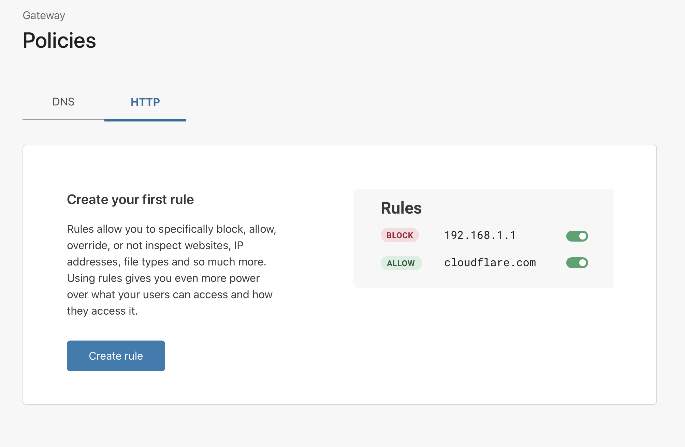
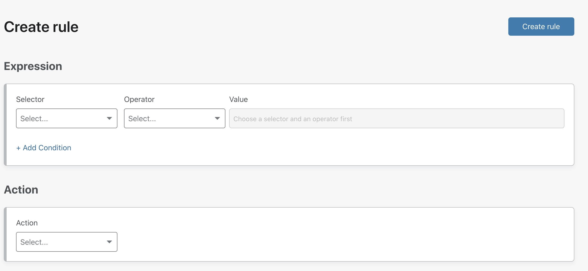

# Policy management

## Before you start

1. Install the [WARP client](/connections/connect-devices/warp) and set it to WARP mode on the devices you want to connect.

2. Install the [Cloudflare root certificate](/connections/connect-devices/warp/install-cloudflare-cert) on your devices you want to connect.

<Aside>
The Cloudflare Gateway L7 firewall will intercept and inspect all HTTP and HTTPS traffic over ports 80 and 443. The inspection of HTTPS traffic requires breaking the TLS connection between the user and the origin server. Cloudflare Gateway presents a certificate to the user and securely connects to the origin on their behalf; however, this requires the Cloudflare certificate to be installed and trusted on each user's device.
</Aside>

## Create your first HTTP policy

1. On the Teams dashboard, navigate to the **Policies** tab.

2. Select the **HTTP tab**.

3. Select **Add a Rule**.

4. Configure the **Selector**, **Operator**, and **Value(s)** to match against.
5. Select an **Action** to perform if the expression matches HTTP traffic.
6. Select **Create Rule**.

The rule is inserted at the bottom of the list of rules when more than one rule is present. Rules are enabled by default and take effect as soon as the rule is created.

Administrators can create up to 50 rules in their HTTP policy.

## Enable L7 filtering

In the settings (Gateway → Policies → Settings) page, click the toggle to enable filtering once clients have been deployed and certificates installed. If you do not enable filtering, your rules will not apply.

<Aside type='warning' header='Important'>

Do not enable filtering without first configuring the [Cloudflare root certificate](/connections/connect-devices/warp/install-cloudflare-cert) on the devices enrolled, otherwise those devices will be prevented from connecting to the Internet.

</Aside>
