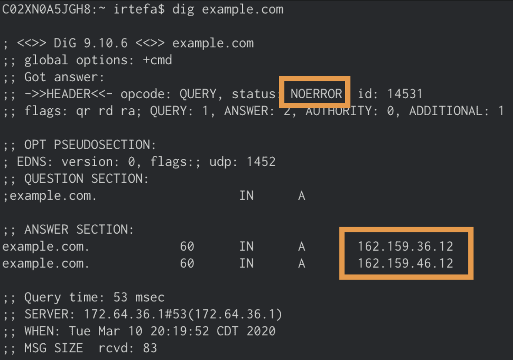

# Secure Web Gateway policies

<Aside>
When creating or editing policies, keep in mind that it may take up to 60 seconds for that policy to be updated across all of our data centers.
</Aside>

With Secure Web Gateway polices, Cloudflare for Teams allows you to set up policies to inspect DNS, HTTP, and Network traffic.

This section describes how to create DNS, HTTP and Network policies on the Cloudflare for Teams Dashboard. To review how to connect networks and devices to Cloudflare, check out the [Connections section](/connections).

<DirectoryListing path="/policies/filtering"/>

## Check that a policy is working

<Aside>
Before you start, please make sure you are connected to a network that is associated with the location where the policy is applied.
</Aside>

Once you've created a policy to block a domain, you can use either `dig` or `nslookup` on your to see if the policy is working as intended.

If you are using a policy to block `example.com`, you can do the following to see if Gateway is blocking `example.com`:

1. Open your terminal.

2. Type `dig example.com` (`nslookup example.com`) if you are using Windows) and press enter

3. If the Block page is **disabled** for the policy, then you should see `REFUSED` in the answer section:

 

 If the Block page is **enabled** for the policy, then you should see `NOERROR` in the answer section and `162.159.36.12` and `162.159.46.12` as the answers when the domain is successfully blocked.

 