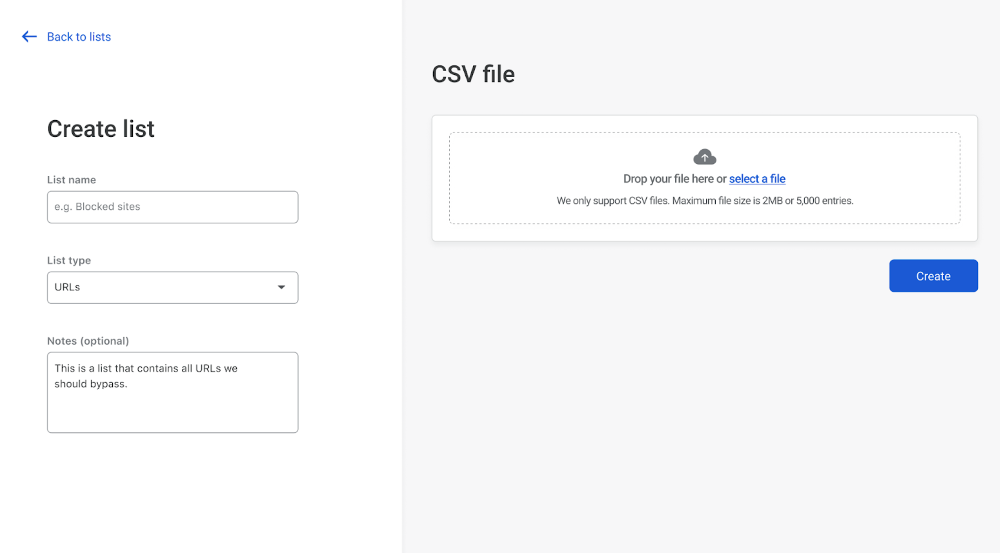

# Lists

<Aside>
Your lists can include up to 5,000 entries for Enterprise subscriptions and 1,000 for Standard subscriptions. A CSV file containing a list of URLs or hostnames must be smaller than 2 MB. 
</Aside>

With Teams, you can create lists of URLs or hostnames to reference when creating [Secure Web Gateway policies](/policies/filtering). This allows you to quickly create rules that match and take actions against several items at once. 

You can create a list by:
* [Uploading a list of entries](#creating-a-list-from-a-csv-file)
* [Manually creating a list of entries](#creating-a-manual-list) 

## Creating a list from a CSV file

If you'd like to test how this feature works, here is a [sample CSV file](../../static/documentation/list-test.csv). You can upload it to the Teams dashboard following the instructions below:

1. On the [Teams dashboard](https://dash.teams.cloudflare.com), navigate to **Gateway > Lists**.
1. Click **Upload CSV**.

  

1. Next, specify a **List name**, enter an optional description, and choose URLs as the **List type**.
1. Drag and drop a file into the CSV File window, or click **Select a file**.
1. Click **Create**. 

Your list will now appear in the Lists page.

## Creating a manual list

1. On the Teams dashboard, navigate to **Gateway > Lists**.
1. Click **Create manual list**.

  

1. Next, specify a **List name**, enter an optional description, and choose URLs as the **List type**.
1. Enter your elements manually in the *Add entries* field.
1. Click **Save**.

## Editing a list

1. In the Lists page, locate the list you want to edit.

1. Click **Edit**. This will allow you to:
    * Edit your list details (name and description) by clicking on the three-dots menu to the right of your list's name.
    * Delete the list by clicking on the three-dots menu to the right of your list's name.
    * Delete individual entries.
    * Manually add entries to your list.

1. Once you’ve edited your list, click **Save**.