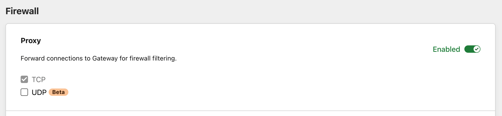

# Network policies

<Aside type="note">

To enable this feature, download and deploy the [WARP client](/connections/connect-devices/warp/deployment) on your devices.

</Aside>

With Cloudflare Zero Trust, you can configure policies to control network-level traffic leaving your endpoints. Using network selectors like IP addresses and ports, your policies will control access to any network origin. Because Cloudflare Zero Trust [integrates with your identity provider](/identity/idp-integration), it also gives you the ability to create identity-based network policies. This means you can now control access to non-HTTP resources on a per-user basis regardless of where they are or what device they’re accessing that resource from.

Build a network policy by configuring the following elements:

* [Actions](#actions)
* [Expressions](#expressions)
* [Selectors](#selectors)
* [Operators](#operators)

## Actions

Just like actions in DNS and HTTP policies, actions in network policies define which decision you want to apply to a given set of elements. You can assign one action per policy.

These are the action types you can choose from:

* [Allow](#allow)
* [Block](#block)
* [Network Override](#network-override)

### Allow

Policies with Allow actions allow network traffic to reach certain IPs or ports. For example, the following configuration allows specific users to reach a given IP address:

| Selector | Operator | Value | Action |
| --- | --- | --- | --- |
| Destination IP | In | `92.100.02.102` | Allow |
| Email | In | `*@example.com` |  |

### Block

Policies with Block actions block network traffic from reaching certain IPs or ports. For example, the following configuration blocks all traffic directed to port 443:

| Selector | Operator | Value | Action |
| --- | --- | --- | --- |
| Destination Port | In | `443` | Block |

### Network Override

Policies with Network Override actions do not inspect traffic directed to, or coming from, certain IPs or ports. For example, the following configuration overrides traffic to a public IP to a Private IP based on a user’s identity:

| Selector | Operator | Value | Action |
| --- | --- | --- | --- |
| Destination IP | In | `95.92.143.151` | Network Override |
| User Email | In | `*@example.com` | |
| Override IP |  | 10.0.0.1 | | 

## Expressions 

Build expressions to determine the set of elements you want to impact with your policy. To build an expression, you need to choose a **Selector** and an **Operator**, and enter a value or range of values in the **Value** field. 

### Selectors

Gateway matches network traffic against the following selectors, or criteria.

#### Identity-based selectors

You can build Network policies using **identity-based selectors**. These selectors require Gateway with WARP mode to be enabled in the Zero Trust WARP client and the user to be enrolled in the organization via the WARP client. For a list of identity-based selectors and API examples, please refer to the [dedicated section](/policies/filtering/identity-selectors).

#### Destination IP

The IP address of the request’s target.

| UI name | API example |
| -- | -- |
| Destination IP | `net.dst.ip == "10.0.0.0/8"` |

#### Destination Port

The port number of the request’s target.

| UI name | API example |
| -- | -- |
| Destination Port | `net.dst.port == "2222"` |

#### Protocol

The protocol used to send the packet.

| UI name | API example |
| -- | -- |
| Protocol | `net.protocol == "tcp"` |

#### Source IP

The IP address of the user making the request.

| UI name | API example |
| -- | -- |
| Source IP | `net.src.ip == "10.0.0.0/8"` |

#### Source Port

The IP address of the user making the request.

| UI name | API example |
| -- | -- |
| Source Port | `net.src.port == "2222"` |

#### SNI

The host whose Server Name Indication (SNI) header Gateway will filter traffic against. This will allow for an exact match.

| UI name | API example |
| -- | -- |
| SNI | `net.sni.host == "www.example.com"` |

#### SNI Domain

The domain whose Server Name Indication (SNI) header Gateway will filter traffic against. This will match against the hostname and sub-domains.

| UI name | API example |
| -- | -- |
| SNI Domain | `net.sni.host == "a.example.com"` |

#### Device Posture

With the Device Posture selector, admins can use signals from end-user devices to secure access to their internal and external resources. For example, a security admin can choose to limit all access to internal applications based on whether specific software is installed on a device, and/or if the device or software are configured in a particular way. 

| UI name | API example |
| --- | --- |
| Device Posture | `any(device_posture.checks.failed[*] in {"1308749e-fcfb-4ebc-b051-fe022b632644"})`, `any(device_posture.checks.passed[*] in {"1308749e-fcfb-4ebc-b051-fe022b632644"})"` |

### Operators

Operators are the way Gateway matches traffic to a selector. Matching happens as follows:

| Operator              |          Meaning
|:---------------------:|:---------------------------:|
|  is                   |  exact match, equals        |
|  is not               |  all except exact match     |
|  in                   |  in any of defined entries  |
|  not in               |  not in defined entries     |
|  matches regex        | regex evaluates to true         |
|  does not match regex |  all except when regex evals to true   |

<Aside>

The <code>in</code> operator allows you to specify IP addresses or networks using CIDR notation. 

</Aside>

## Changing network protocol

You can set your protocol preferences in the **Protocol** card under **Settings** > **Network**. 

<Aside>

Any option you select in the card will automatically apply to all of your network policies unless you specify a protocol within a policy itself.

</Aside>