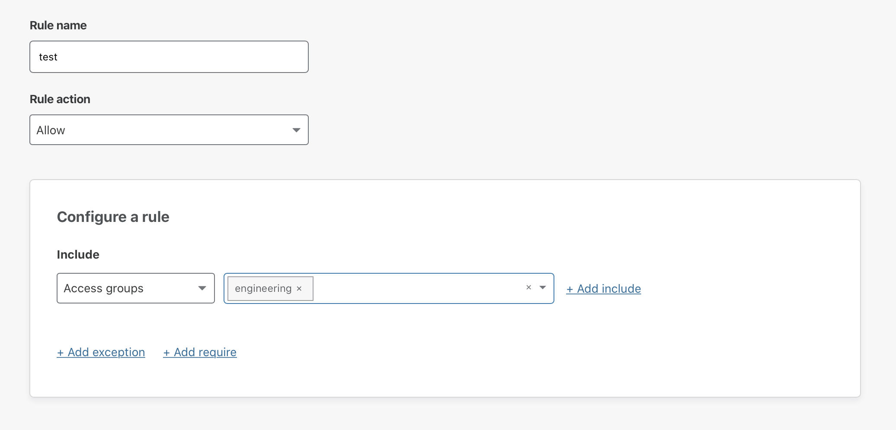
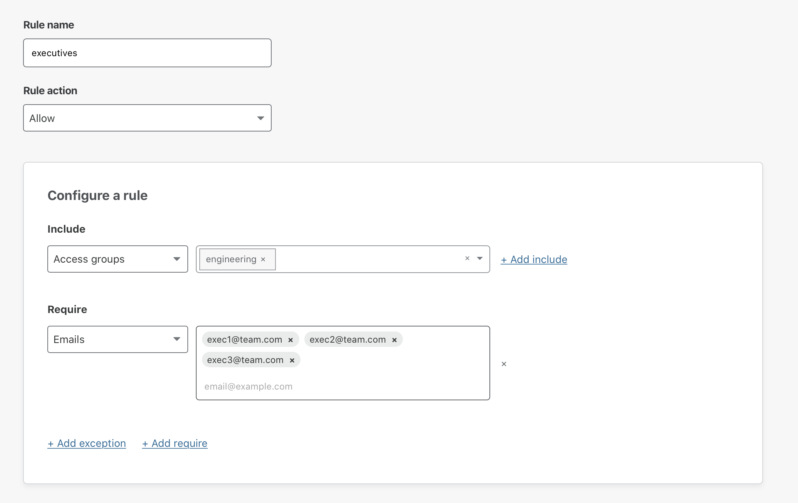
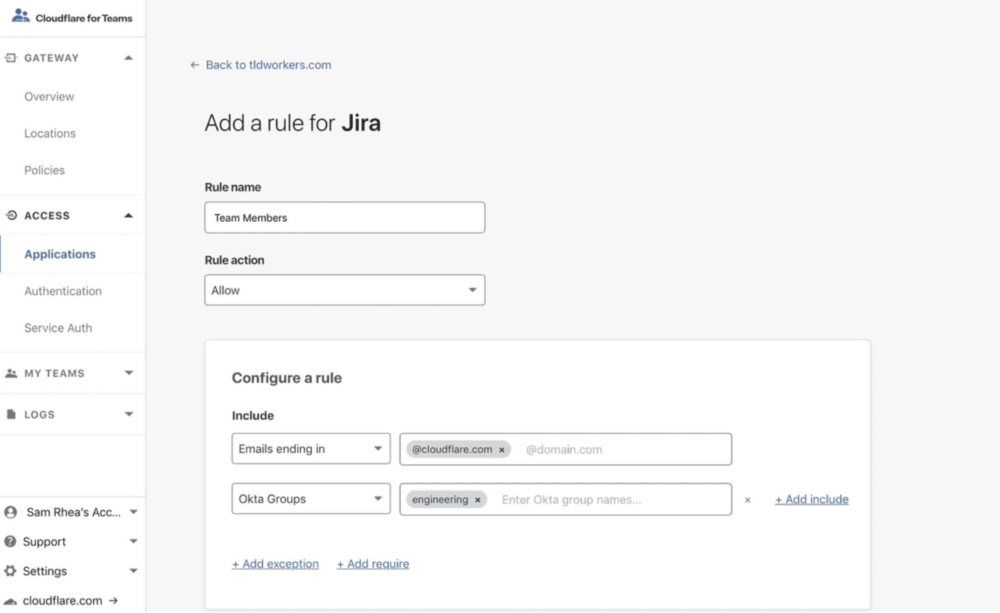

# Application Paths

You can create unique rules for parts of an application that share a root path. When multiple rules are set for a common root path, they do not inherit rules. Instead, the more specific rule takes precedence. 

## Example scenario

An example application is deployed at `dashboard.com/eng` that anyone on the engineering team should be able to access. A policy called *engineering* restricts access to that path to members of the engineering team.

That policy may look like:

However, a tool deployed at `dashboard.com/eng/exec` should only be accessed by the executive team. When using only Policy A, this path inherits the rules from Policy A and members of the engineering team can access that path. To restrict access to `dashboard.com/eng/exec`, you'll need to create a second policy, e.g., *executives*, that grants access to the executive team only.

When applying *executives* to `dashboard.com/eng/exec`, the more specific policy takes precedence (*executives*), and the `/exec` path is gated by *executives*.

## Subdomains

You can configure an Application for an apex domain, a particular subdomain, or all subdomains using a wildcard rule. Similarly, you can apply an Access Application to an entire website or protect a specific path. When protecting the entire website, leave the path field empty. You specify paths, for example `/admin`, as well.

Access does not support overlapping definitions. For example, when setting rules for `/admin` and `/admin/specific` separately, `/admin/specific` does not inherit the rule set for `/admin`. The more specific rule is enforced.

Access does not support port numbers in the URL. Requests to URLs with port numbers are redirected to the URL and the port numbers stripped.

## Using wildcards in rules

You can secure any subdomain of the apex domain in Cloudflare Access by using a wildcard in the rule. Wildcard rules use an asterisk (`*`) in the Subdomain field in the Application Overview menu.

When using wildcards in rules, keep in mind that:

* **Using a wildcard in the *Subdomain* field does not cover the apex domain.** That is, a wildcard rule that controls access using the format, `*.example.com`, covers `alpha.example`.com and `beta.example.com`, but not `example.com`. You must create separate rules for the apex domain.

* **Using a wildcard in the *Subdomain* field does not cover multi-level subdomains**. For instance, a wildcard rule like `*.example.com` would cover `test.example.com` but not `test.beta.example.com`.

