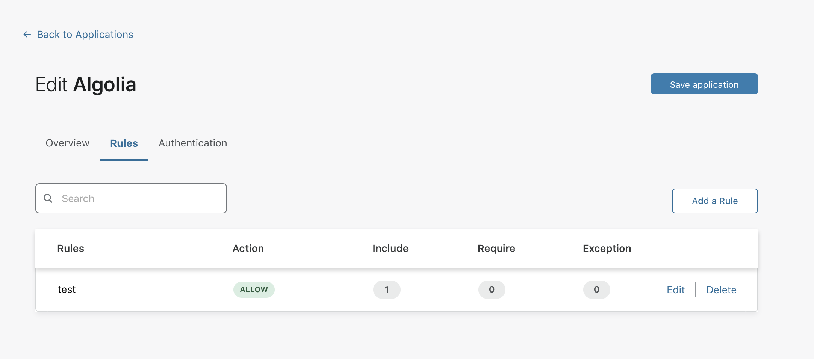

# Enforce MFA

With zero-trust policies, you can require that users log in to certain applications with specific types of multifactor authentication (MFA) methods. For example, you can create rules that only allow users to reach a given application if they authenticate with a physical hard key.

This feature is only available if you are using the following identity providers:

* Okta
* Azure AD

To enforce an MFA requirement to an application:

1. On the Teams dashboard, navigate to **Access > Applications**.

1. Find the application for which you want to enforce MFA and click **Edit**. Alternatively, [create a new application](/applications/configure-apps/).

1. Navigate to the **Rules** section of the application.

1. If your application already has a  rule containing an identity requirement, find it and click **Edit**.

 The rule must contain an Include rule which defines an identity. For example, the Include rule should allow for users who are part of a user [group](/identity/users/groups), email domain, or identity provider group.

3. Add a *Require* action to the rule.

4. Select *Authentication Method* and choose `mfa - multiple-factor authentication`.

5. Save the rule.

<Aside type='warning' header='Important'>

**What happens if the user fails to present the required MFA method?**

Cloudflare Access will reject the user, even if they successfully login to the identity provider with an alternative method.
</Aside>

## Adding authentication methods into the JWT

When users authenticate with their identity provider, the identity provider thenshares their username with Cloudflare Access. Cloudflare Access then writes that value into the [JSON Web Token (JWT)](/glossary#jwt) generated for the user.

Certain identity providers can also share the multifactor authentication (MFA) method presented by the user to login. Cloudflare Access can add these values into the JWT and force. For example, if the user authenticated with their password and a physical hard key, the identity provider can send a confirmation to Cloudflare Access. 

Cloudflare Access then stores that method into the same JWT issued to the user.

Cloudflare Access follows [RFC 8176](https://tools.ietf.org/html/rfc8176), Authentication Method Reference Values, to define authentication methods.

For instructions on how to create policies to enforce MFA, see our [Policies and Rules section](/learning/policies-and-rules/#enforcing-mfa).