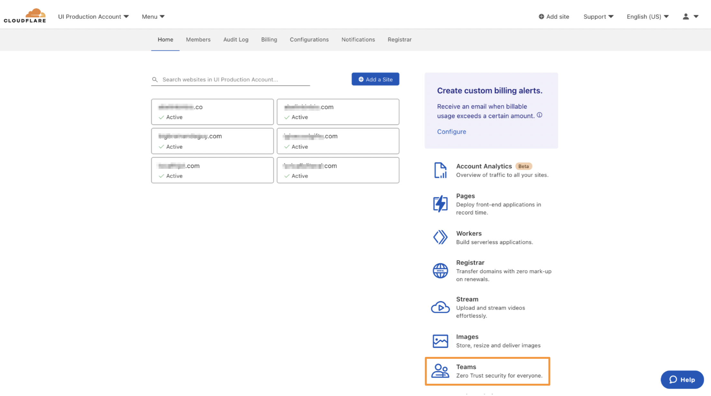

# Get started

Welcome to Cloudflare for Teams. This guide covers the main steps you need to take in order to fully set up your Teams environment.

## Pre-requisites

* A Cloudflare account

## Start from the Cloudflare Dashboard

1. On your Account Home in the Cloudflare Dashboard, click on the Teams icon.

    

2. On the onboarding screen, choose a [team name](/glossary#team-name).

3. Complete your onboarding by selecting a subscription plan and entering your payment details. If you chose the **Teams Free plan**, please note this step is still needed, but you won’t be charged.

4. Welcome to the Cloudflare for Teams dashboard! Your account has been created. You can now explore a list of one-click actions we have designed to help you kickstart your experience with Teams.

    

## Install the WARP client on your devices

If you want to enable security features such as Browser Isolation, HTTP filtering, AV scanning, and device posture, or connect networks to Cloudflare, here are the next step you need to take:

1. **Set up a login method.** Configure [One-time PIN](/identity/one-time-pin) or connect a [third-party identity provider](/identity/idp-integration) on the Teams Dashboard. This is the login method your users will utilize when authenticating to add a new device to your Teams setup.

1. **Next, define [device enrollment permissions](/connections/connect-devices/warp/warp-settings#device-enrollment-permissions)**. Create device enrollment rules to define which users in your organization should be able to connect devices to your organization's Teams setup. As you create your rule, you will be asked to select which login method you would like users to authenticate with.

1. **Install the [Cloudflare root certificate](/connections/connect-devices/warp/install-cloudflare-cert) on your devices.** Advanced security features including HTTP traffic inspection require users to install and trust the Cloudflare root certificate on their machine or device. If you are installing certificates manually on all your devices, these steps will need to be performed on each new device that is to be subject to HTTP filtering.

1. **Download and deploy the WARP client to your devices**. Choose one of the [different ways](/connections/connect-devices/warp/deployment) to deploy the WARP client, depending on what works best for your organization.

1. **Log in to your organization's Cloudflare for Teams instance from your devices**. On your device, navigate to the Settings section in the WARP client and insert your organization's team name.

1. **Enable the Proxy setting in the Teams Dashboard.** Navigate to **Settings** > **Network** and enable the **Proxy** setting. This will allow you to start routing your HTTP traffic to Gateway.  

Your devices are now connected to Cloudflare for Teams through the WARP client, and you can start enforcing security measures on your traffic and access requests.

## Check your Teams environment

Now that your environment is set up, you can control your network activity by checking out our analytics pages.

1. **View your Devices in Teams.** Navigate to **My Team** > **Devices** to find a list of your enrolled devices, when they were last seen, and the WARP client version they are running. 
1. **View your Users in Teams.** Navigate to **My Team** > **Users** to check who is currently an active user in your Teams environment, revoke users, and check information such as last login, location, and devices they use. 
1. **View Logs.** Navigate to the **Logs** section for an overview of events in your network. Deep-dive into which access requests were made, and check which queries were filtered by Gateway and the action that was enforced on each of them.

You can also check the [Cloudflare for Teams Health Page](https://help.teams.cloudflare.com/) for a comprehensive overview of what filtering options you have enabled for your traffic.