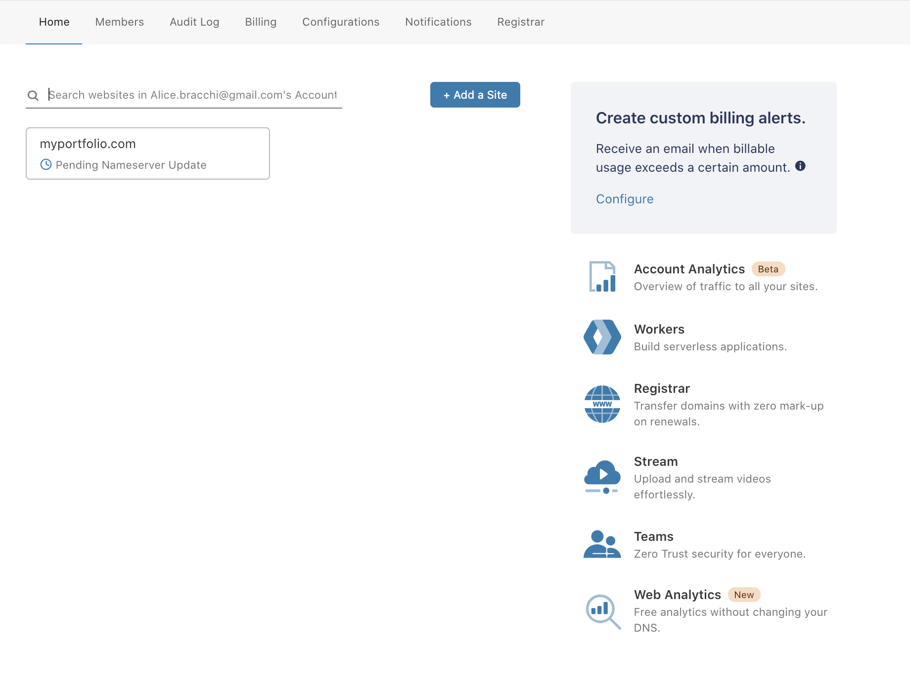
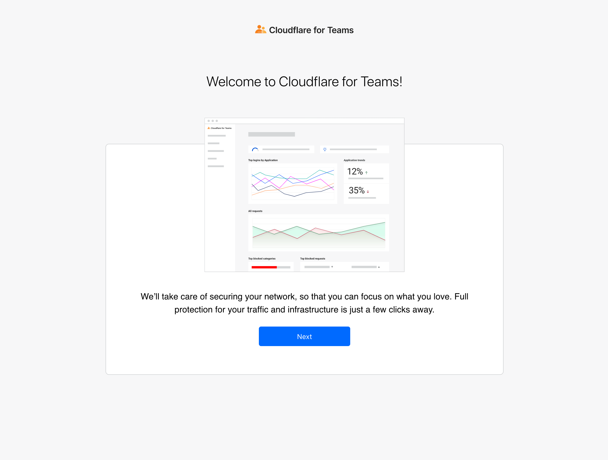
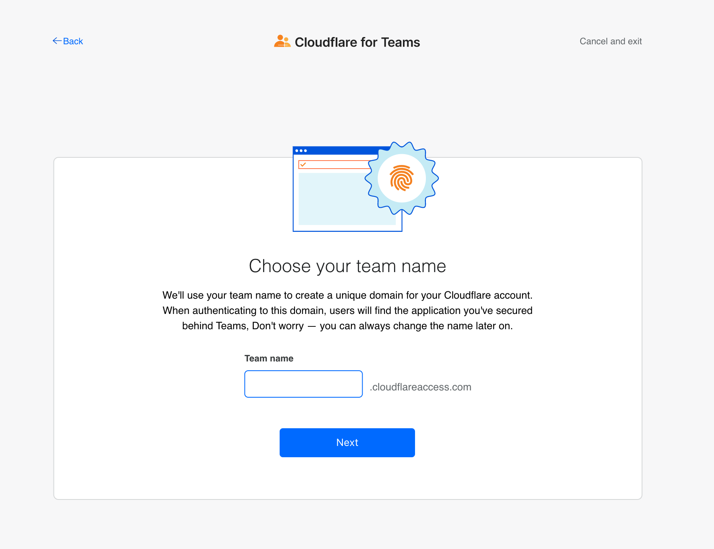
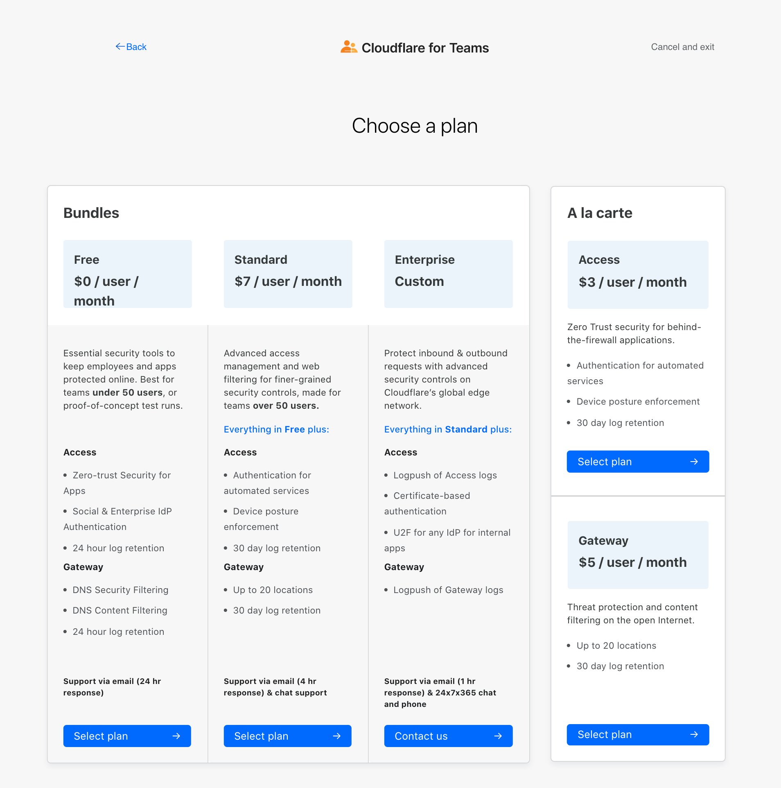
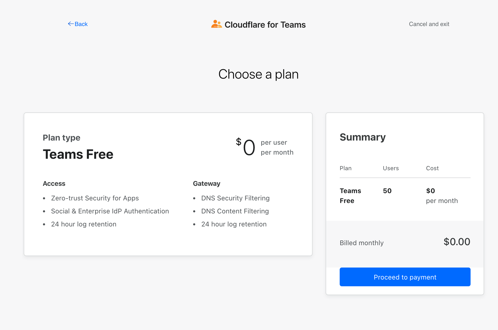
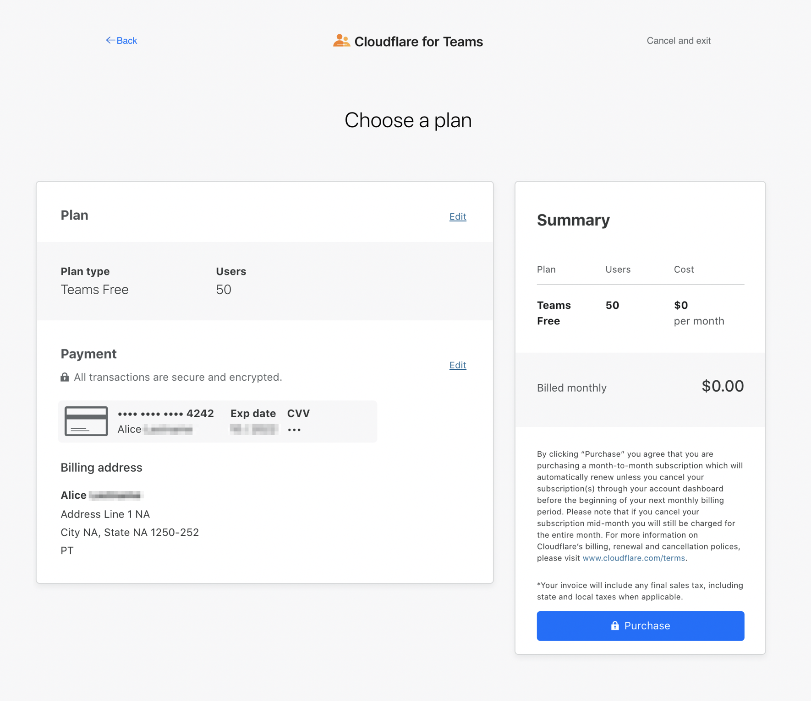
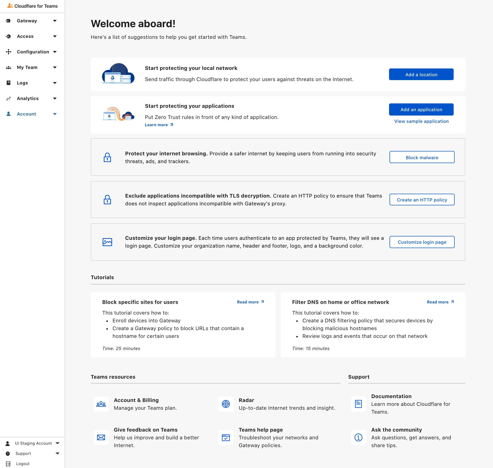

# Get started

<Aside>

Before you start using Cloudflare for Teams, create a Cloudflare account. To do that, navigate to the [Cloudflare dashboard](https://dash.teams.cloudflare.com/) and create a new account with your email address and a password.

</Aside>

Setting up Cloudflare for Teams takes only a couple of minutes. You will need to complete these three steps:

1. Choose a [team name](/glossary#team-name).
1. Choose a [plan](https://www.cloudflare.com/en-gb/teams-pricing/).
1. Adding your payment details (also required for customers on the Free plan).

Let's walk through the setup flow!

1. Once you've created your Cloudflare account, navigate to [the sign-up link](https://dash.cloudflare.com/sign-up/teams).
1. Log in with your Cloudflare credentials.
1. Click on the Teams icon.

 

1. On the Welcome page, click **Next**.

 

1. Choose your [team name](/glossary#team-name). This name will be used to generate a [team domain](/glossary#team-domain) that will be shared across the applications you'll protect behind Cloudflare for Teams.

 

1. Click **Next**.

1. Choose a payment plan.

 

1. Click **Next**. We'll show you a summary of the payment plan you've selected; you now have the opportunity to go back and choose a different plan or click **Proceed to payment**.

 

1. As a last step, enter your payment details and click **Purchase**. For Free customers, credit cards will not be charged.

 

1. Welcome to the Cloudflare for Teams dashboard! Your account has been created. You can now explore a list of one-click actions we've designed to help you kickstart your experience with Teams.

 For example, if you've purchased one of the Teams bundle plans, you can:

 * [Add your first location](/connections/connect-networks)
 * [Add your first application](/applications/configure-applications)
 * [Customize your login page](/identity/login-page)

 And so much more. Happy exploring!

 

## Starter packs

* `Add a location` [Locations](/connections/connect-networks/locations) are any network you're looking to protect with Teams. By clicking `Add a location` Teams will automatically identify and create a location based on the local network you're currently on. This Location can then be verified by navigating to Gateway > Locations.

## Tutorials

Once you've created your account, you can start exploring Cloudflare for Teams. We recommend reviewing the Cloudflare for Teams [Tutorials](/tutorials) section to begin adding new features.
