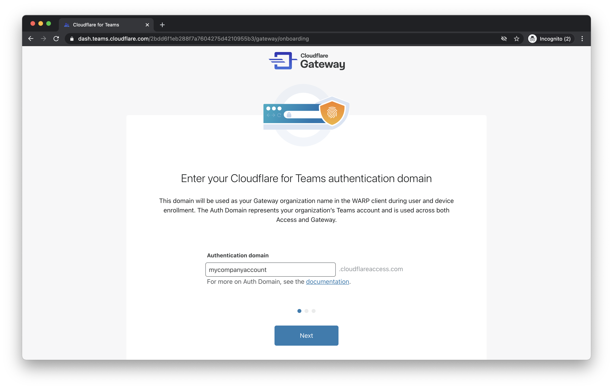

# Quick start

Start using Cloudflare for Teams by creating a Cloudflare account.

1. Navigate to [Cloudflare for Teams](https://dash.cloudflare.com/sign-up?redirect_uri=https%3A%2F%2Fdash.teams.cloudflare.com%2Fauth-callback) and create a new account with your email address and a password.

2. Click **Create account**. You can now choose to:

  * Set up [Cloudflare Access](#set-up-cloudflare-access) to build Zero Trust rules for the applications and data you protect.
  * Set up [Cloudflare Gateway](#set-up-cloudflare-gateway) to build DNS filtering, Secure Web Gateway, and cloud firewall policies for your organization.
  * Skip directly to the [Teams dashboard](https://dash.teams.cloudflare.com).

## Set up Cloudflare Access

1. Click **Begin setup** in the Cloudflare Access card.

1. Enter your *auth domain*. The authentication domain will represent your Cloudflare for Teams account across Access and Gateway. The URL will also serve as the launch page for end users.

 

1. Click **Next**. Cloudflare will now check if you have [added an active zone to Cloudflare](https://support.cloudflare.com/hc/articles/201720164-Creating-a-Cloudflare-account-and-adding-a-website).

1. If an active zone hasn't been added yet, you will be prompted to create your first **SaaS application** on the Teams dashboard. To do so, click **Continue setup in Teams dash**.

 

1. If you have added an active zone to Cloudflare, you can set up your first internal application by providing a name and input the subdomain where your application will be served.

 The subdomain must be part of a zone in your Cloudflare account.

7. Now, create the first **policy** for the app you are securing with Access.

Provide a name and then specify an *Include* rule for the policy.

The *Include* rule will determine which users will be allowed to access the application.
You can either select:
  * *Emails* - this option restricts access to users whose email addresses match the ones you define.
  * *Emails ending in* - this option restricts access to users whose email addresses end with the email endings you define.

You can return to edit the policy with more complex rules like identity provider groups or hard key requirements.

8. Click **Next**.

9. You have now successfully configured Cloudflare Access.

 To view your application on the *Teams dashboard*, click **View your application**.

 To explore the dashboard, click **Proceed to Teams dashboard**.

## Set up Cloudflare Gateway

1. Click **Begin setup** in the Cloudflare Gateway card.

1. Enter your *auth domain*. The authentication domain will be used as your Gateway organization name in the WARP client during user and device enrollment.

1. Set up your first location. Alternatively, you can choose to click **Skip to Teams dash**.

1. If you choose to set up your first location, enter a location name and click **Next**. You will be able to change this name at any time on the Teams dashbaord.

 

1. Follow the instructions on how to setup your DNS resolvers.

1. Click **Finish setup**. This will take you to the Teams dashboard.

You have now successfully set up Cloudflare Gateway.

## Tutorials

Once you have your account created, you can begin using Cloudflare for Teams. We recommend reviewing the Cloudflare for Teams [Tutorials](/tutorials) section to begin adding new features.