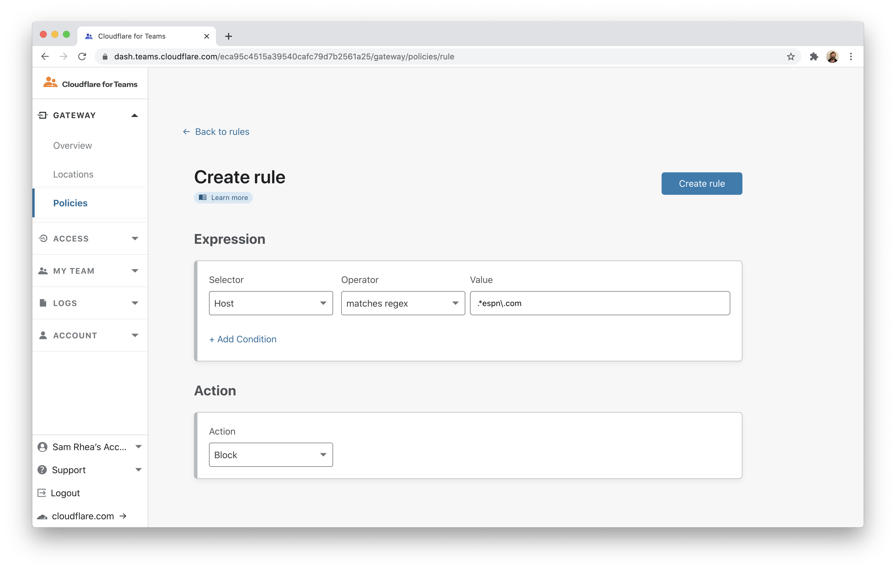
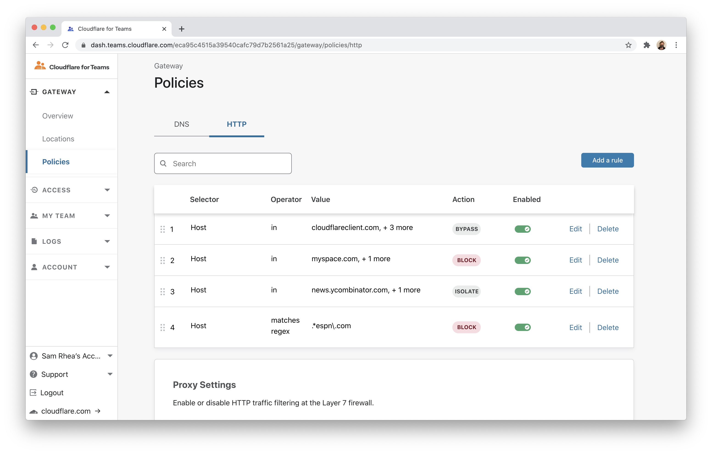
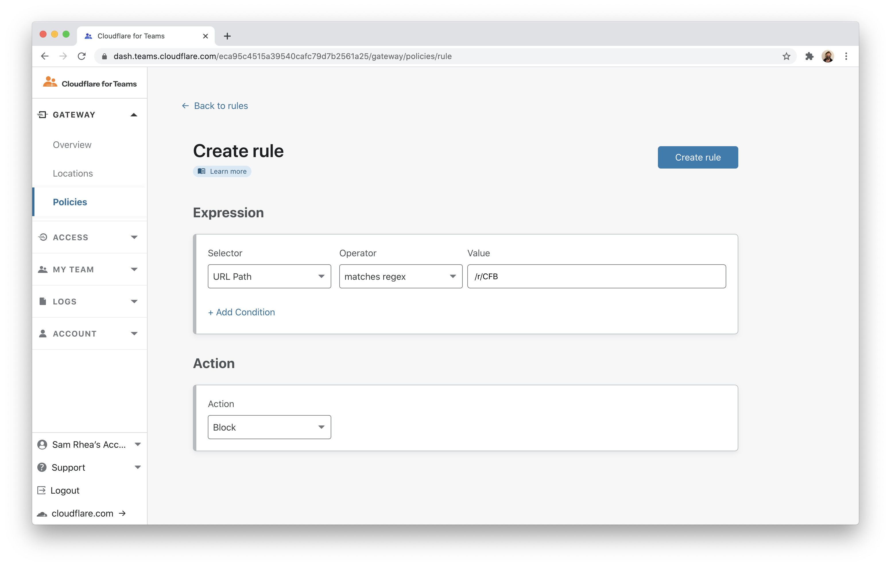
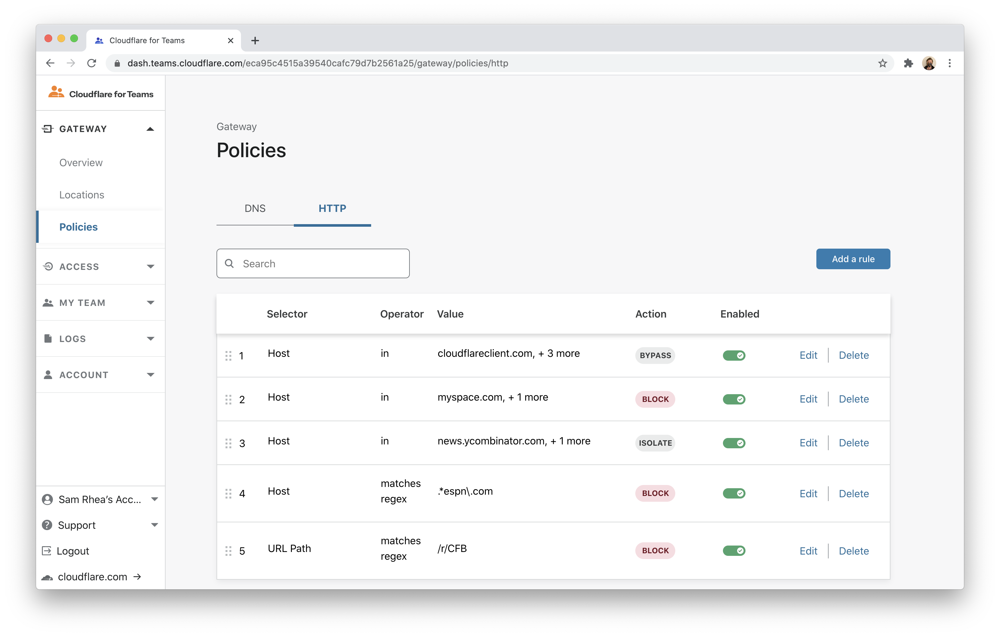
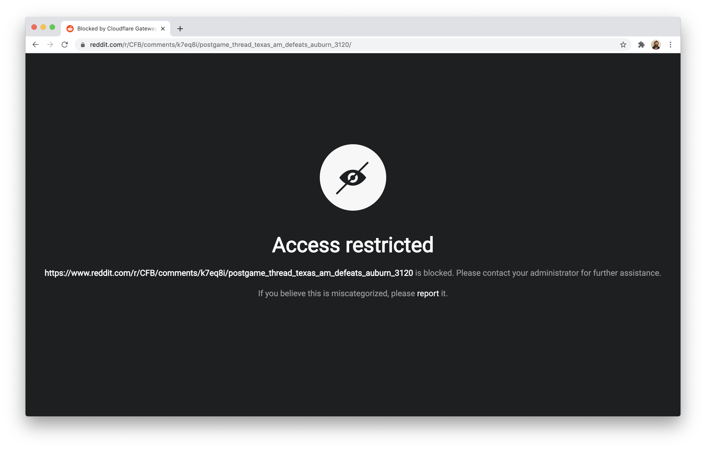
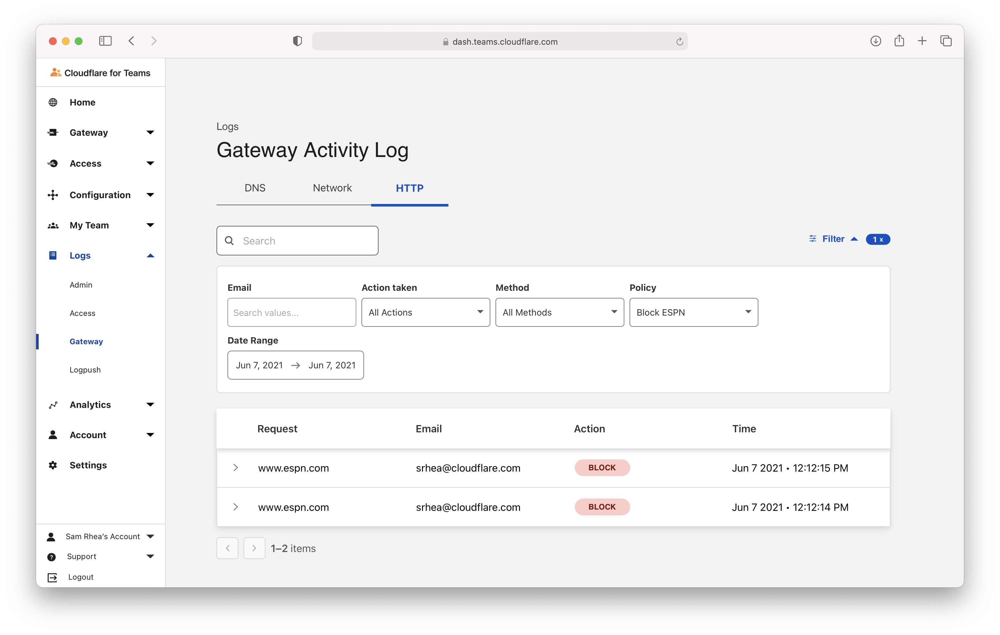

# Block sites by host and URL

You can use Cloudflare Gateway and the Cloudflare WARP client application to block attempts to reach hostnames or to block URL paths without blocking the rest of the hostname.

**🗺️ This tutorial covers how to:**

* Enroll devices into Gateway
* Create a Gateway policy to block URLs that contain a hostname
* Create a Gateway policy to block URLs that contain a URL path
* Review the block events in the Gateway logs

**⏲️Time to complete: 25 minutes**

## Add Cloudflare Gateway

Before you begin, you'll need to follow [these instructions](https://developers.cloudflare.com/gateway/getting-started/onboarding-gateway) to set up Cloudflare Gateway in your account. Cloudflare Gateway operates in two modes:

* DNS filtering
* Proxy (HTTP filtering)

The proxy mode in Gateway requires a Gateway Standard or Cloudflare for Teams Standard [plan](https://www.cloudflare.com/teams-pricing/).

To filter all Internet-bound traffic in the proxy mode, devices must install and enroll the Cloudflare for Teams WARP client. The WARP client will send all Internet traffic to a Cloudflare data center near the user where it can be filtered and logged before reaching the rest of the Internet.

Building a rule in Access to enforce Gateway connections requires the use of the WARP client and its configuration to proxy Internet traffic to Cloudflare.

## Determine which devices can enroll

To proxy traffic through Gateway, devices must run the Cloudflare WARP client and [be enrolled in your Teams account](https://developers.cloudflare.com/gateway/connecting-to-gateway). When devices enroll, users will be prompted to authenticate with your identity provider or a consumer identity service. You can also deploy the client and its configurations [via a device management platform](https://developers.cloudflare.com/warp-client/warp-for-teams/teams) like JAMF or InTune.

First, determine which devices can enroll based on user identity. If you have already integrated your identity provider when setting up Cloudflare Access you can reuse that integration. If you have not set up an identity provider, follow [these instructions](https://developers.cloudflare.com/access/getting-started/access-setup) to add Access and integrate a free identity option or a specific provider.

Next, build a rule to decide which devices can enroll into your Gateway account. Navigate to the `Devices` page in the `My Teams` section of the sidebar.


Click `Device Settings` to build the enrollment rule. In the policy, define who should be allowed to enroll a device and click `Save`.


## Enroll a device

Follow the [instructions here](https://developers.cloudflare.com/warp-client/setting-up) to install the WARP client depending on your device type. Cloudflare Gateway does not need a special version of the client.

Once installed, click the gear icon.


Under the `Account` tab, click `Login with Cloudflare for Teams`.


Input your Cloudflare for Teams org name. You will have created this during the Cloudflare Access setup flow. You can find it under the `Authentication` tab in the `Access` section of the sidebar.


The user will be prompted to login with the identity provider configured in Cloudflare Access. Once authenticated, the client will update to `Teams` mode. You can click the gear to toggle between DNS filtering or full proxy. In this use case, you must toggle to `Gateway with WARP`. These settings can be configured globally for an organization through a device management platform.


## Configure the Cloudflare certificate

To inspect traffic, Cloudflare Gateway requires that a [certificate be installed](https://developers.cloudflare.com/gateway/connecting-to-gateway/install-cloudflare-cert) on enrolled devices. You can also distribute this certificate through an MDM provider. The example below follows a manual distribution flow.

Download the Cloudflare certificate provided in the [instructions here](https://developers.cloudflare.com/gateway/connecting-to-gateway/install-cloudflare-cert). You can also find the certificate in the Cloudflare for Teams dashboard. Navigate to the `Account` page in the `Settings` section of the sidebar and scroll to the bottom.

Next, follow [these instructions](https://developers.cloudflare.com/gateway/connecting-to-gateway/install-cloudflare-cert) to install the certificate on your system.

Once the certificate has been installed, you can configure Gateway to inspect HTTP traffic. To do so, navigate to the `Policies` page in the Gateway section. Scroll to the bottom and toggle `Proxy Settings` to enabled.


## Build a hostname policy

Click **Add a rule** to add a new HTTP policy. You can build rules that match an exact hostname or, like the example here, rules that use regular expressions to match for patterns.

The rule below uses the `matches regex` operator to block any subdomain that uses `espn.com` as the host. You can also build a rule with an `is` operator and input `espn.com` directly.

```
.*espn\.com
```



Once you have clicked **Create rule** you should see it appear at the bottom of the rule list. Gateway enforces rules from top to bottom. If you had a rule with higher precedence (ranked higher in the list) that allowed ESPN, that rule would allow the user before this rule could block.



## Build a URL policy

Some websites are organized by URL path, so blocking by host or subdomain is not sufficient. Instead, you must build rules for a specific URL path.

In the example below, `reddit.com` is a website where different areas of interest are grouped into a URL string that follows `/r/`. In this case, `CFB` is the section of Reddit that discusses college football.

Matching for this URL requires a regular expression rule.

```
/r/CFB
```



Click **Create rule** and you should see it appear in your rule list.



## Blocks

When users visit that section of Reddit (and any page within it), they will receive a block page. Any attempt to reach ESPN will also be blocked.



You can review the blog event in the HTTP logs. Navigate to the `Gateway` page in the `Logs` section of the Cloudflare for Teams dashboard. Filter for `Block` as the decision type.

