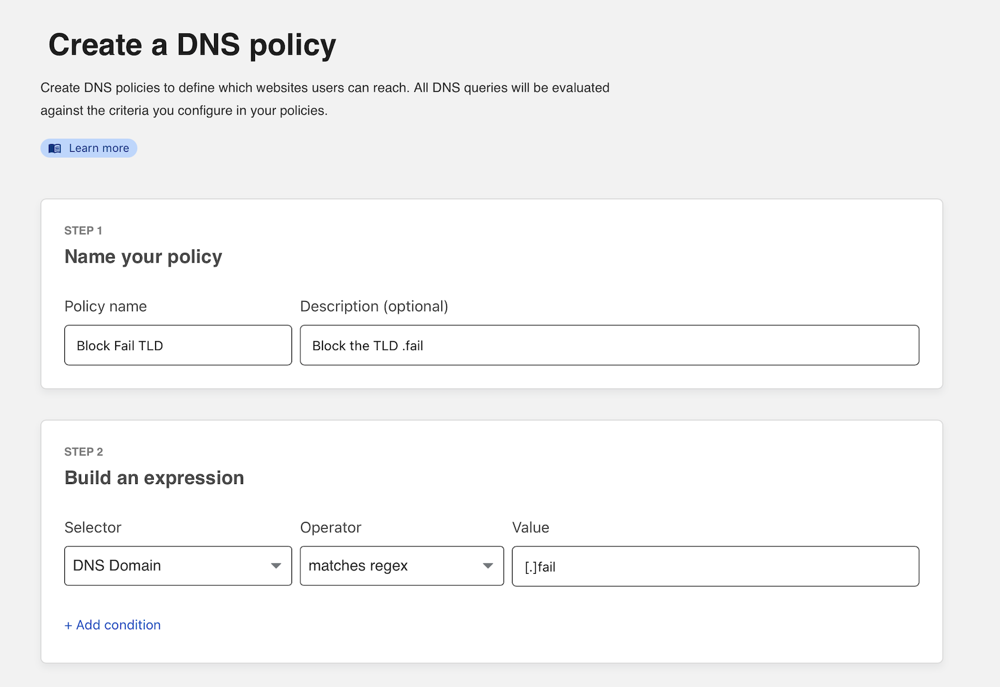
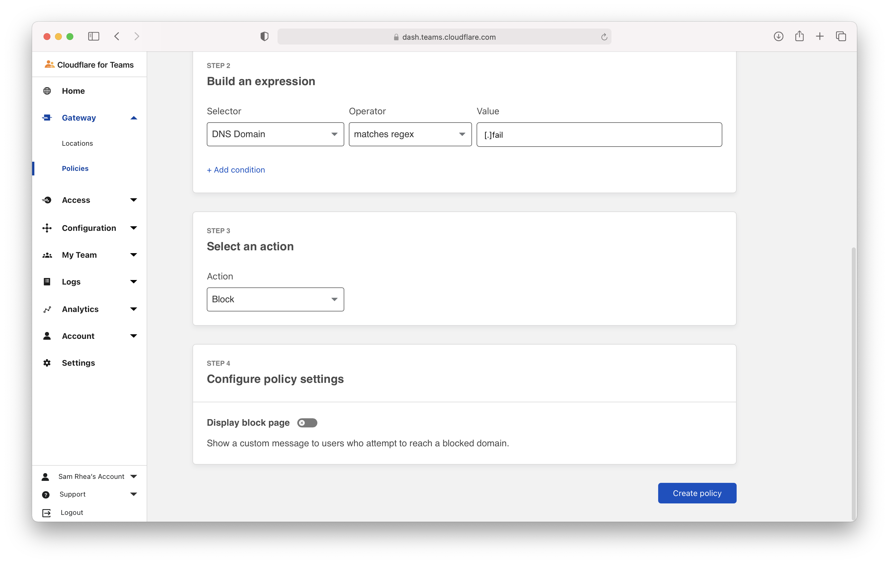
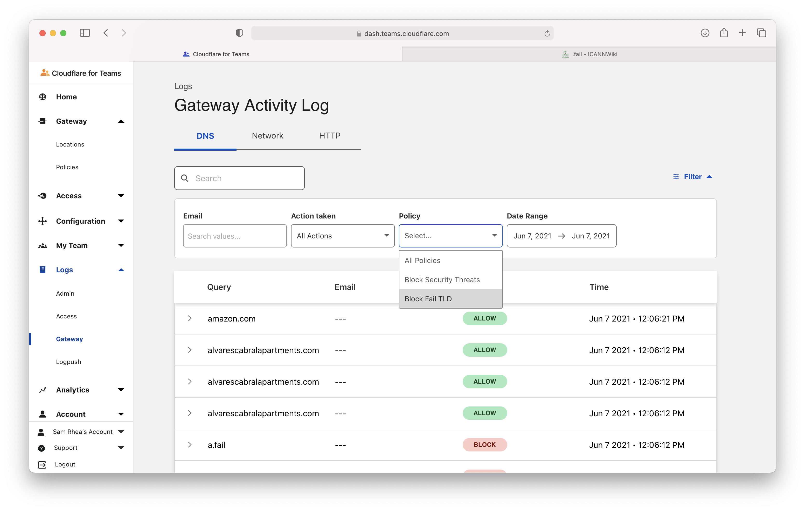
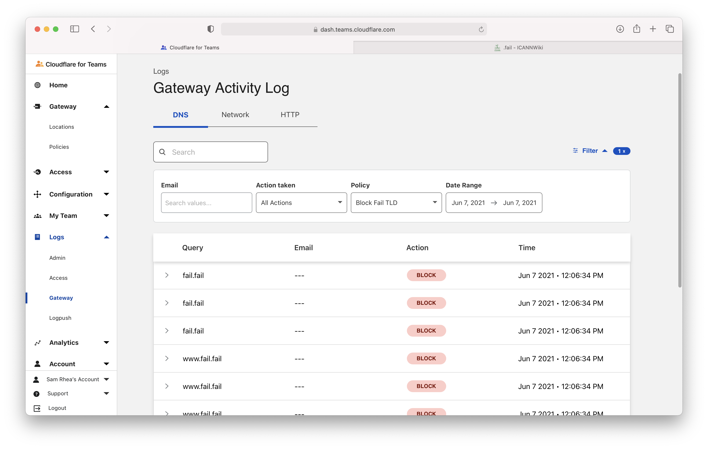

# Block sites by TLD

You can use Cloudflare Gateway to block DNS queries a entire top level domain (TLD). These policies will block any hostname in a specific TLD.

**🗺️ This tutorial covers how to:**

* Build a policy in Gateway to block entire TLDs

**⏲️Time to complete:**

5 minutes

## Before you start
1. [Add Gateway to your account](/setup)

## Build a policy to block by TLD

Visit the Zero Trust dashboard. Open the `Policies` page in the Gateway section and select the `DNS` tab.


Click **Create a policy**. In the policy builder, name the policy and optionally provide a description.

Choose `Domain` in the Selector, `matches regex` in the Operator, and input the following value:

```
[.]fail
```

Replacing `fail` with the TLD you intend to block.



Choose `Block` as the action. Optionally, enable the block page to present a block page to users. Users must have the Cloudflare certificate installed to see the block page.

Finish the policy by clicking **Create policy**.



Input the TLD you need to block. If you need to block `.fail` remove the leading `.` and only input `fail`. Click **Add to policy** and save the policy.

<Aside type="note">

For more information on how policies work with regular expressions, refer to [Can I use regular expressions to build policies?](/faq/teams-policies-faq#can-i-use-regular-expressions-to-build-policies)

</Aside>

## Review logs

You can test your policy by attempting to visit a domain with the blocked TLD. To review logs of the block, navigate to the `Logs` section of the Zero Trust dashboard, select `Gateway`, and choose the `DNS` tab.



You can filter for events by policy. Select the name of the policy in the `Policy` drop down menu.

