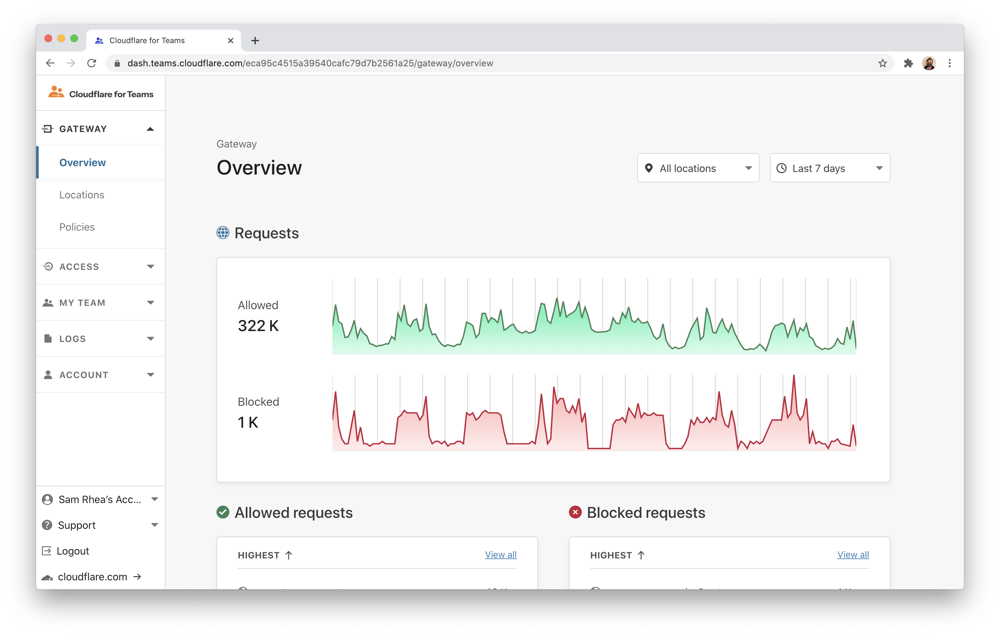
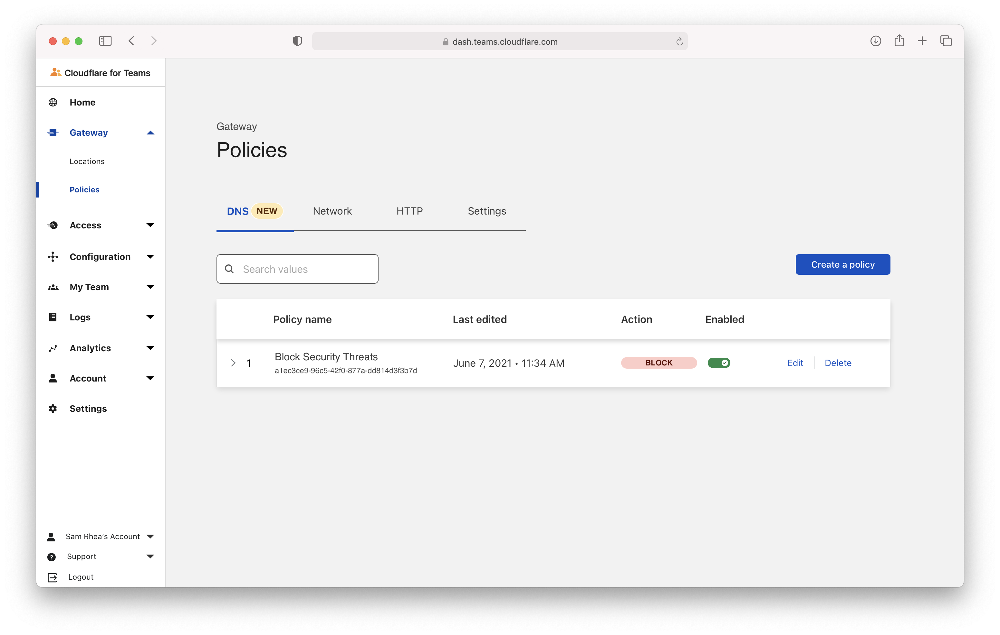
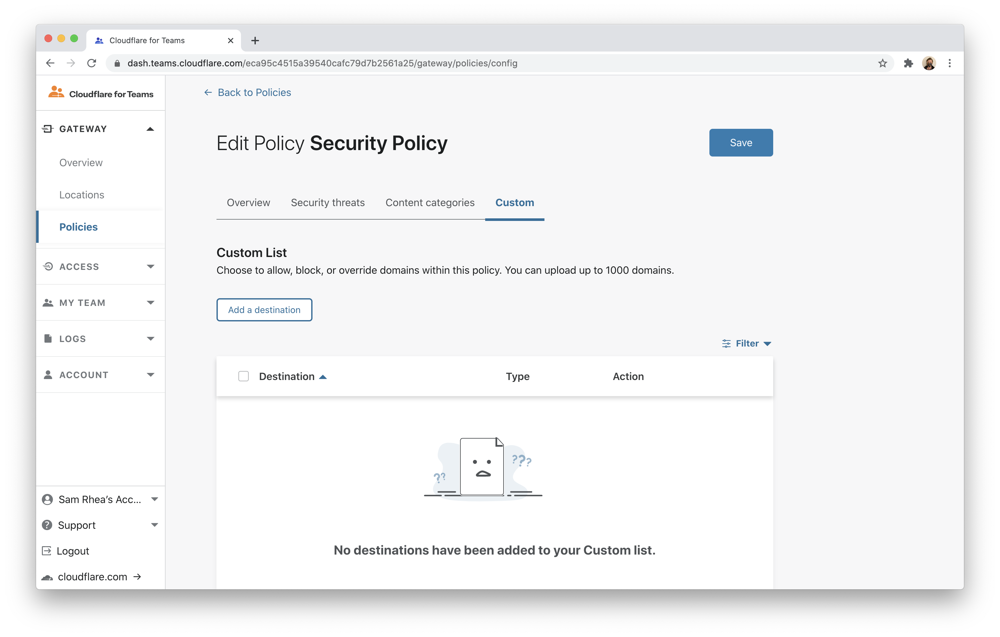
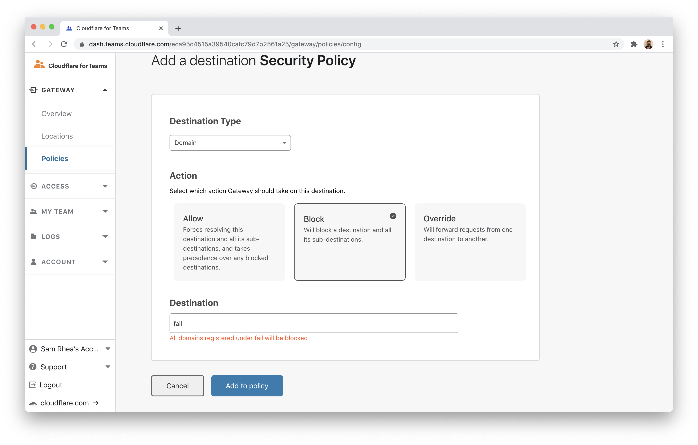

# Block sites by TLD

You can use Cloudflare Gateway to block DNS queries a entire top level domain (TLD). These policies will block any hostname in a specific TLD.

**🗺️ This tutorial covers how to:**

* Build a policy in Gateway to block entire TLDs

**⏲️Time to complete: 5 minutes**

## Configure Cloudflare Gateway

Before you begin, you'll need to follow [these instructions](https://developers.cloudflare.com/gateway/getting-started/onboarding-gateway) to set up Cloudflare Gateway in your account. TLD blocking is available on any plan.

## Block by TLD

Visit the Cloudflare for Teams dashboard.

Open the `Policies` page in the Gateway section and select the `DNS` tab.

Create a new policy or edit an existing policy. In the policy builder, select the `Custom` tab and click **Add a destination**

Input the TLD you need to block. If you need to block `.fail` remove the leading `.` and only input `fail`. Click **Add to policy** and save the policy.

