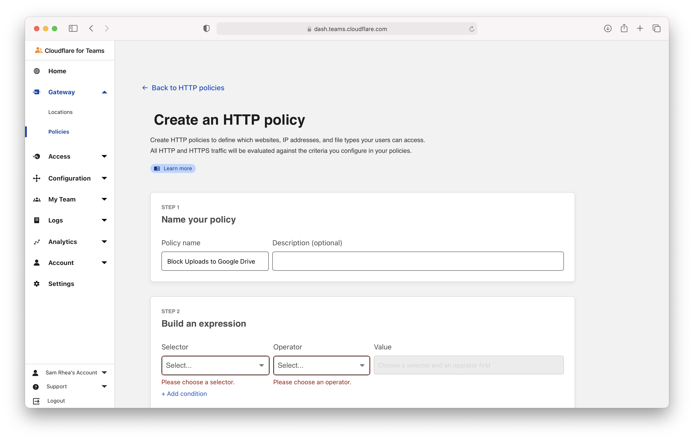
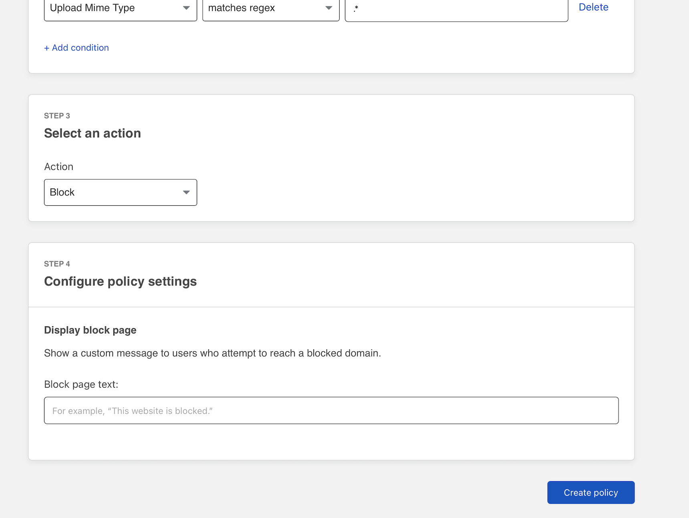
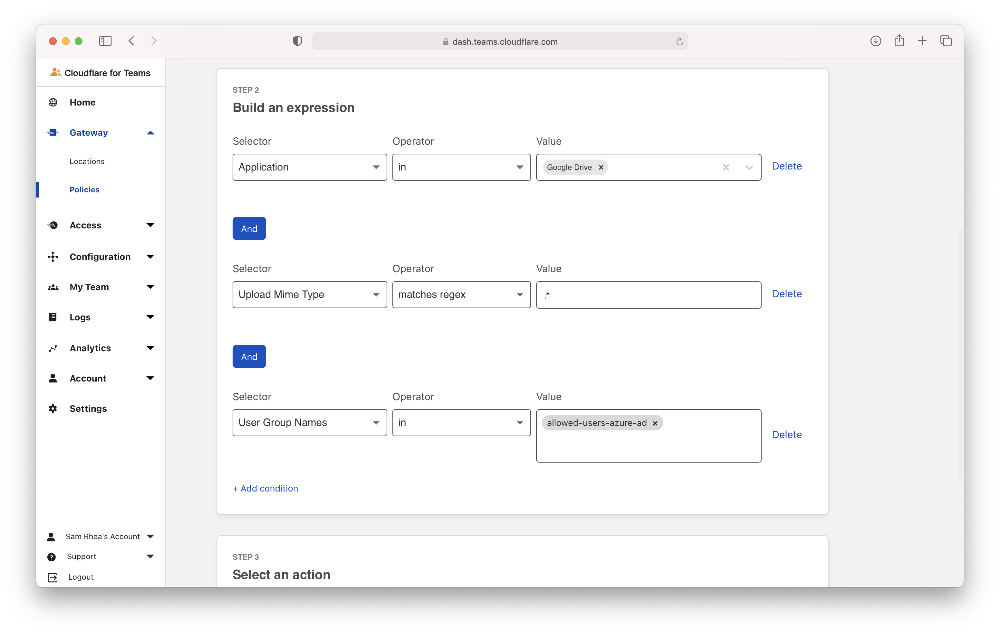
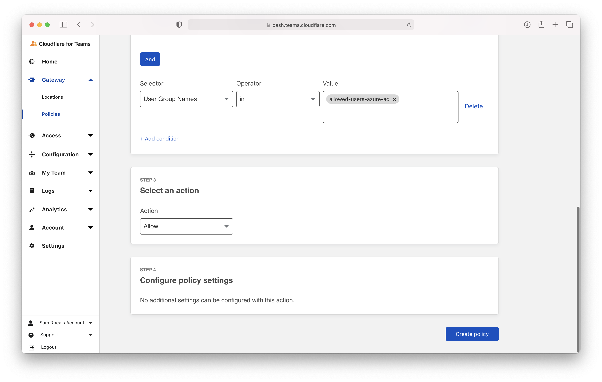
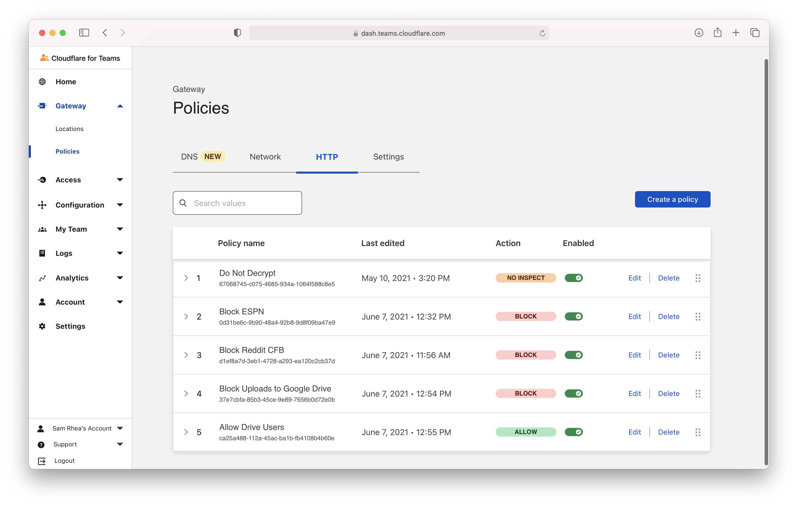

# Block file uploads to Google Drive

You can use Cloudflare Gateway and the Cloudflare WARP client application to prevent enrolled devices from uploading files to an unapproved cloud storage provider.

**🗺️ This tutorial covers how to:**

* Create a Gateway policy to block file uploads to a specific provider
* Enroll devices into a Cloudflare for Teams account where this rule will be enforced
* Log file type upload attempts

**⏲️ Time to complete:**

10 minutes

## Create a Gateway HTTP policy

You can [build a policy](/policies/filtering/http-policies) that will block file uploads to Google Drive. Navigate to the `Policies` page. On the HTTP tab, click `Create a policy`.

Name the policy and provide an optional description.

Cloudflare curates a constantly-updating list of the hostnames, URLs, and endpoints used by common applications. In this example, "Google Drive" list containst the destinations used by Google Drive.

In the rule builder, select "Application" in the **Selector** field, "in" in the **Operator** field, and under "File Sharing" select "Google Drive" in the **Value** field.

Next, click **+ Add Condition** and choose "Upload Mime Type" and "matches regex". Under value, input `.*` - this will match against files of any type being uploaded.

Scroll to **Action** and choose "Block". Click **Create rule** to save the rule.

## Exempt some users

You can allow certain users to upload to Google Drive, while blocking all others, by adding a second policy and modifying the order of rule operations in Gateway.

Create a new policy and include the first two values from the previous policy. Add a third condition and input the value of user identity that should be allowed to upload. This example uses the name of a group from an integrated identity provider.

Select `Allow` for the action and save the rule.

Next, modify the existing rule order.

Drag the `Allow` rule higher than the `Block` rule.

## Integrate your identity provider

The HTTP filtering policy created will apply to any HTTP requests sent from configured locations or enrolled devices. You can begin to [enroll devices](/connections/connect-devices/warp/deployment) by determining which users are allowed to enroll.

Navigate to the `Configuration` section of the Cloudflare for Teams dashboard and select `Authentication`. Cloudflare for Teams will automatically create a "One-time PIN" option which will rely on your user's emails. You can begin using the one-time PIN option immediately or you can integrate your corporate [identity provider](/identity/idp-integration) as well.

## Determine which devices can enroll

Next, build a rule to decide which devices can enroll in your account. Navigate to the `Devices` page in the `My Teams` section of the sidebar.

Click **Manage enrollment rules** to build the enrollment Next, click **Add a rule** to begin.

You can determine who is allowed to enroll using criteria including Access groups, groups from your identity provider, email domain, or named users. This example allows any user with a `@cloudflare.com` account to enroll.

Return to the top of the page and click **Add rule**.

On the next page, click **Save rules** to conclude.

## Configure the Cloudflare certificate

To inspect traffic, Cloudflare Gateway requires that a [certificate be installed](/connections/connect-devices/warp/install-cloudflare-cert) on enrolled devices. You can also distribute this certificate through an MDM provider. The example below describes the manual distribution flow.

Download the Cloudflare certificate provided in the [instructions here](/connections/connect-devices/warp/install-cloudflare-cert). You can also find the certificate in the Cloudflare for Teams dashboard - navigate to the `Account` page in the `Settings` section of the sidebar and scroll to the bottom.

Next, follow [these instructions](/connections/connect-devices/warp/install-cloudflare-cert) to install the certificate on your system.

## Enable the Cloudflare proxy

Once the certificate has been installed, you can configure Gateway to inspect HTTP traffic. To do so, visit the `Settings` tab in the `Policies` page. Toggle `Proxy Settings` to **Enabled**. This will tell Cloudflare to begin proxying any traffic from enrolled devices, except the traffic excluded using the [split tunnel](/connections/connect-devices/warp/exclude-traffic) settings.

Next, enable TLS decryption. This will tell Cloudflare to begin decrypting traffic for inspection from enrolled devices, except the traffic excluded from inspection.

## Enroll a device

Follow the [instructions](/connections/connect-devices/warp/deployment) to install the WARP client depending on your device type. Cloudflare Gateway does not need a special version of the client.

Once installed, click the gear icon.

Under the `Account` tab, click `Login with Cloudflare for Teams`.

Input your Cloudflare for Teams org name. You will have created this during the Cloudflare Access setup flow. You can find it under the `Authentication` tab in the `Access` section of the sidebar.

The user will be prompted to login with the identity provider configured in Cloudflare Access. Once authenticated, the client will update to `Teams` mode. You can click the gear to toggle between DNS filtering or full proxy. In this use case, you must toggle to `Gateway with WARP`. These settings can be configured globally for an organization through a device management platform.

## Test policy

You can test the policy by attempting to upload a file to Google Drive. Google Drive should return an error message when blocked.

