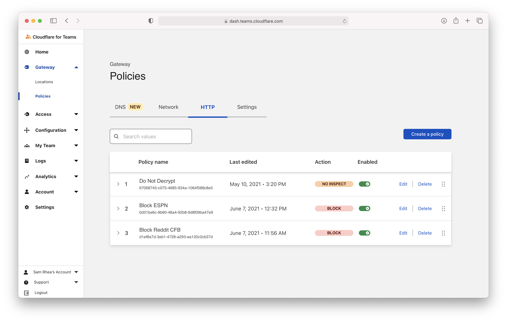
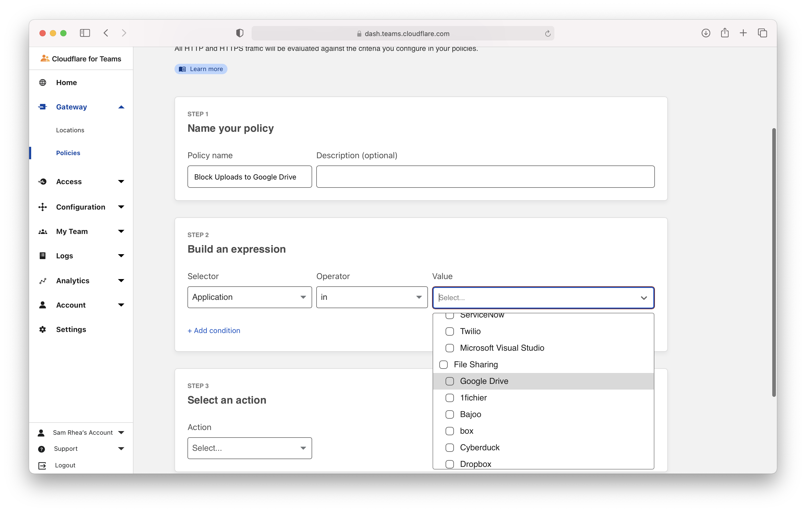
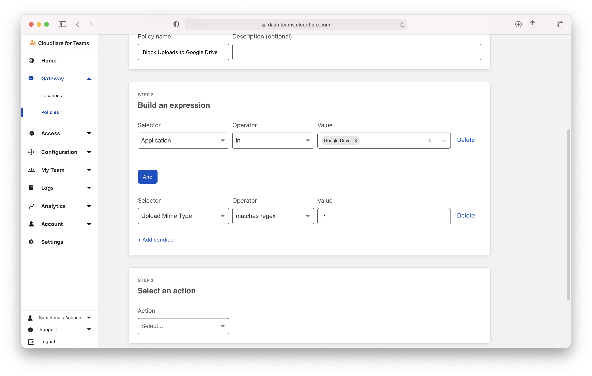
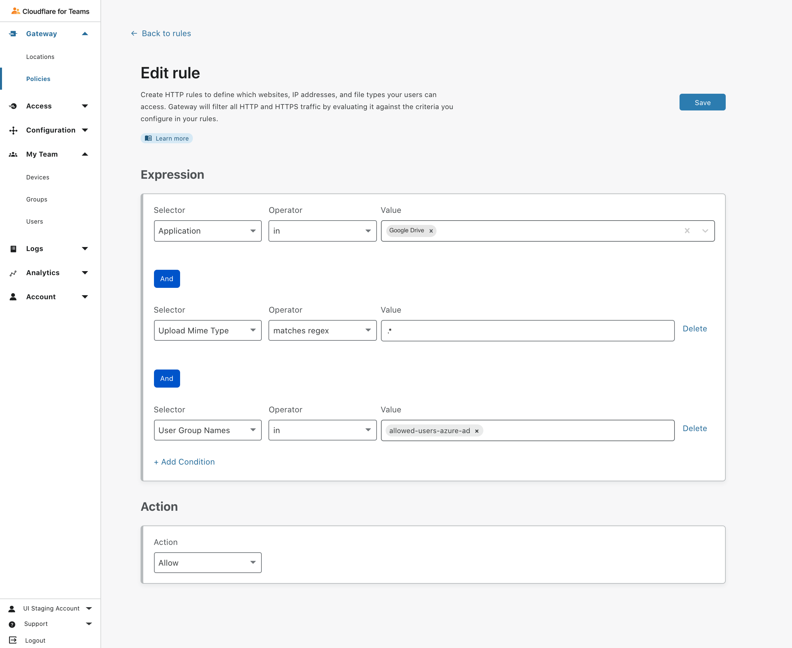
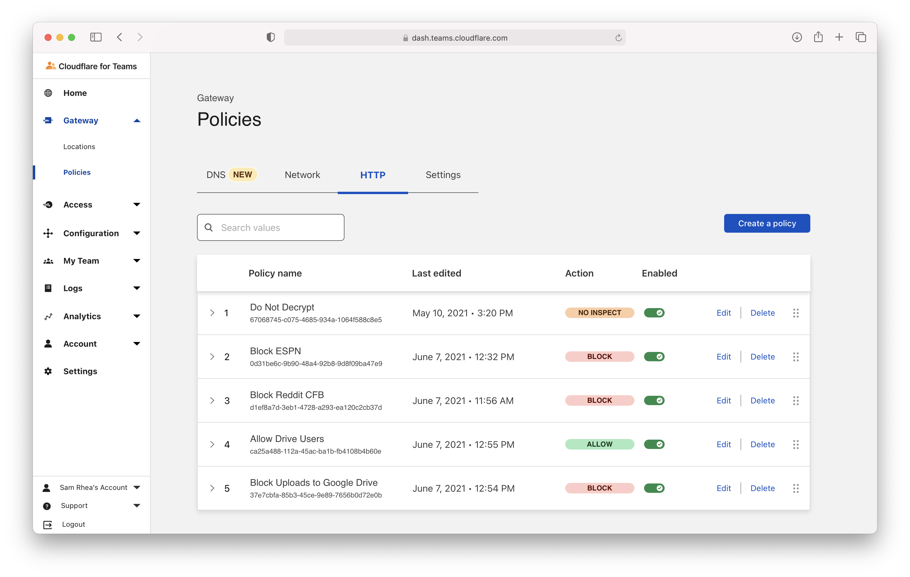
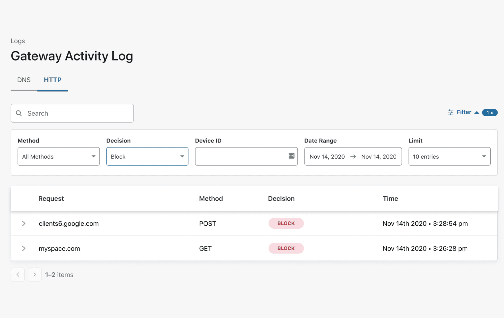

# Block file uploads to Google Drive

You can use Cloudflare Gateway and the Cloudflare WARP client application to prevent enrolled devices from uploading files to an unapproved cloud storage provider.

**🗺️ This tutorial covers how to:**

* Create a Gateway policy to block file uploads to a specific provider
* Enroll devices into a Cloudflare for Teams account where this rule will be enforced
* Log file type upload attempts

**⏲️ Time to complete: 10 minutes**

| Before you start |
|---|---|
1. [Connect devices](https://developers.cloudflare.com/cloudflare-one/connections/connect-devices/warp) to Cloudflare's edge with the WARP client and [install the root certificate](/connections/connect-devices/warp/install-cloudflare-cert)
1. [ Enable web inspection](/connections/connect-devices/warp/control-proxy)

## Create a Gateway HTTP policy

You can [build a policy](/policies/filtering/http-policies) that will block file uploads to Google Drive. Navigate to the `Policies` page. On the HTTP tab, click `Add a policy`.

Cloudflare curates a constantly-updating list of the hostnames, URLs, and endpoints used by common applications. In this example, "Google Drive" list containst the destinations used by Google Drive.

In the rule builder, select "Application" in the **Selector** field, "in" in the **Operator** field, and under "File Sharing" select "Google Drive" in the **Value** field.

Next, click **+ Add Condition** and choose "Upload Mime Type" and "matches regex". Under value, input `.*` - this will match against files of any type being uploaded.

Scroll to **Action** and choose "Block". Click **Create rule** to save the rule.

## Change rule precedence

You can control the order of rule operations in the Gateway policies page. If you need to allow certain users in your organization to upload files, create a rule with the same first two expressions and add a condition that specifies the user or group. Instead of "Block" choose "Allow" in the **Action** field.

Rank the Allow rule higher than the Block rule.

## Test policy

You can test the policy by attempting to upload a file to Google Drive. Google Drive should return an error message when blocked.

## View Logs

Once enabled, if a user attempts to upload a file you can view logs of the block.

Navigate to the `Logs` section of the sidebar and choose `Gateway`. Open the Filter action and select `Block` from the dropdown under `Decision`.

