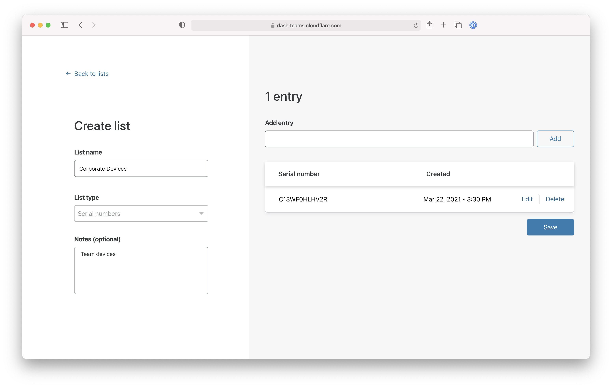

# Require corporate devices

You can use Cloudflare Access to require team members to connect to self-hosted or SaaS applications from a device that your team owns or manages.

**🗺️ This walkthrough covers how to:**

* Create or upload a list of devices in your inventory
* Deploy Cloudflare WARP, the Cloudflare for Teams agent, to collect device information
* Build a Zero Trust rule that requires users to connect from devices in your inventory

**⏲️Time to complete: 30 minutes**

## Create or upload a list of devices

Navigate to `dash.teams.cloudflare.com` and select the `Lists` page from the Configuration section of the sidebar. Click **Create manual list**. You can also upload a CSV list.

Give your list a name and choose `Serial numbers` from the List type field.

Input the serial numbers of the devices your team manages. For larger teams, we recommend uploading a CSV or using Cloudflare's API endpoint. Click **Save**.

Once saved, the serial number list will appear in your list view.

## Deploy Cloudflare WARP

Cloudflare Access relies on the Cloudflare for Teams agent, WARP, to gather the serial number of a device attempting to reach a policy.

In order to allow users to authenticate, you must deploy the WARP agent in proxy mode and users must enroll into your Cloudflare for Teams account.

## Build a Zero Trust rule

You can now add this requirement to existing or new applications.

To add to an existing application, choose the specific resource from the `Applications` page in the Access section of the sidebar. Click **Edit**.

Select the **Rules** tab and edit the existing rule in place.

