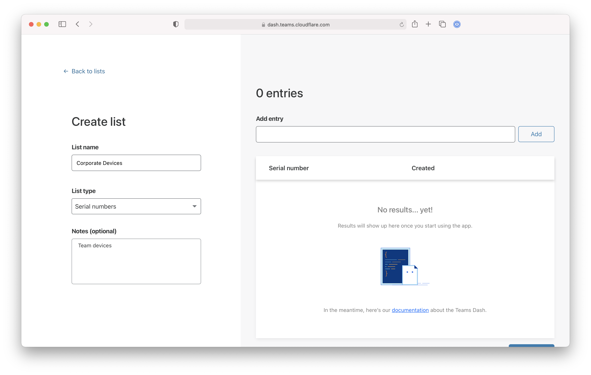

# Require corporate devices

You can use Cloudflare Access to require team members to connect to self-hosted or SaaS applications from a device that your team owns or manages.

**🗺️ This walkthrough covers how to:**

* Create or upload a list of devices in your inventory
* Deploy the Cloudflare WARP client to collect device information
* Build a Zero Trust policy that requires users to connect from devices in your inventory

**⏲️Time to complete:**

30 minutes

## Create or upload a list of devices

1. Navigate to the [Teams Dashboard](dash.teams.cloudflare.com).
1. Go to **My Team > Lists**.
1. Click **Create manual list**. You can also upload a CSV list.
1. Give your list a name and choose `Serial numbers` from the List type field.

    

1. Input the serial numbers of the devices your team manages. For larger teams, we recommend uploading a CSV or using Cloudflare's API endpoint. Click **Save**.

Once saved, the serial number list will appear in your list view.

## Deploy Cloudflare WARP

Cloudflare Access relies on the Cloudflare for Teams client, WARP, to gather the serial number of a device attempting to reach a policy.

In order to allow users to authenticate, you must [deploy the WARP agent](/tutorials/gw-rollout-guide#configure-device-policies) in proxy mode and [users must enroll](/tutorials/gw-rollout-guide#enroll-the-cloudflare-for-teams-agent-for-dns-filtering) into your Cloudflare for Teams account.

## Build a Zero Trust policy

You can now add this corporate device requirement to existing or new applications.

1. Navigate to the [Teams Dashboard](dash.teams.cloudflare.com) to begin.

1. To add to an existing application, choose the specific resource from the **Applications** page in the Access section of the sidebar. Click **Edit**.

1. Select the **Rules** tab and edit the existing rule in place.

1. Add a `Require` rule and choose `Device Posture - Serial Number List` from the drop down menu. Choose the list of devices to require and click **Save rule**.

    

Once saved, any device attempting to reach the application in this example will both need to be in the `@cloudflare.com` domain and connecting from a device that uses Cloudflare WARP and presents a serial number in the list created.

You can build this rule as a [reuseable policy](/tutorials/default-groups) to save time adding it to other applications.