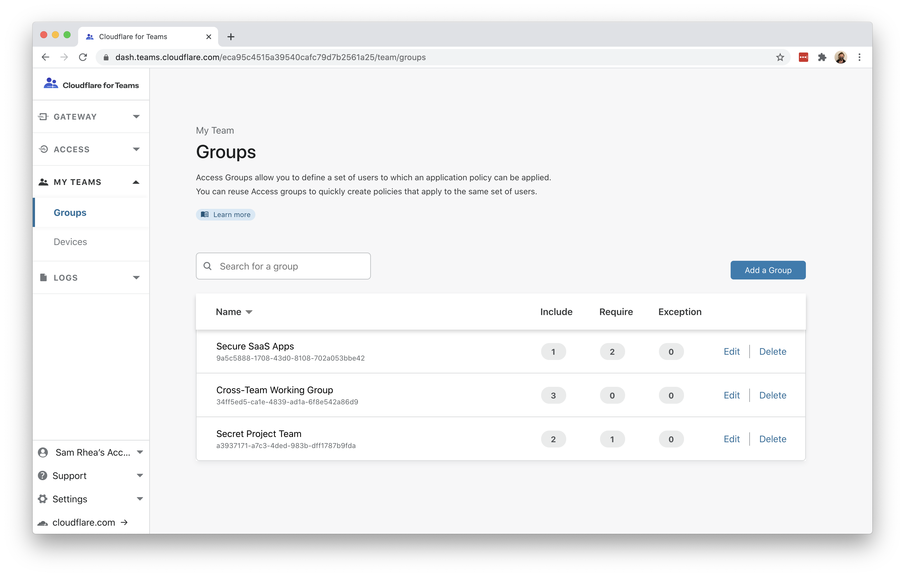
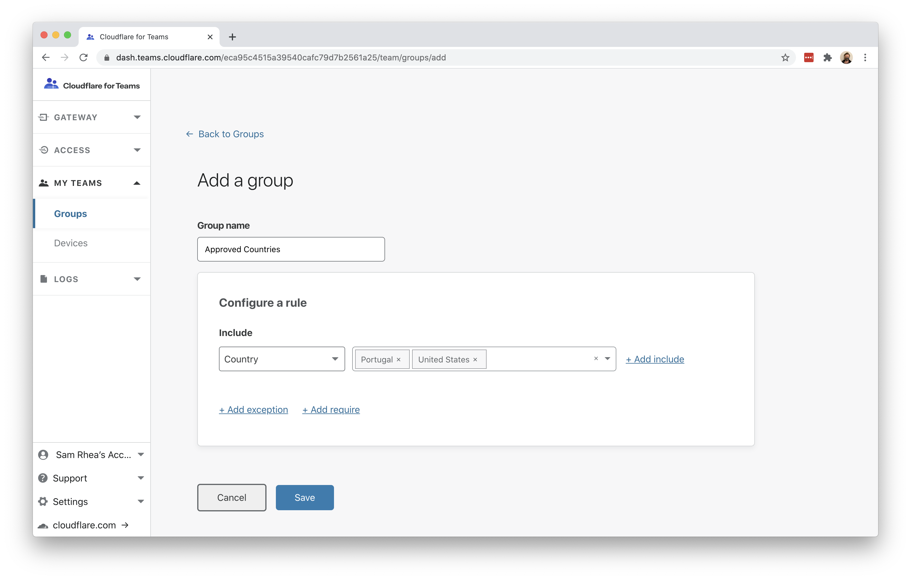
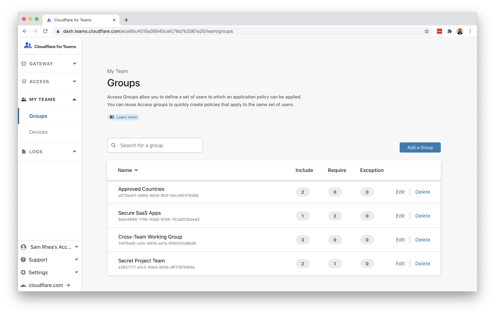
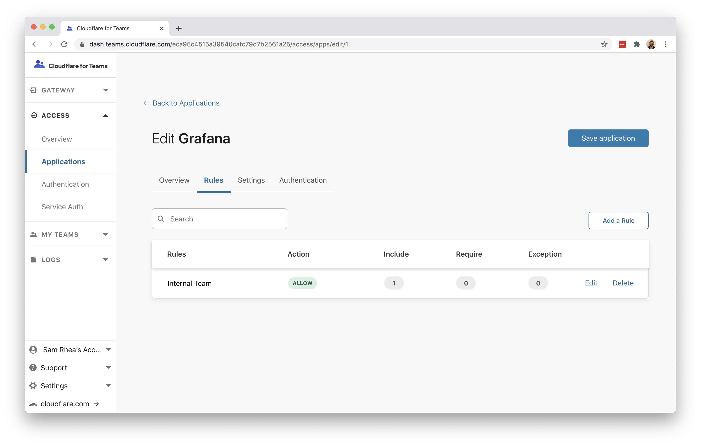
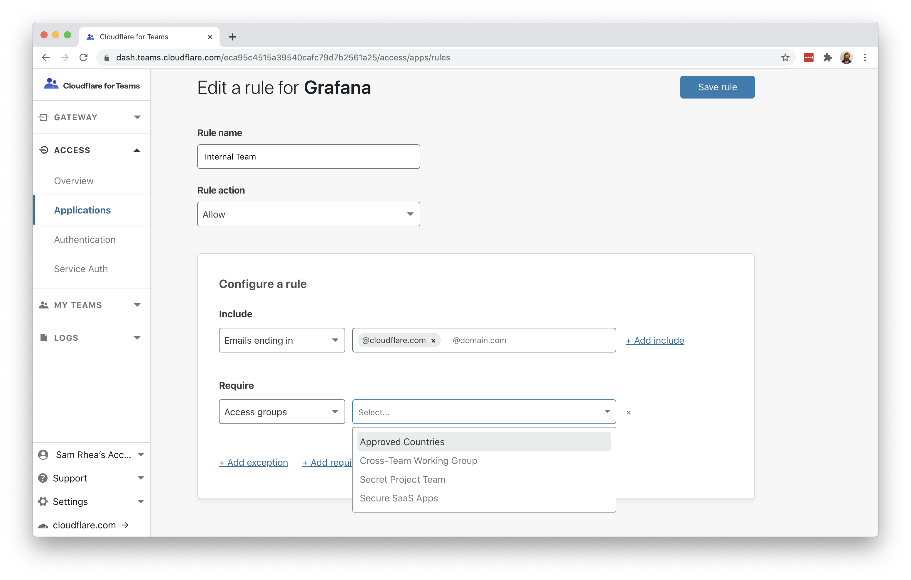

# Require specific countries

You can use Cloudflare Access to require team members to connect to self-hosted or SaaS applications from a list of approved countries.

Before you build the rule, you'll need to follow [these instructions](https://developers.cloudflare.com/access/getting-started/access-setup) to set up Cloudflare Access in your account.

**🗺️ This walkthrough covers how to:**

* Create a list of approved countries where a team operates
* Require that users connecting to self-hosted or SaaS applications connect from those countries

**⏲️Time to complete: ~5 minutes**

## Create an approved country list

Navigate to the `Groups` page in the `My Teams` section of the Cloudflare for Teams dashboard. Click `Add a Group`.

Groups contain criteria that you can reuse in Access policies. Additionally, groups can allow you to nest certain operators inside of rules in the Access policy.

For example, `Include` rules work like `OR` operators - anything in the list will meet the criteria. However, if you include values in the Require field, these work like `AND` operators. Since you cannot connect from multiple countries at the same time, you must use a group to define a list of options that can be used inside of a `Require` rule in the policy.

Click `Add a Group`. In the next page, select `Country` from the `Include` dropdown and add two or more countries.

Click `Save`.

## Build a policy

You can now build Access policies that will require at least one country in the approved countries list. Navigate to the `Applications` page in the `Access` section of the Cloudflare for Teams dashboard.

You can build this rule for SaaS or self-hosted applications. This example will add the requirement to an existing application, but you can also add it when creating a new application.

Choose an application and click `Edit`.

Select the existing rule and click `Edit`.

Click `+ Add require`. In the dropdown, select `Access groups`. The existing groups will display and choose the name of the group with the approved countries list.

Cloudflare Access will follow the nesting of the group created. In this case, the `Require` rule will require that all of the conditions be met - like an `AND` operator. Since the group has multiple country options,because it was constructed with an `Include` rule like an `OR` operator, meeting at least one of them will be true and allow the user to proceed.