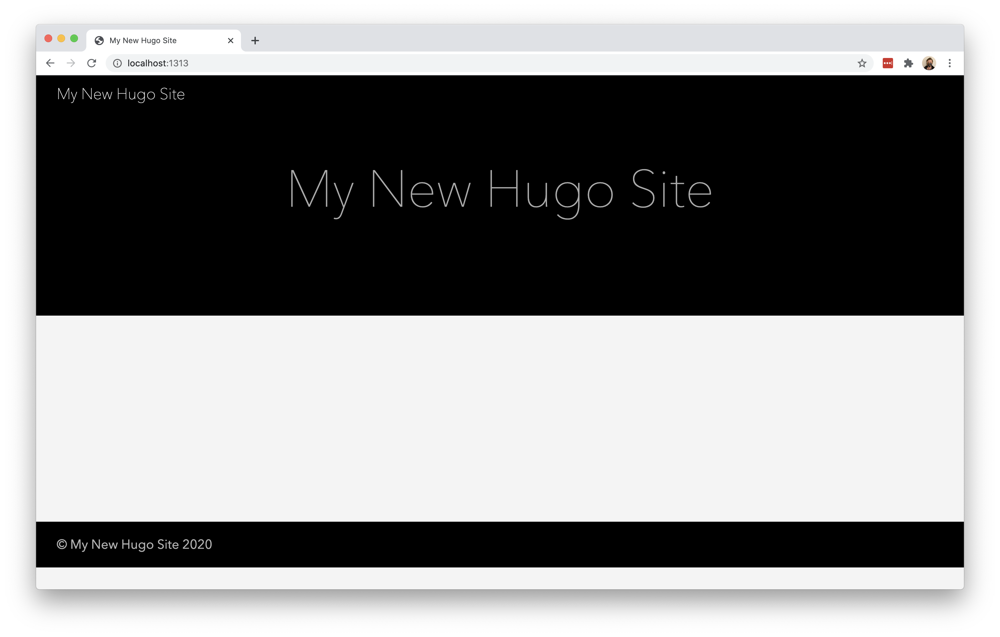
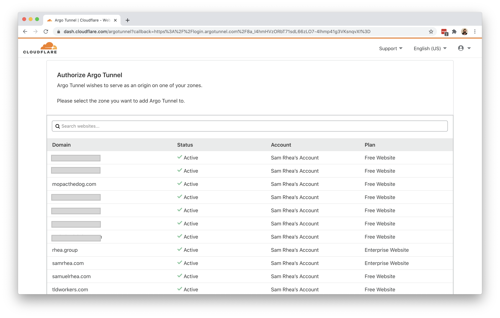
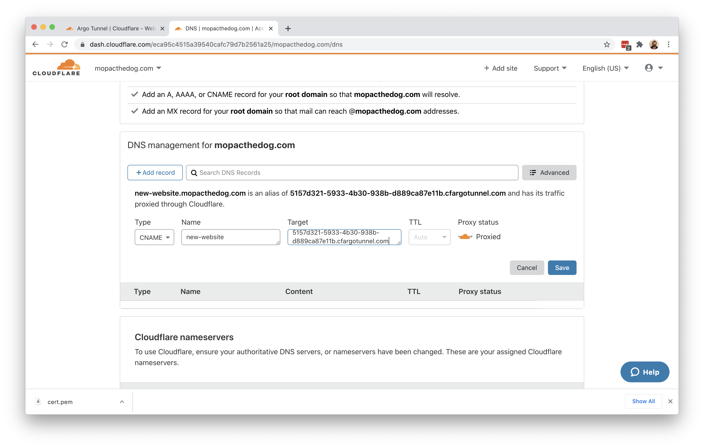

# Connect without long-lived API keys

You can use [Argo Tunnel](/connections/connect-apps) to connect applications and servers to Cloudflare's network without leaving sensitive API keys lingering in your environment. These applications can be both public-facing or protected by [Cloudflare Access](/glossary#cloudflare-access).

**🗺️ This tutorial covers how to:**

* Start a secure, outbound-only, connection from a server to Cloudflare
* Keep that connection running after deleting the initial authentication file
* Give that application a hostname where users can reach the resource

**⏲️Time to complete: ~20 minutes**

## Install `cloudflared`

In this example, the resource being connected is a [Hugo site](https://gohugo.io/getting-started/quick-start/). Hugo, a static site generator, provides a built-in server that can be used for testing changes. That server is available at `localhost:1313` - an address only available currently on the same machine as the server.



To share this work-in-progress with an audience on the Internet, start by [downloading and installing](/connections/connect-apps/install-and-setup) the Argo Tunnel daemon, `cloudflared`. On Mac, you can do so by running the following `brew` command. If you do not have Homebrew, follow the [documentation here](https://docs.brew.sh/Installation) to install it.

`$ brew install cloudflare/cloudflare/cloudflared`

Once installed, run the following command in your Terminal to authenticate this instance of `cloudflared` into your Cloudflare account.

`$ cloudflared login`

The command will launch a browser window and prompt you to login with your Cloudflare account. Choose a website that you have added into your account.



Once you click one of the sites in your account, Cloudflare will download a certificate file, called `cert.pem` to authenticate this instance of `cloudflared`. The `cert.pem` file uses a certificate to authenticate your instance of `cloudflared` and includes an API key for your account to perform actions like DNS record changes.

You can now use `cloudflared` to control Argo Tunnel connections in your Cloudflare account.


## Create a Tunnel

You can now [create an Argo Tunnel](/connections/connect-apps/create-tunnel) that will connect `cloudflared` to Cloudflare's edge. You'll configure the details of that Tunnel in the next step.

Run the following command to create a Tunnel. You can replace `new-website` with any name that you choose. This command requires the `cert.pem` file.

`$ cloudflared tunnel create new-website`

Cloudflare will create the Tunnel with that name and generate an ID and credentials file for that Tunnel.


## Delete the `cert.pem` file

The credentials file is separate from the `cert.pem` file. Unlike the `cert.pem` file, the credentials file consists of a token that authenticates only the Named Tunnel you just created. Formatted as `JSON`, the file cannot make changes to your Cloudflare account or create additional Tunnels.

If you are done creating Tunnels, you can delete the `cert.pem` file, leave only the credentials file, and continue to manage DNS records directly in the Cloudflare dashboard or API. For additional information on the different functions of the two files, see the table in [this section](/connections/connect-apps/create-a-tunnel).

## Configure `cloudflared`

You can now [configure](/connections/connect-apps/configuration) `cloudflared` to route traffic to your local development environment. You can use a configuration file to do so, which makes it easier to start `cloudflared` in the future.

By default, `cloudflared` expects the configuration file at a specific location: `~/.cloudflared/config.yml`. You can modify this location if you want. For this example, we'll keep the default. Create or edit your configuration file using a text editor.

`$ vim ~/.cloudflared/config.yml`

The `url` value is the destination where the new website is available locally. The `tunnel` and `credentials-file` value can be copied from the output of the last command.

```yml
url: http://localhost:1313
tunnel: 5157d321-5933-4b30-938b-d889ca87e11b
credentials-file: /Users/username/.cloudflared/5157d321-5933-4b30-938b-d889ca87e11b.json
```

If you are using the credentials file without the `cert.pem` file, you must specify the Tunnel ID in the `tunnel:` value. You cannot use the Name alone with the credentials file.

## Run Argo Tunnel

At this point, you have created and configured your Argo Tunnel connection. You can now [run that](/connections/connect-apps/run-tunnel) Tunnel. Running it will create connections to Cloudflare's edge. Those connections will not respond to traffic, yet. You'll add DNS records in the next step to share the resource across the Internet.

`$ cloudflared tunnel run`

## Create DNS records

You can now [route traffic](/connections/connect-apps/routing-to-tunnel) to your Tunnel, and on to your local server, using Cloudflare DNS. Visit the [Cloudflare dashboard](https://dash.cloudflare.com), select a website, and click on the `DNS` tab.

Click `+Add record` and choose `CNAME`. In the `Name` field, add the name of the subdomain of your new site. In the `Content` field, paste the ID of your Tunnel created earlier and append `cfargotunnel.com`.

`5157d321-5933-4b30-938b-d889ca87e11b.cfargotunnel.com`



Alternatively, you can create a DNS record from `cloudflared` directly.

Once saved, you can share the subdomain created and visitors can reach your local web server environment.