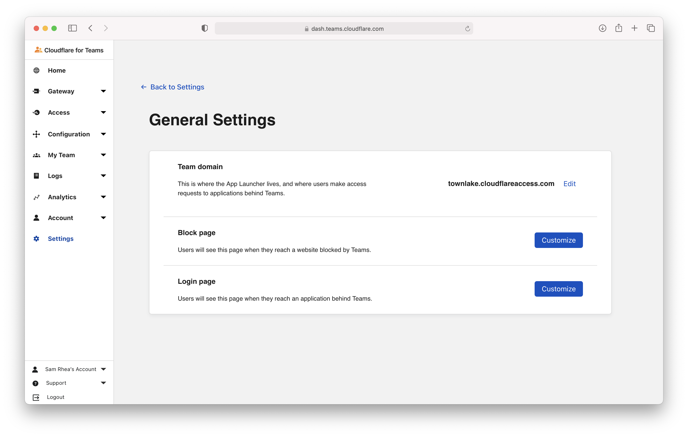
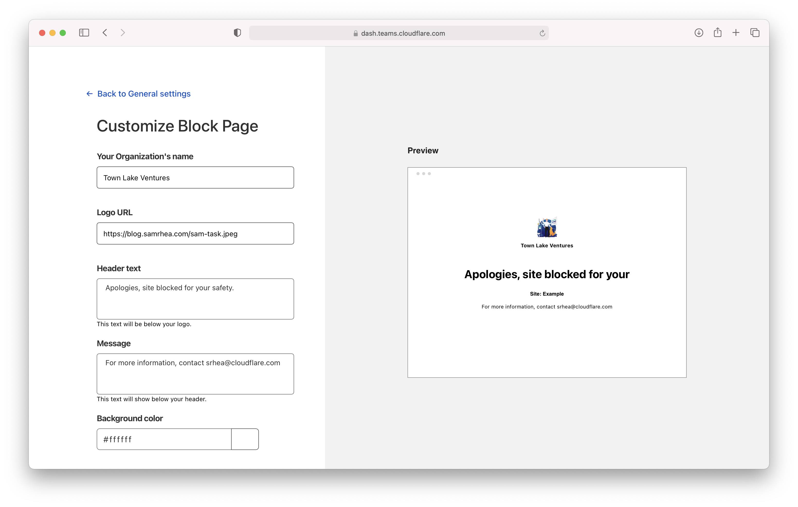
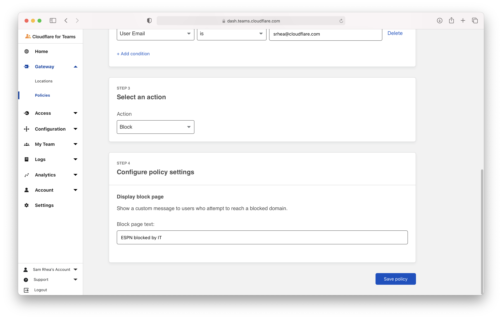
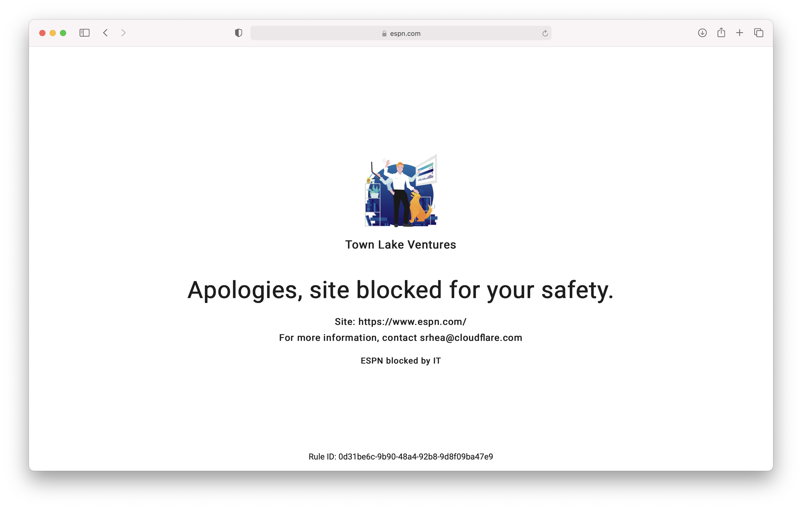

# Customize the block page presented to users

Cloudflare Gateway can present users with a block page when a DNS or HTTP filtering policy applies a block action. Your team can customize the block page with branding from your organization, additional messaging, and messaging specific to particular rules.

To present this block page, in either DNS or HTTP filtering mode, users must have the Cloudflare certifiate [installed on their devices](/connections/connect-devices/warp/install-cloudflare-cert).

**🗺️ This walkthrough covers how to:**

* Create a custom block page for your users
* Customize the text presented for specific rules

**⏲️ Time to complete:**

10 minutes

## Before you start

1. [Add Gateway to your account](/setup)
1. [Add the Cloudflare certificate to devices in your organization](/connections/connect-devices/warp/install-cloudflare-cert)

---

## Customize the block page

Navigate to the `Settings` page of the Cloudflare for Teams dashboard. Select `General`.

Click **Customize** on the **Block page** row.

You can use the next page to modify the name of your organization and the text presented. You can also add a URL for your team's logo and modify the background color. Click **Save** once you have finished your edits.

## Customize text for a specific rule

Cloudflare Gateway can modify your custom block page to present text specific to particular rules. For example, if you have a particular rule that should include additional clarifying text, the user will see that in the block page.

Edit one of your existing policies or create a new one. If the policy is a `Block`, you will see the option to customize the block page presented.

Input the additional text to be presented to the user.

Now, when the user is blocked by that particular rule they will see your custom block page and the specific text configured.

