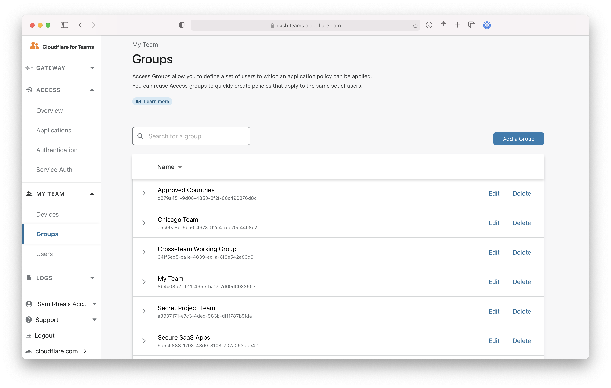
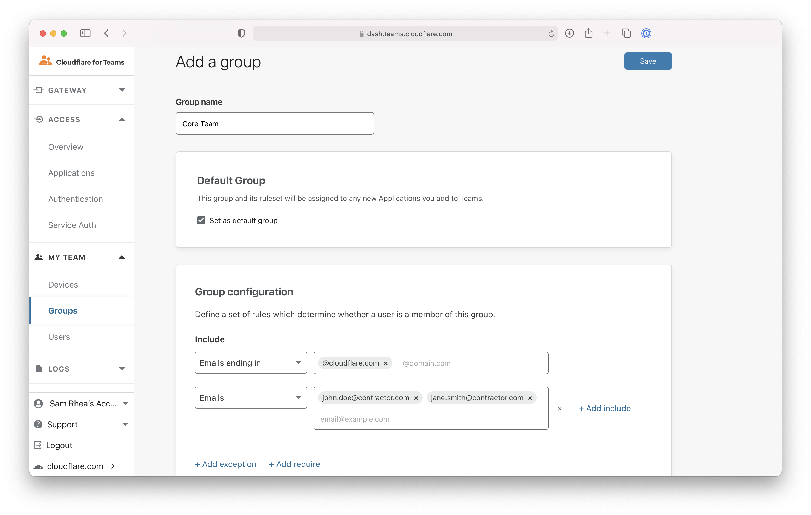
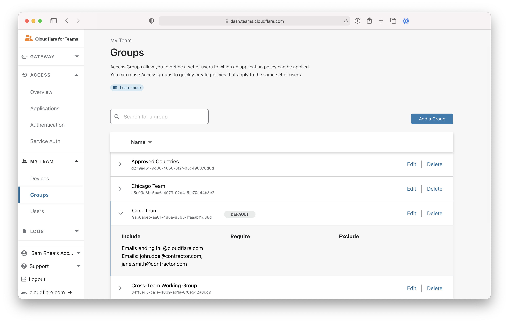
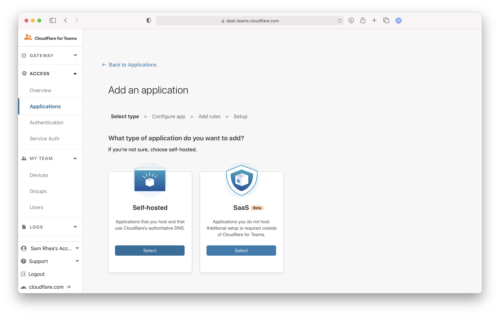
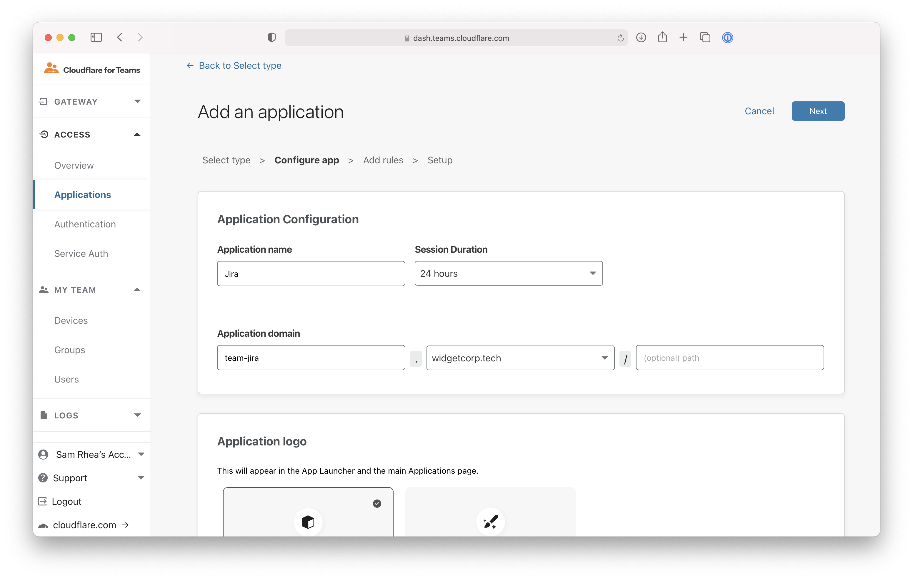
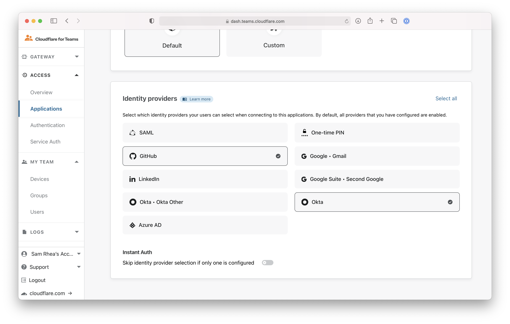
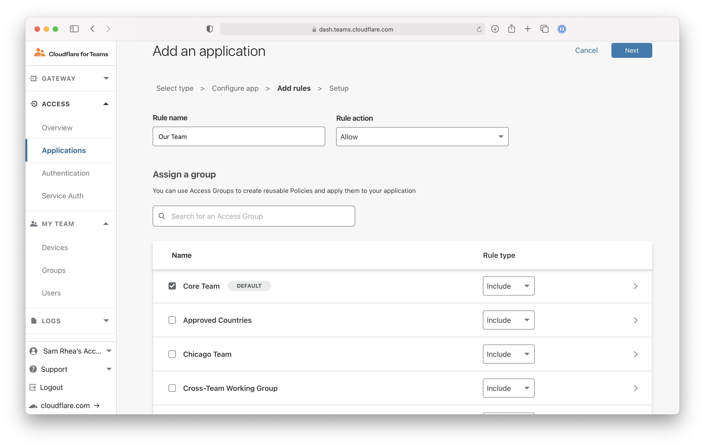
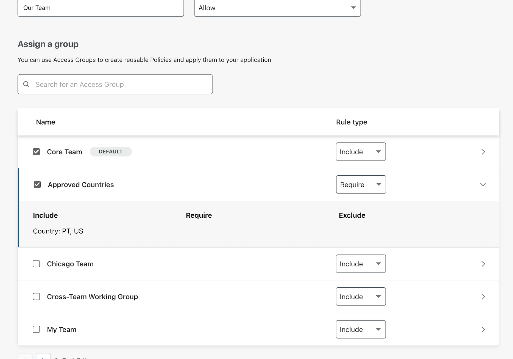
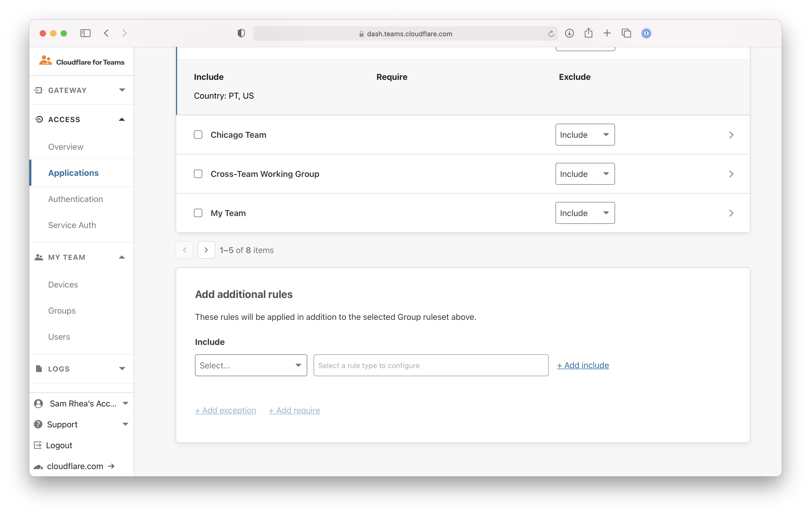

# Create reuseable Zero Trust rules

You can use Cloudflare Access to require team members to connect to self-hosted or SaaS applications from a list of approved countries.

Before you build the rule, you'll need to follow [these instructions](https://developers.cloudflare.com/cloudflare-one/setup) to set up Cloudflare Access in your account.

**🗺️ This walkthrough covers how to:**

* Build a Zero Trust rule once and set it as the default for your account
* Use that rule when adding an application to Cloudflare Access
* Combine that default rule with other rules for additional customization

**⏲️Time to complete: 10 minutes**

## Create a default group

Navigate to the `Groups` page in the `My Teams` section of the Cloudflare for Teams dashboard.

Groups contain criteria that you can reuse in Access policies. Additionally, groups allow you to nest certain operators within rules in the Access policy.

For example, `Include` rules work like `OR` operators - anything in the list will meet the criteria. However, if you include values in the Require field, these work like `AND` operators.

You can set a group to be the default for your Cloudflare for Teams account. Any new policy that you create will, by default, include that group as its basic rule. To make an existing group the default, click **Edit**. To create a new group as the default, click **Add a Group**.

This example creates a new default group which will allow anyone with an `@cloudflare.com` address or the two contractor emails to reach an assigned application. Click **Save**.

The page will tag the default group as `Default`. You can quickly see the rule contents by clicking on the arrow to the left to expand the rules inside of a group.

## Use a default group

You can now use this group in any new or existing application. To add to a new application, navigate to the `Applications` page in the `Access` section of the Cloudflare for Teams dashboard.

Click **Add an application**.

Groups can be used in both self-hosted and external SaaS applications. This example uses a self-hosted application.

In the next page, give the application a name and set the subdomain or URL where the Access policy will apply.

Lower on the page, you can also choose which identity providers can be used to authenticate for this specific application. In this example, the employees will use Okta while contractors will login with GitHub.

On the next page, Access will already have toggled the default rule to apply to the application. If saved at this point, any user attempting to reach `team-jira.widgetcorp.tech` must authenticate with an `@cloudflare.com` address or must be one of the two contractor users set in the default group. If you don't want to use it, you can uncheck the box and add manual rules.

You can also combine multiple groups. Another group listed here, `Approved Countries`, contains countries where this particular team operates. You can add this type of group to the policy. Instead of setting this as an `Include`, setting it as a `Require` will require that users connect from one of the countries in the list - in addition to having either an `@cloudflare.com` or specified contactor username.

Finally, you can add manual one-off rules at the bottom of the page.

Click **Next** to finish creating the application.

## Change a Group once and update all applications

Going forward, you can make edits once to the default group that will apply to any application that uses the group. For example, if a third contractor is added to the team you can add them to any application that uses the default group by editing the group itself.