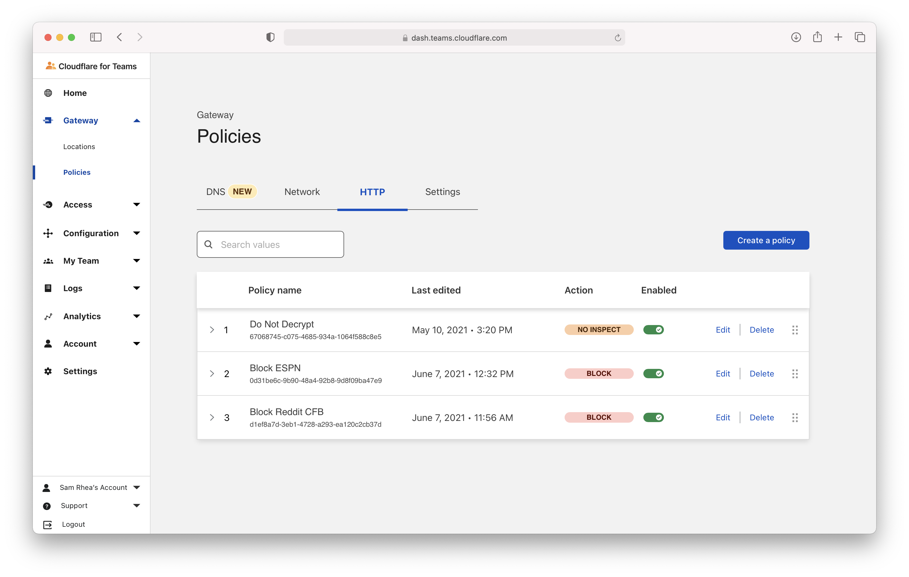
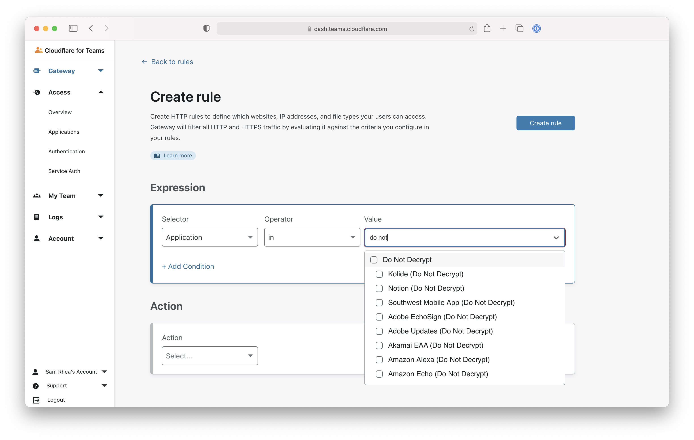
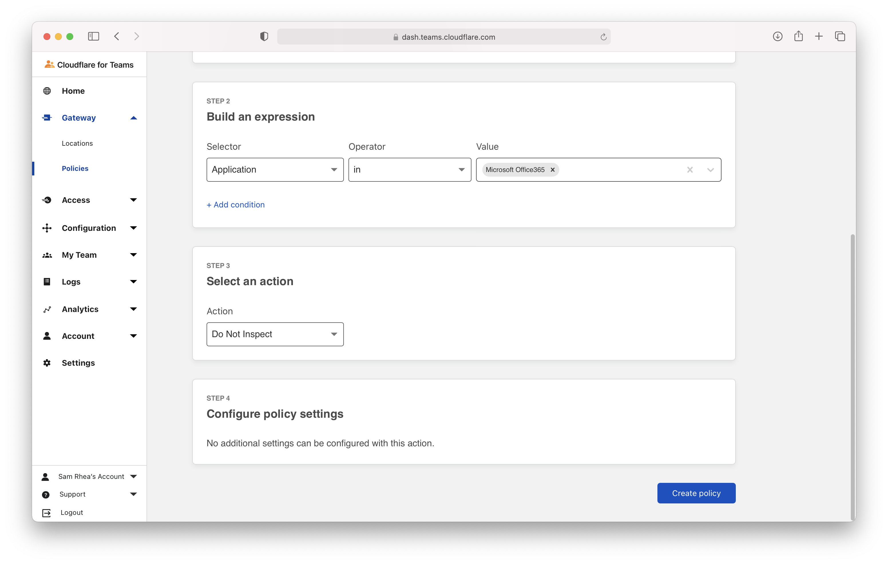
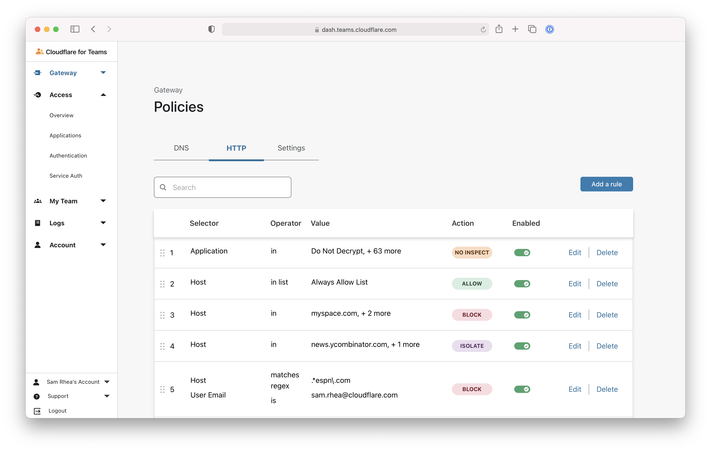

# Skip inspection for groups of applications

Some common applications and resources, like endpoints used by Zoom or Apple, rely on certificate pinning. The TLS inspection performed by a service like Cloudflare Gatway will cause errors when users visit those applications.

Cloudflare for Teams has compiled a list of resources that rely on this mechanism and you can use this list to quickly exclude these endpoints from inspection. You can also use this same workflow to exclude any application from Cloudflare Gateway's inspection.

**🗺️ This walkthrough covers how to:**

* Build a `Do not inspect` policy using Cloudflare's list of certificate pinned resources
* Configure that policies precedence in your Gateway configuration

**Before you start:**

1. [Connect devices](https://developers.cloudflare.com/cloudflare-one/connections/connect-devices/warp) to Cloudflare's edge with the WARP client and [install the root certificate](/connections/connect-devices/warp/install-cloudflare-cert)
1. [ Enable web inspection](/connections/connect-devices/warp/control-proxy)

**⏲️ Time to complete: 5 minutes**

## Build the policy

Navigate to the **HTTP** tab of the `Policies` page in Cloudflare Gateway. Click **Add a rule**.

Under **Selector** choose **Application**. Select **in** in the **Operator field**. For value, type "Do Not Decrypt" or scroll to that section. Select the top-level "Do Not Decrypt" item.

Cloudflare Gateway will automatically include all of the endpoints known to perform certificate pinning. However, this list does not mean that all of Google will be excluded from inspection for example - only those resources within Google that perform certificate pinning.

Scroll to the bottom of the page and select **Do Not Inspect** and click **Create rule**.

## Change rule precedence

New rules are saved at the bottom of the rule list in Gateway. Gateway evaluates rules from top-to-bottom. We recommend dragging the **Do Not Inspect** rule to the top of the list so that it always applies first.

