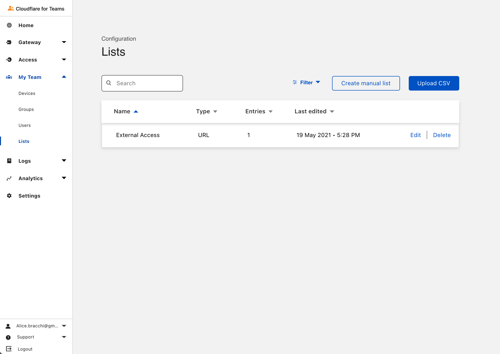
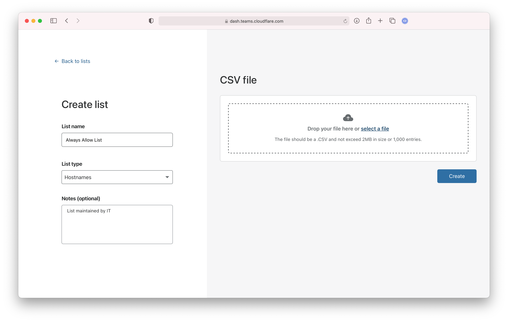
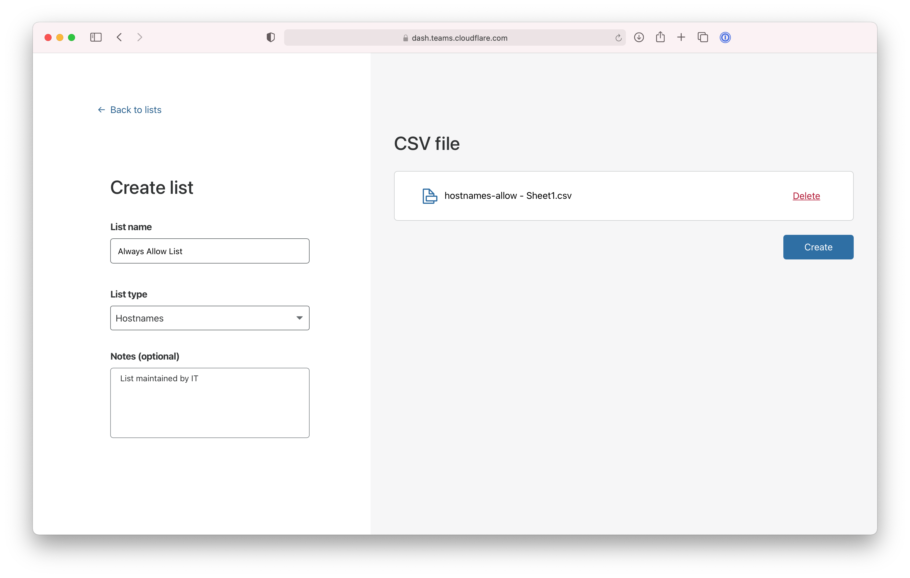
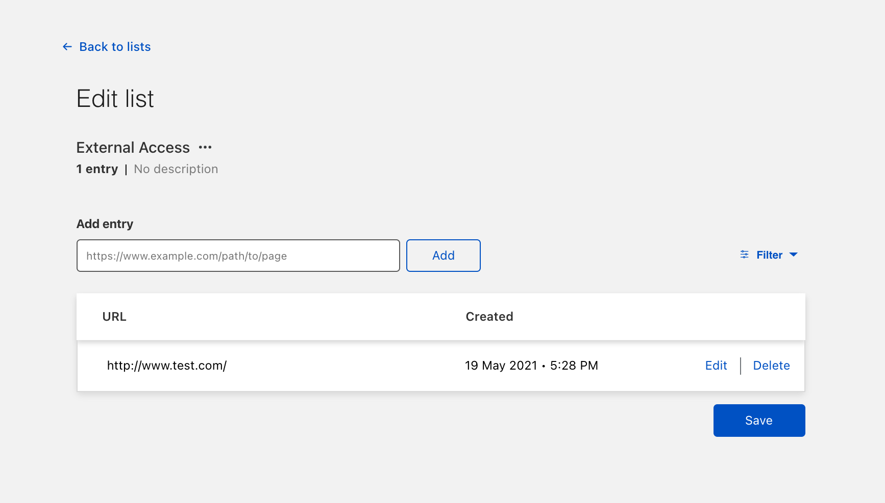
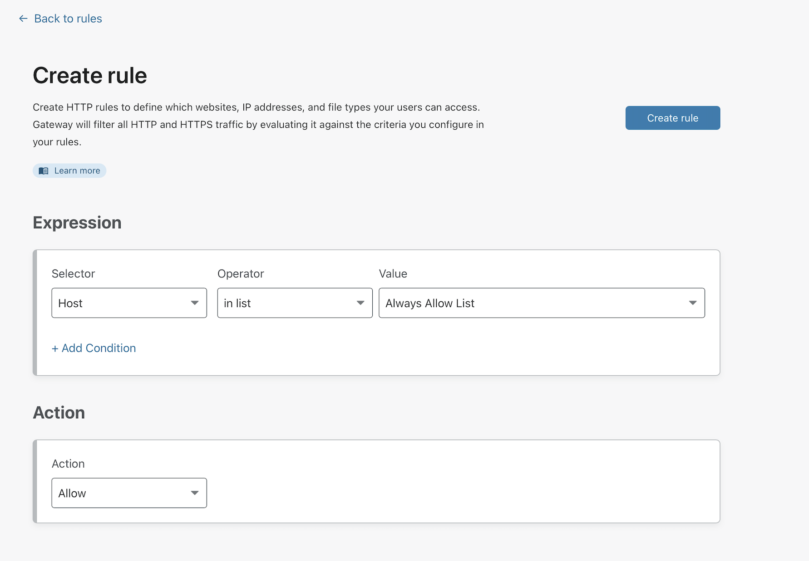
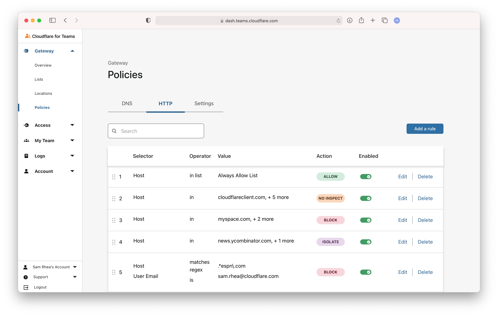

# Upload and use a list of objects

You can upload and manage lists of objects to use in Gateway rules. These lists can include:

|Object|Example|
|---|---|
|Hostname|`foo.app.com`|
|URL|`https://foo.app.com/admin`|
|Email| `user@cloudflare.com` |

You can then use these lists in Gateway policies to block, allow, isolate or exclude from decryption.

**🗺️ This walkthrough covers how to:**

* Upload a CSV of hostnames into a list
* Manage the list in the Teams dashboard
* Use the list in a Gateway policy

**⏲️ Time to complete:**

10 minutes

## Upload a CSV

You can manually create a list or upload a CSV to Cloudflare for Teams.

1. To begin, navigate to the [Teams Dashboard](https://dash.teams.cloudflare.com) and go to **My Team > Lists** page.

1. Click **Upload CSV** to add a CSV.

1. Name the list and choose its type. A list can only include objects of the same type. You can add an optional comment. Next, click **select a file** and then **Create**.

    

The list will begin to upload and confirm if successful.

## Review upload

The next page will present the items uploaded through the CSV. You can edit or remove individual items. You can also return to this page if you want to make edits, additions, or removals in the future.

Click **Save** to proceed.

## Use a list

You can now use the list in the Cloudflare gateway rule builder. This example uses a hostname list, so the selector is `Host`. Choose `in list` and select the specific list from the drop down.

You can now modifiy the rule precedence of the list-based rule in the UI by dragging and dropping the row.

