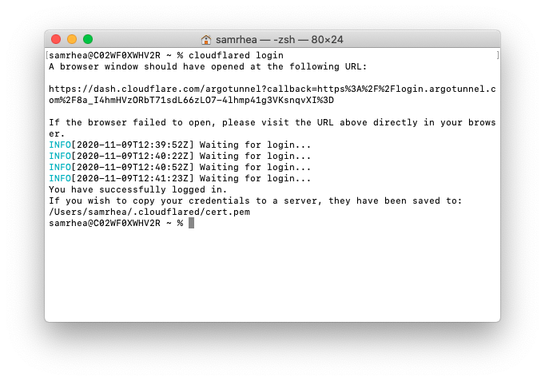

# Secure GitLab with Zero Trust Rules for SSH and HTTP

You can use Cloudflare Access to add Zero Trust rules to a self-hosted instance of GitLab. Combined with Argo Tunnel, users can connect through HTTP and SSH and authenticate with your team's identity provider.

**🗺️ This walkthrough covers how to:**

* Deploy an instance of GitLab
* Lock down all inbound connections to that instance and use Argo Tunnel to set outbound connections to Cloudflare
* Build policies with Cloudflare Access to control who can reach GitLab
* Connect over HTTP and SSH through Cloudflare

**⏲️Time to complete: 1 hour**

---

## Deploying GitLab

This section walks through deploying GitLab in Digital Ocean. If you have already deployed GitLab, you can skip this section.

Create a Droplet that has 16 GB of RAM and 6 CPUs. This should make it possible to support 500 users, based on [GitLab's resource recommendations](https://docs.gitlab.com/ee/install/requirements.html).


GitLab will provide an external IP that is exposed to the Internet (for now). You will need to connect to the deployed server using this external IP for the initial configuration. You can secure connections to the IP by [adding SSH keys](https://www.digitalocean.com/community/tutorials/how-to-set-up-ssh-keys--2) to your Digital Ocean account.

This example uses a macOS machine to configure the Droplet. Copy the IP address assigned to the machine from Digital Ocean.


Open Terminal and run the following command, replacing the IP address with the IP assigned by Digital Ocean.

```bash
$ ssh root@134.209.124.123
```

Next, install GitLab. This example uses the [Ubuntu package](https://about.gitlab.com/install/#ubuntu) and the steps in the GitLab documentation, with a few exceptions called out below.

Run the following commands to begin.

```bash
sudo apt-get update

sudo apt-get install -y curl openssh-server ca-certificates
curl https://packages.gitlab.com/install/repositories/gitlab/gitlab-ee/script.deb.sh | sudo bash
```

The commands above download the GitLab software to this machine. You must now install it. This is the first place this tutorial will diverge from the operations in the GitLab documentation. The next step in the GitLab-provided tutorial sets an external hostname. Instead, you can just install the software.

```bash
sudo apt-get install gitlab-ee
```

After a minute or so, GitLab will be installed.


However, the application is not running yet. You can check to see what ports are listening to confirm by installing and using `netstat`.

```bash
sudo apt-get install net-tools
sudo netstat -tulpn | grep LISTEN
```

The result should be only the services currently active on the machine:


To start GitLab, run the software's reconfigure command.

```bash
sudo gitlab-ctl reconfigure
```

GitLab will launch its component services. Once complete, confirm that GitLab is running and listening on both ports 22 and 80.


Users connect to GitLab over SSH (port 22 here) and HTTP for the web app (port 80). In the next step, you will make it possible for users to try both through Cloudflare Access. I'll leave this running and head over to the Cloudflare dashboard.

## Securing GitLab with Zero Trust rules

### Building Access policies

You can use Cloudflare Access to build Zero Trust rules to determine who can connect to both the web application of GitLab (HTTP) and who can connect over SSH.

When a user makes a request to a site protected by Access, that request hits Cloudflare's network first. Access can then check if the user is allowed to reach the application. When integrated with Argo Tunnel, the zero-trust architecture looks like this:


To determine who can reach the application, Cloudflare Access relies on integration with identity providers like Okta or AzureAD or Google to issue the identity cards that get checked at the door. While a VPN allows users free range on a private network unless someone builds an active rule to stop them, Access enforces that identity check on every request (and at any granularity configured).

For GitLab, start by building two policies. Users will connect to GitLab in a couple of methods: in the web app and over SSH. Create policies to secure a subdomain for each. First, the web app.

Before you build the rule, you'll need to follow [these instructions](https://developers.cloudflare.com/access/getting-started/access-setup) to set up Cloudflare Access in your account.

Once enabled, navigate to the `Applications` page in the Cloudflare for Teams dashboard. Click `Add an application`.


Choose self-hosted from the options presented.


In the policy builder, you will be prompted to add a subdomain that will represent the resource. This must be a subdomain of a domain in your Cloudflare account. You will need separate subdomains for the web application and SSH flows.

This example uses `gitlab.widgetcorp.tech` for the web application and `gitlab-ssh.widgetcorp.tech` for SSH connectivity.


While on this page, you can decide which identity providers will be allowed to authenticate. By default, all configured providers are allowed. Click `Next` to build rules to determine who can reach the application.

You can then add rules to determine who can reach the site.


Click `Next` and `Next` again on the `Setup` page - this example does not require advanced CORS configuration. Repeat these steps for the second application, `gitlab-ssh.widgetcorp.tech`.


## Cloudflare Argo Tunnel

Cloudflare Argo Tunnel creates a secure, outbound-only, connection between this machine and Cloudflare's network. With an outbound-only model, you can  prevent any direct access to this machine and lock down any externally exposed points of ingress. And with that, no open firewall ports.

Argo Tunnel is made possible through a lightweight daemon from Cloudflare called `cloudflared`. Download and then install that on the Digital Ocean machine with the two commands below.

```bash
sudo wget https://bin.equinox.io/c/VdrWdbjqyF/cloudflared-stable-linux-amd64.deb
sudo dpkg -i ./cloudflared-stable-linux-amd64.deb
```

Once installed, authenticate the instance of `cloudflared` with the following command.

`cloudflared login`

The command will print a URL that you must visit to login with your Cloudflare account.


Choose a website that you have added into your account.


Once you click one of the sites in your account, Cloudflare will download a certificate file to authenticate this instance of `cloudflared`. You can now use `cloudflared` to control Argo Tunnel connections in your Cloudflare account.



### Connecting to Cloudflare

You can now connect GitLab to Cloudflare using Argo Tunnel.

First, create a new Tunnel by running the following command.

```bash
cloudflared tunnel create gitlab
```

`cloudflared` will generate a unique ID for this Tunnel. You can use this Tunnel both for SSH and HTTP traffic.


Next, you will need to configure Argo Tunnel to proxy traffic to both destinations. The configuration below will take traffic bound for the DNS record that will be created for the web app and the DNS record to represent SSH traffic to the right port.

You use the text editor of your choice to edit the configuration file. The example relies on `Vi`.

```bash
vim ~/.cloudflared/config.yml
```

Next,

```yml
tunnel: 6ff42ae2-765d-4adf-8112-31c55c1551ef
credentials-file: /root/.cloudflared/6ff42ae2-765d-4adf-8112-31c55c1551ef.json

ingress:
  - hostname: gitlab.widgetcorp.tech
    service: http://localhost:80
  - hostname: gitlab-ssh.widgetcorp.tech
    service: ssh://localhost:22
  # Catch-all rule, which just responds with 404 if traffic doesn't match any of
  # the earlier rules
  - service: http_status:404
```


You can test that the configuration file is set correctly with the following command.

```bash
cloudflared tunnel ingress validate
```

`cloudflared` should indicate the Tunnel is okay. You can now begin running the Tunnel.

```bash
cloudflared tunnel run
```


<Aside>

This command should be run as a `systemd` service for long-term use; if it terminates, GitLab will be unavailable.

</Aside>

### Configure DNS records

You can now create DNS records for GitLab in the Cloudflare dashboard. Remember, you will still need two records - one for the web application and one for SSH traffic.

In the DNS tab, choose the website where you built your Access policies. Click `+Add record` and select `CNAME` from type. In the `Name` field, input `gitlab`. In the `Target` field, input the ID of the Tunnel created followed by `cfargotunnel.com`. In this example, that value is:

```
6ff42ae2-765d-4adf-8112-31c55c1551ef.cfargotunnel.com
```


Click `Save`. Repeat the process again by creating a second `CNAME` record, with the same `Target`, but input `gitlab-ssh` for the `Name`. Both records should then appear, pointing to the same Tunnel. The ingress rules defined in the configuration file above will direct traffic to the appropriate port.


### Connecting to the web application

You can now test the end-to-end configuration for the web application. Visit the subdomain created for the web application. Cloudflare Access will prompt you to authenticate. Login with your provider.


Once authenticated, you should see the GitLab web application.


Register your own account and create a Blank project to test SSH in the next step.


GitLab will create a new project and repository.


<Aside>

To pull or push code, you must also add an SSH key to your profile in GitLab.

</Aside>

### Configuring SSH

To push and pull code over SSH, you will need to install `cloudflared` on the client machine as well. This example uses a macOS laptop. On macOS, you can install `cloudflared` with the following command.

```
$ brew install cloudflare/cloudflare/cloudflared
```

While you need to install `cloudflared`, you do not need to wrap your SSH commands in any unique way. Instead, you will need to make a one-time change to your SSH configuration file.

```bash
vim /Users/samrhea/.ssh/config
```

Input the following values; replacing `gitlab-ssh.widgetcorp.tech` with the hostname you created.

```bash
Host gitlab-ssh.widgetcorp.tech
  ProxyCommand /usr/local/bin/cloudflared access ssh --hostname %h
```
You can now test the SSH flow by attempting to clone the project created earlier.

```bash
$ git clone git@gitlab-ssh.widgetcorp.tech:samrhea/demo
```

`cloudflared` will prompt you to login with my identity provider and, once successful, issue a token to your device to allow you to authenticate.


### Lock down exposed ports

You can now configure your Digital Ocean firewall with a single rule, block any inbound traffic, to prevent direct access.


Argo Tunnel will continue to run outbound-only connections and I can avoid this machine getting caught up in a crypto mining operation, or something worse.

## View logs

You can also view logs of the events that are allowed and blocked. Open the `Access` page of the `Logs` section in the Cloudflare for Teams dashboard.


