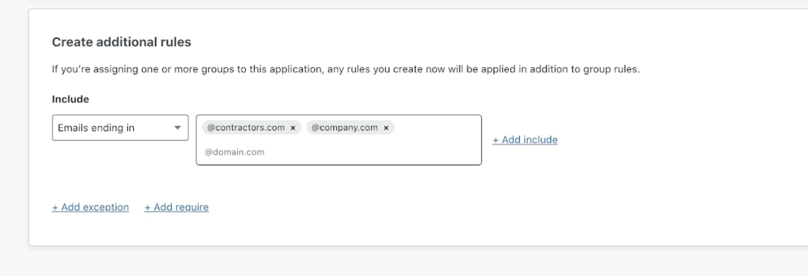

# Control access to Grafana using Bypass and Allow rules

Cloudflare for Teams allows you to create Zero Trust rules that are tailored to your organization’s needs. 

Let’s say you want your team's full-time employees to have permanent and direct access to an internal application like Grafana when connecting from your office IP range. However, if your team works with external resources (e.g., contractors), you may want to enforce a different level of security and ask every external resource to always authenticate through One-Time PIN (OTP) to Grafana.

You can configure rules so that your employees will enjoy smooth access to Grafana, while still making it possible for you to check for identity every external access request. Let's see how.

**🗺️ This walkthrough covers how to:**

* Ensure that employees connecting from your office always have access to your internal Grafana application 
* Require that each request from external users is checked for identity

**⏲️Time to complete: ~15 minutes**

## Secure Grafana behind Teams

1. On the [Teams dashboard](https://dash.teams.cloudflare.com), navigate to Access > Applications.
1. Click **self-hosted**.
1. Choose an Application name and set a session duration. 
1. Enter your Grafana Dashboard URL in the domain field.

   

1. Scroll down to the Identity providers card and select the ones you want external users to authenticate through.
For this tutorial, we’ll choose One-Time PIN (OTP).
  
   

1. Click **Next**.

## Build a Bypass rule

Let’s now configure rules to regulate access to Grafana. The first thing you need to do is configure a Bypass rule to disable any Access enforcement on your full-time employees. You can do that by disabling Access enforcement over a given range of IP addresses.

1. Enter a Rule name and set the Rule action to *Bypass*.

   

1. Then, scroll down to **Create additional rules**. 
1. For the *Include* rule, select *IP ranges* from the drop-down menu. 
1. Specify the IP addresses your employees will connect from.
1. Click **Next** to finalize the setup of the application.
1. Click **Add application**.

Your application now shows in the Applications page.
  
   

## Build an Include rule

Next, you’ll need to add a rule to require an identity check for all requests coming from outside the IP ranges you’ve specified in the Bypass rule.

To build the rule:

1. Locate your application on the Applications page.
1. Click **Edit**.
1. Click **Add a Rule**. The Bypass rule you’ve just created will show up on this page.
1. Click **Add a Rule**.
1. Choose a Rule name and set the Rule action to *Allow*.
1. Under **Create additional rules**, add an *Include* rule to grant access to users whose emails end in `@contractors.com` and `@company.com`.

   

1. Click Save rule in the top-right corner.
Your rules have now been configured.

To recap:

* Your *Bypass* rule ensures that Access won’t be enforced on the set of IP addresses you’ve specified.
* Your *Allow* rule ensures that anyone asking to access Grafana from a different IP address will only be granted access if their email address ends in `@contractors.com` or `@company.com`.

You can find and review your rules by clicking **Edit** next to your application on the Applications page.
