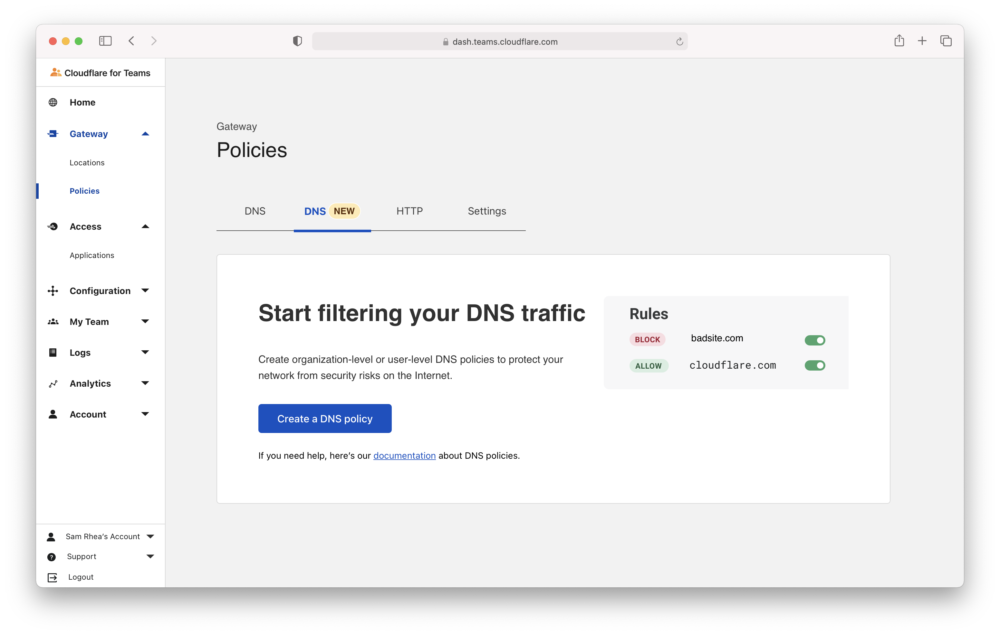
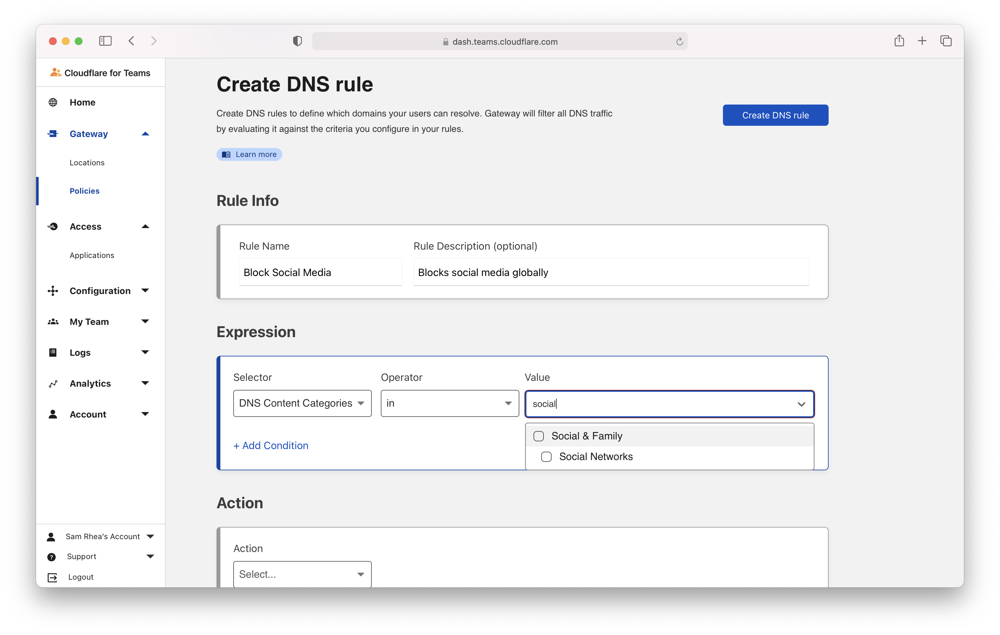
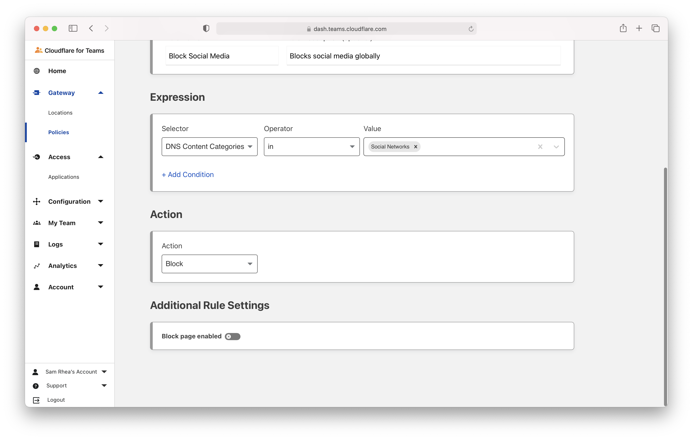
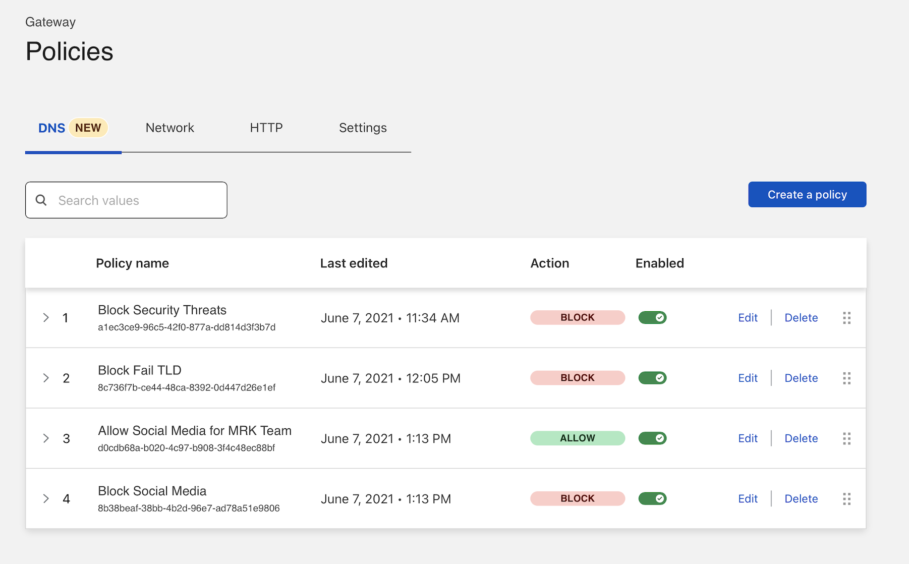

# Filter DNS based on users and groups

Cloudflare's DNS filtering solution can apply filters based on who is making the query. With those options, your team can apply different DNS filtering policies to different parts of your organization based on specific user identity or groups from your identity provider's directory.

To apply these types of rules, you will need to deploy Cloudflare's agent on the devices in your organization. Cloudflare's agent will prompt users to login and will use the identity from that authentication to send DNS-over-HTTPS (DoH) queries that include the user identity. These types of policies can also run in-line with Cloudflare Gateway's HTTP filtering rules.

**🗺️ This walkthrough covers how to:**

* Build a DNS filtering rule that applies to a group of users
* Use DNS filtering rule precedence to allow some users to reach a destination

**⏲️ Time to complete:**

10 minutes

## Before you start

1. [Add Gateway to your account](/setup)
1. [Integrate your identity provider](/identity/idp-integration)
1. [Enroll users in the Cloudflare for Teams agent](/connections/connect-devices/warp)

---

## Allow a team to reach social media

Navigate to the Gateway section of the Cloudflare for Teams Dashboard and open the `Policies` page. Select the `DNS` tab; if you see two `DNS` tabs, select the one marked `NEW`. Click **Create a DNS policy** to get started.

This first rule will allow users of your marketing team to reach social media. Select **DNS Content Categories** and choose **Social Media** from the options.

Next, click **+Add condition** to add a second rule. In this rule, select **User Group Names**. You can also select individual user emails or group IDs, as well as locations. Input the name of the group in your identity provider that should be allowed to reach social media.

In the **Action** section, select **Allow** and save the rule at the top of the page.

## Block social media for all other users

You can now build a rule that will block social media for the rest of your organization. Add a second rule and once again select **DNS Content Categories** and choose **Social Media** from the options.

The rule does not need any additional criteria. This policy will apply to all locations and users in your organization, regardless of how DNS queries are sent.

In the **Action** section, select **Block** and save the rule at the top of the page.

Once saved, ensure that the `Allow` rule has higher precedence than the `Block` rule. You can drag-and-drop rules as needed in the UI.

Rules are evaluated from top to bottom, so when the `Allow` rule is ranked first, users in the marketing group will be allowed to reach social media. Users who do not meet that criteria will have the next rule applied and will be blocked.