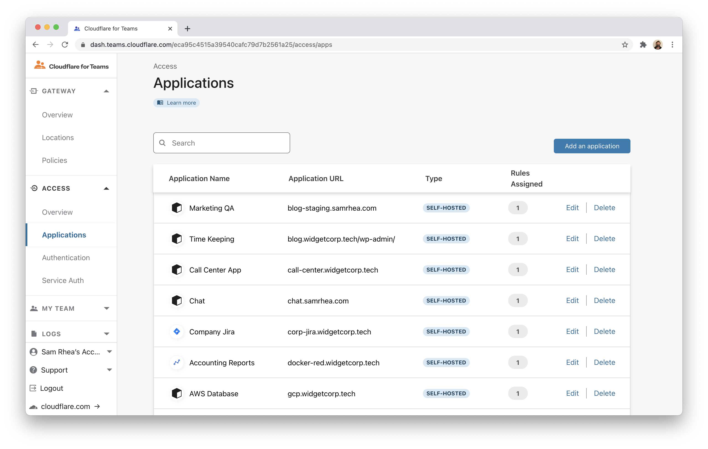
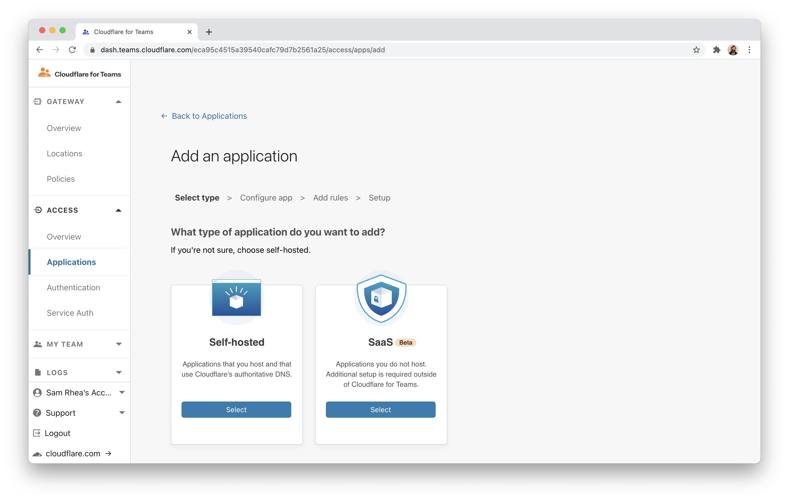
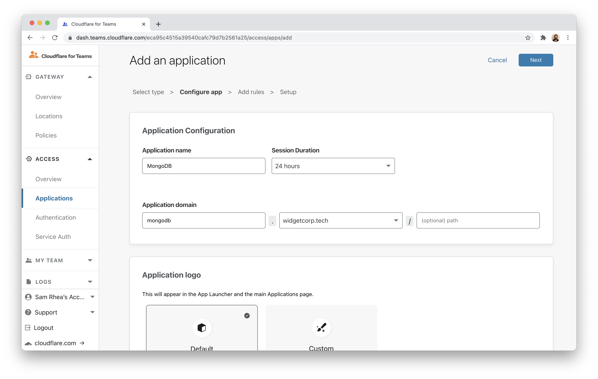
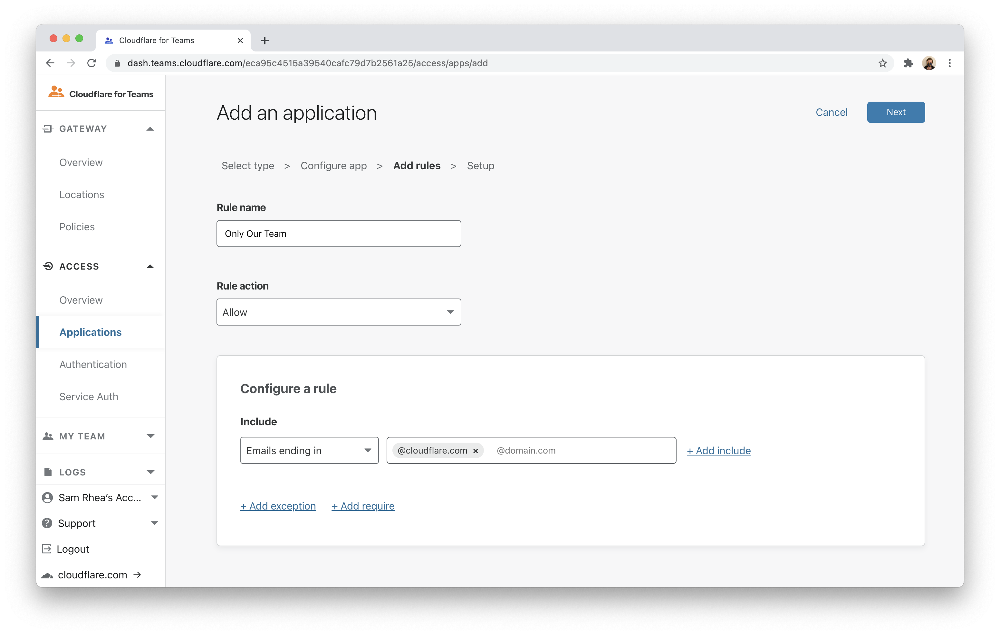
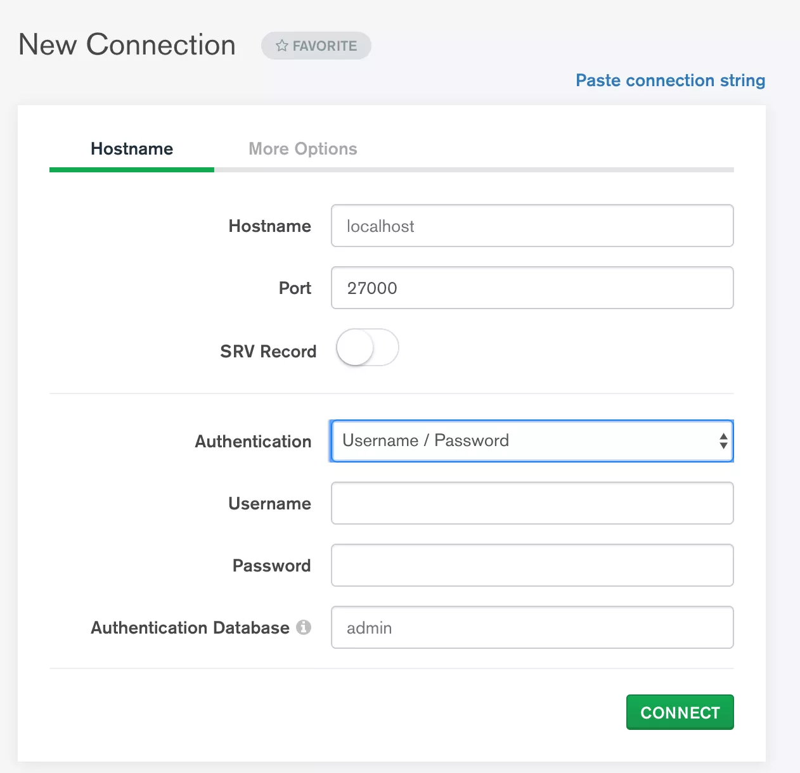

# MongoDB SSH

You can build Zero Trust rules to secure connections to MongoDB deployments using Cloudflare Access and Argo Tunnel. Argo Tunnel requires a lightweight daemon, `cloudflared`, running alongisde the deployment and as on the client side.

In this tutorial, a client running `cloudflared` connects over SSH to a MongoDB deployment running on Kubernetes. The deployment example is structured to connect [Compass](https://www.mongodb.com/products/compass) to the MongoDB instance. The MongoDB Kubernetes deployment runs both the MongoDB database service and `cloudflared` as a ingress service that operates like a jump host.

**🗺️ This tutorial covers how to:**

* Create a Cloudflare Access rule to secure a MongoDB deployment
* Configure a StatefulSet and service definition for the deployment
* Configure an Argo Tunnel connection to Cloudflare's edge
* Create an SSH configuration file for the client

**⏲️ Time to complete: 50 minutes**

## Configure Cloudflare Access

You can build a rule in Cloudflare Access to control who can connect to your MongoDB deployment. Cloudflare Access rules are built around a hostname; even though this deployment will be accessible over SSH, the resource will be represented in Cloudflare as a hostname. For example, if you have the website `app.com` in your Cloudflare account, you can build a rule to secure `mongodb.app.com`.

First, follow [these instructions](/setup) to set up Cloudflare Access in your account.

Next, navigate to the `Applications` page in the `Access` section of the Cloudflare for Teams dashboard.



Click **Add an application** and choose `Self-hosted`.



Create an application for a subdomain where users will connect to your deployment. Click **Next**.



Build a rule to determine who can reach the deployment. You can build a rule that allows anyone in your organization to connect or you can build more granular rules based on signals like identity provider groups, [multifactor method](/tutorials/okta-u2f), or [country](/tutorials/country-rules).



Click **Next** again and add the application.

## Configure the Kubernetes deployment

To be accessible over SSH, the Kubernetes deployment should manage both the MongoDB standalone service and an SSH proxy service. The configuration below will deploy 1 replica of the database service, available at port 27017, as well as an SSH proxy available at port 22.

<details>
    <summary> StatefulSet Configuration</summary>

```yaml
apiVersion: apps/v1
kind: StatefulSet
metadata:
  name: mongodb-standalone
  namespace: mongodb
spec:
  serviceName: database
  replicas: 1
  selector:
    matchLabels:
      app: database
  template:
    metadata:
      labels:
        app: database
        selector: mongodb-standalone
    spec:
      containers:
      - name: mongodb-standalone
        image: mongo
        command: ["mongod"]
        args: ["--config=/config/mongod.conf"]
        ports:
        - containerPort: 27017
          protocol: TCP
          name: mongod
        volumeMounts:
        - name: mongodb-conf
          mountPath: /config
          readOnly: true
        - name: mongodb-data
          mountPath: /data/db
        - name: tls
          mountPath: /etc/tls
        - name: mongodb-socket
          mountPath: /socket
      - name: ssh-proxy
        image: ubuntu:20.04
        command: ["/scripts/entrypoint.sh"]
        ports:
        - containerPort: 22
          protocol: TCP
          name: ssh-port
        volumeMounts:
        - name: mongodb-socket
          mountPath: /socket
        - name: scripts
          mountPath: /scripts
          readOnly: true
        - name: ssh-authorized-keys
          mountPath: /config/ssh
          readOnly: true
        resources:
          requests:
            cpu: 20m
            memory: 32Mi
      volumes:
      - name: mongodb-socket
        emptyDir: {}
      - name: mongodb-conf
        configMap:
          name: mongodb-standalone
          items:
          - key: mongod.conf
            path: mongod.conf
      - name: tls
        secret:
          secretName: tls
      - name: mongodb-data
        persistentVolumeClaim:
          claimName: mongodb-standalone
      - name: scripts
        configMap:
          name: scripts
          items:
          - key: entrypoint.sh
            path: entrypoint.sh
            mode: 0744
      - name: ssh-authorized-keys
        configMap:
          name: ssh-proxy-config
          items:
          - key: authorized_keys
            path: authorized_keys
            mode: 0400
```
</details>

The corresponding service definition should also specify the the ports and target ports for the containers (in this case, the database service and the SSH proxy service).

<details>
    <summary>Service Definition</summary>

```yaml
apiVersion: v1
kind: Service
metadata:
  name: database
  namespace: mongodb
  labels:
    app: database
spec:
  clusterIP: None
  selector:
    app: database
  ports:
    - protocol: TCP
      port: 27017
      targetPort: 27017
---
apiVersion: v1
kind: Service
metadata:
  name: ssh-proxy
  namespace: mongodb
  labels:
    app: database
spec:
  selector:
    app: database
  ports:
    - protocol: TCP
      port: 22
      targetPort: 22
```
</details>

The MongoDB pod and the SSH jump host will share a Unix socket over an empty directory volume. The `entrypoint.sh` file run by the jump host, example below, will start an OpenSSH server.

```bash
#!/bin/sh
export TZ=America/Chicago
ln -snf /usr/share/zoneinfo/$TZ /etc/localtime && echo $TZ > /etc/timezone
apt-get update -y && apt-get install -y openssh-server
mkdir /root/.ssh
cp /config/ssh/authorized_keys /root/.ssh/authorized_keys
chmod 400 /root/.ssh/authorized_keys
service ssh start
while true;
do sleep 30;
done;
```

## Configure Argo Tunnel

Next, you can use `cloudflared` to connect to Cloudflare's Edge using Argo Tunnel. Start by [downloading and installing](/connections/connect-apps/install-and-setup) the Argo Tunnel daemon, `cloudflared`.

Once installed, run the following command to authenticate the instance of `cloudflared` into your Cloudflare account.

`$ cloudflared login`

The command will launch a browser window and prompt you to login with your Cloudflare account. Choose a website that you have added into your account.


Once you click one of the sites in your account, Cloudflare will download a certificate file, called `cert.pem` to authenticate this instance of `cloudflared`. The `cert.pem` file uses a certificate to authenticate your instance of `cloudflared` and includes an API key for your account to perform actions like DNS record changes.

You can now use `cloudflared` to control Argo Tunnel connections in your Cloudflare account.


### Create a Tunnel

You can now [create an Argo Tunnel](/connections/connect-apps/create-tunnel) that will connect `cloudflared` to Cloudflare's edge. You'll configure the details of that Tunnel in the next step.

Run the following command to create a Tunnel. You can replace `mongodb` with any name that you choose. This command requires the `cert.pem` file.

`$ cloudflared tunnel create mongodb`

Cloudflare will create the Tunnel with that name and generate an ID and credentials file for that Tunnel.


### Delete the `cert.pem` file

The credentials file is separate from the `cert.pem` file. Unlike the `cert.pem` file, the credentials file consists of a token that authenticates only the Named Tunnel you just created. Formatted as `JSON`, the file cannot make changes to your Cloudflare account or create additional Tunnels.

If you are done creating Tunnels, you can delete the `cert.pem` file, leave only the credentials file, and continue to manage DNS records directly in the Cloudflare dashboard or API. For additional information on the different functions of the two files, see the table in [this section](connections/connect-apps/create-a-tunnel).

Store the `JSON` file as a Kubernetes secret.

### Configure Argo Tunnel

The previous setps used `cloudflared` to generate a credentials file for your Cloudflare account. When run as a service alongside the MongoDB Kubernetes deployment you will need to use a Docker image of `cloudflared`. Cloudflare makes an [official image available](https://hub.docker.com/r/cloudflare/cloudflared) in DockerHub.

The configuration below will run a single replica of `cloudflared` as an ingress point alongside the MongoDB and SSH proxy services. `cloudflared` will proxy traffic to the SSH proxy service. The `cloudflared` instance will run as its own deployment in a different namespace and, if network policy allows, ingress to any service in the Kubernetes node.

<details>
    <summary>`cloudflared` Configuration</summary>

```yaml
apiVersion: apps/v1
kind: Deployment
metadata:
  name: dashboard-tunnel
  namespace: argotunnel
  labels:
    app: dashboard-tunnel
spec:
  replicas: 1
  selector:
    matchLabels:
      app: dashboard-tunnel
  template:
    metadata:
      labels:
        app: dashboard-tunnel
    spec:
      containers:
        - name: dashboard-tunnel
          # Image from https://hub.docker.com/r/cloudflare/cloudflared
          image: cloudflare/cloudflared:2020.11.11
          command: ["cloudflared", "tunnel"]
          args: ["--config", "/etc/tunnel/config.yaml", "run"]
          ports:
          - containerPort: 5000
          livenessProbe:
            tcpSocket:
              port: 5000
            initialDelaySeconds: 60
            periodSeconds: 60
          volumeMounts:
          - name: dashboard-tunnel-config
            mountPath: /etc/tunnel
          - name: tunnel-credentials
            mountPath: /etc/credentials
      volumes:
      - name: dashboard-tunnel-config
        configMap:
          name: dashboard-tunnel-config
      - name: tunnel-credentials
        secret:
          secretName: tunnel-credentials
---
apiVersion: v1
kind: ConfigMap
metadata:
  name: dashboard-tunnel-config
  namespace: argotunnel
data:
  config.yaml: |
    tunnel: 9a00ef26-4997-4de2-83db-631efc74245c
    credentials-file: /etc/credentials/k8s-dashboard.json
    metrics: :5000
    protocol: http2
    no-autoupdate: true
    ingress:
    - hostname: mongodb.widgetcorp.tech
      originRequest:
        bastionMode: true
    - service: http_status:404
```
</details>

## Connect from a client

Once deployed, you can run `cloudflared` on the client side to connect to the MongoDB deployment. Add the following lines to your SSH configuration file, replacing the examples with your hostname and details. The `--destination` value should match the URL of the SSH Proxy service configured previously.

```bash
Host mongodb
  ProxyCommand /usr/local/bin/cloudflared access ssh --hostname mongodb.widgetcorp.tech --destination ssh-proxy.mongodb.svc.cluster.local:22
  LocalForward 27000 /socket/mongodb-27017.sock
  User root
  IdentityFile /Users/username/.ssh/id_rsa
```

This is a one-time step. When you next attempt to make an SSH connection to the deployment, `cloudflared` will launch a browser window and prompt you to authenticate. Once authenticated, you will be connected if you have a valid session. Once the tunnel is established, all requests to `localhost:27000` on your machine will be forwarded to `/socket/mongodb-27017.sock` on the SSH proxy container.

You can then set MongoDB Compass to connect to `localhost:27000`.

