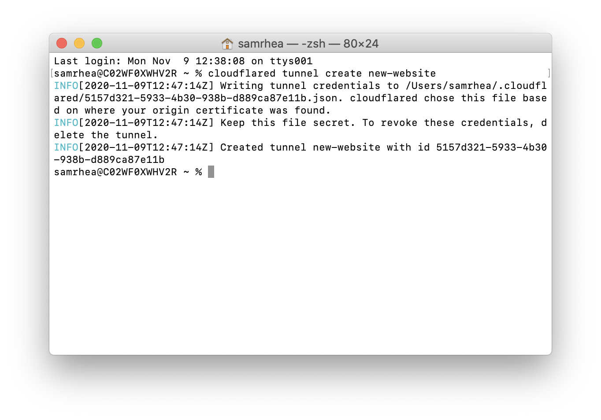

# Connect multiple HTTP origins

You can use [Argo Tunnel](https://developers.cloudflare.com/argo-tunnel/) to connect applications and servers to Cloudflare's network. Argo Tunnel relies on a piece of software, `cloudflared`, to create those connections. You can deploy a single instance of `cloudflared` to proxy traffic to multiple destinations for multiple hostnames.

**🗺️ This tutorial covers how to:**

* Start a secure, outbound-only, connection from a machine to Cloudflare for multiple applications
* Give those applications hostnames where users can connect

**⏲️Time to complete: ~10 minutes**

## Install `cloudflared`

In this example, two resources are running and need to be connected to the Internet:

* a [Hugo site](https://gohugo.io/getting-started/quick-start/). Hugo, a static site generator, provides a built-in server that can be used for testing changes. That server is available at `localhost:1313`.
* Grafana, a charting application. Grafana is available at `localhost:3000`

Start by [downloading and installing](https://developers.cloudflare.com/argo-tunnel/getting-started/installation) the Argo Tunnel daemon, `cloudflared`. On Mac, you can do so by running the following `brew` command. If you do not have Homebrew, follow the [documentation here](https://docs.brew.sh/Installation) to install it.

`$ brew install cloudflare/cloudflare/cloudflared`

Once installed, run the following command in your Terminal to authenticate this instance of `cloudflared` into your Cloudflare account.

`$ cloudflared login`

The command will launch a browser window and prompt you to login with your Cloudflare account. Choose a website that you have added into your account.


Once you click one of the sites in your account, Cloudflare will download a certificate file, called `cert.pem` to authenticate this instance of `cloudflared`. The `cert.pem` file uses a certificate to authenticate your instance of `cloudflared` and includes an API key for your account to perform actions like DNS record changes.

You can now use `cloudflared` to control Argo Tunnel connections in your Cloudflare account.


## Create a Tunnel

You can now [create an Argo Tunnel](https://developers.cloudflare.com/argo-tunnel/create-tunnel) that will connect `cloudflared` to Cloudflare's edge. You'll configure the details of that Tunnel in the next step.

Run the following command to create a Tunnel. You can replace `new-website` with any name that you choose. This command requires the `cert.pem` file.

`$ cloudflared tunnel create new-website`

Cloudflare will create the Tunnel with that name and generate an ID and credentials file for that Tunnel. This Tunnel will represent both applications and both hostnames.



## Configure `cloudflared`

You can now [configure](https://developers.cloudflare.com/argo-tunnel/configuration) `cloudflared` to route traffic to both applications for multiple hostnames using [ingress rules](https://developers.cloudflare.com/argo-tunnel/configuration/ingress). You must use a configuration file to do so.

By default, `cloudflared` expects the configuration file at a specific location: `~/.cloudflared/config.yml`. You can modify this location if you want. For this example, we'll keep the default. Create or edit your configuration file using a text editor.

`$ vim ~/.cloudflared/config.yml`

The `tunnel` and `credentials-file` value can be copied from the output of the last command.

```yml
tunnel: 5157d321-5933-4b30-938b-d889ca87e11b
credentials-file: /Users/samrhea/.cloudflared/5157d321-5933-4b30-938b-d889ca87e11b.json

ingress:
  - hostname: grafana.widgetcorp.tech
    service: http://localhost:3000
  - hostname: blog.widgetcorp.tech
    service: http://localhost:1313
  # Catch-all rule, which just responds with 404 if traffic doesn't match any of
  # the earlier rules
  - service: http_status:404
```

The configuration above will send traffic received for `grafana` to the Grafana address and traffic bound for `blog` to the Hugo address. The last service rule specifies a catch-all which will respond to requests that do not meet the previous rules. You must include a catch-all. In this case, the catch-all returns a 404.

You can run the following command to validate the configuration file before you start your tunnel. If an error is present, `cloudflared` will alert you first.

`$ cloudflared tunnel validate`

If you are using the credentials file without the `cert.pem` file, you must specify the Tunnel ID in the `tunnel:` value. You cannot use the Name alone with the credentials file.

## Run Argo Tunnel

At this point, you have created and configured your Argo Tunnel connection. You can now [run that](https://developers.cloudflare.com/argo-tunnel/create-tunnel) Tunnel. Running it will create connections to Cloudflare's edge. Those connections will not respond to traffic, yet. You'll add DNS records in the next step to share the resource across the Internet.

`$ cloudflared tunnel run`

## Create DNS records

You can now [route traffic](https://developers.cloudflare.com/argo-tunnel/routing-to-tunnel) to your Tunnel, and on to both applications, using Cloudflare DNS. Visit the [Cloudflare dashboard](https://dash.cloudflare.com), select a website, and click on the `DNS` tab.

Click `+Add record` and choose `CNAME`. In the `Name` field, add the name of the subdomain of your new site. In the `Content` field, paste the ID of your Tunnel created earlier and append `cfargotunnel.com`. Repeat this process for the second subdomain - they will both share the same Tunnel address.

`5157d321-5933-4b30-938b-d889ca87e11b.cfargotunnel.com`


Once saved, you can share the subdomain created and visitors can reach both applications.
