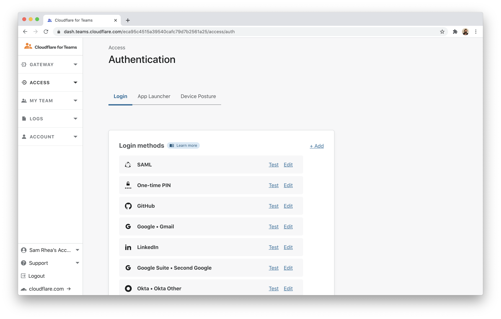
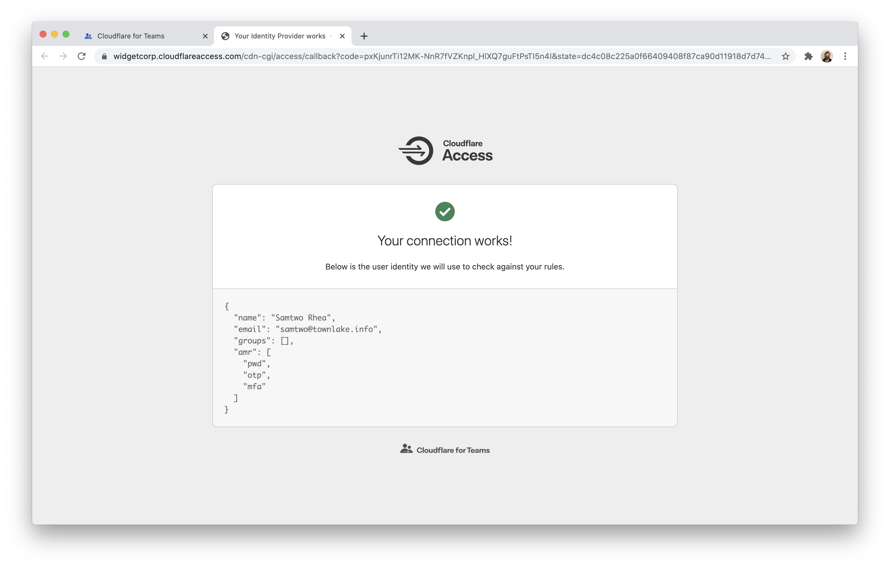
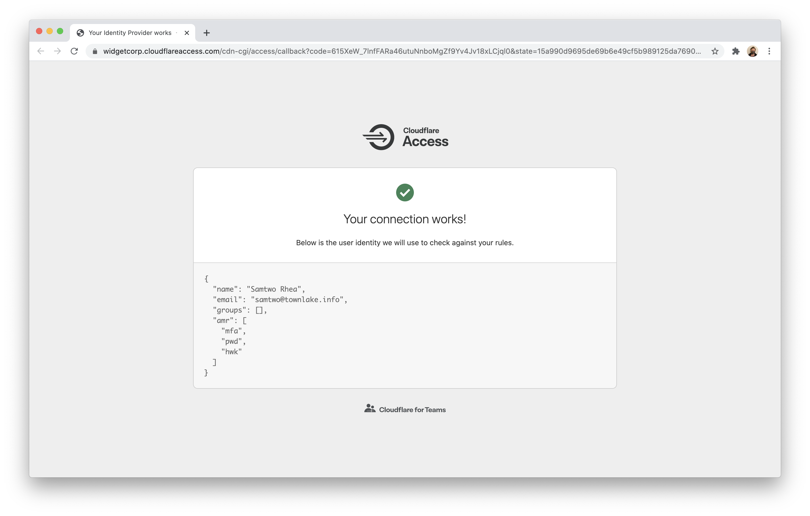
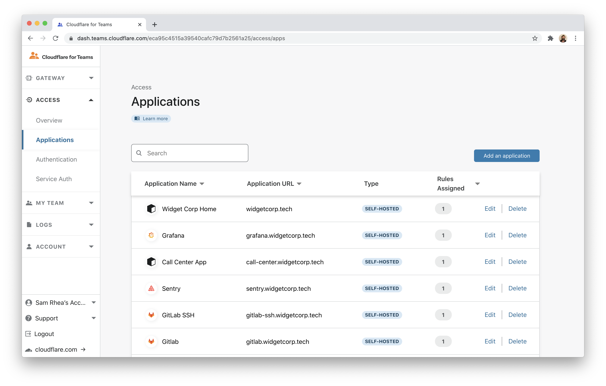
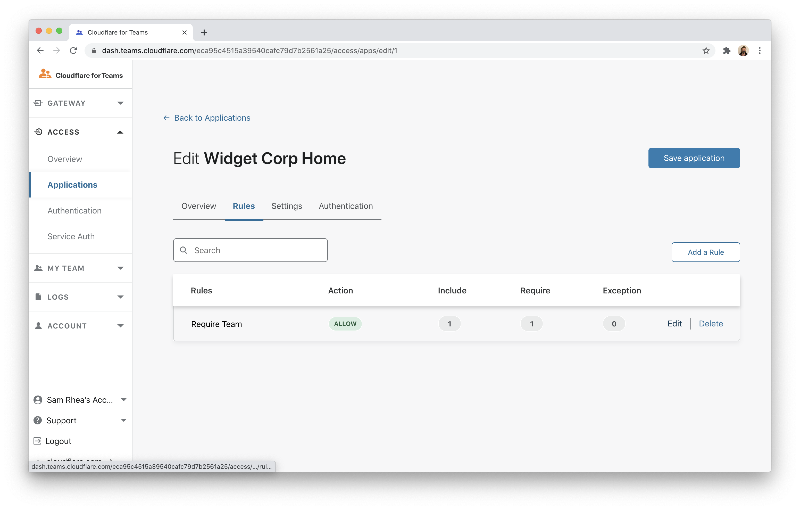
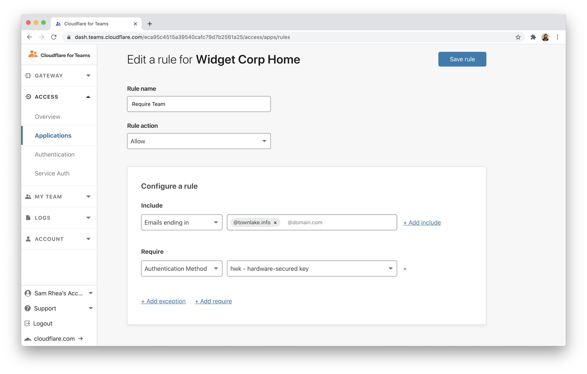
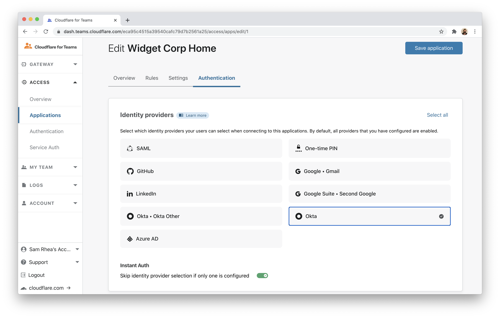
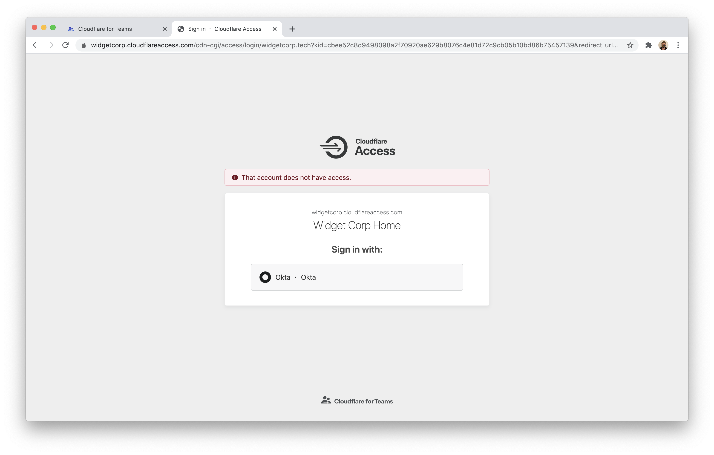

# Require U2F with Okta

Many identity providers, like Okta, support multiple multifactor authentication (MFA) options simultaneously. For example, Okta will allow you to login with your password and a temporary code generated in an app or a U2F hard key like a Yubikey.

Some second factor methods are more resistant to phishing. U2F options require you to have access to a physical device, also known as a hardware key. Without that key, a user cannot impersonate you even if they have your password. You can build rules in Cloudflare Access to require that users authenticate with a hardware key - even if your provider supports multiple options. When users login with a less secure option, like an app-based code, Access will block them.

**🗺️ This tutorial covers how to:**

* Integrate Cloudflare Access with Okta
* Configure Okta for U2F enrollment
* Build an Access policy that require users login with a hardware key
* Specify that policy to apply to certain Access applications

The first two sections of this tutorial link to guides to set up Cloudflare Access and integrate Okta. If you already use Cloudflare Access with Okta, you can skip ahead to the fourth section.

**⏲️Time to complete: 20 minutes**

## Configure Cloudflare Access

Before you begin, you'll need to follow [these instructions](https://developers.cloudflare.com/access/getting-started/access-setup/) to set up Cloudflare Access in your account. The hardware key feature is available on any plan, including the free plan.

## Integrate Okta

Follow [these instructions](https://developers.cloudflare.com/access/authentication/configuring-identity-providers/okta) to integrate Okta with your Cloudflare Access account.

## Configure Okta for U2F

An Okta administrator in your organization must first [enable U2F support](https://help.okta.com/en/prod/Content/Topics/Security/MFA.htm) in your Okta account **and** [configure users](https://help.okta.com/en/prod/Content/Topics/Security/healthinsight/required-factors.htm) to be prompted for it. This is a global setting; if your account has already configured U2F, you do not need to do anything unique to use it with Cloudflare Access.

## Test U2F in Access

You can begin building U2F policies by testing your Okta integration. Navigate to the `Authentication` page in the `Access` section of the Cloudflare for Teams dashboard. Choose the row for Okta and click **Test**.

Cloudflare Access will prompt you to login with your Okta account. For the purposes of the test, use a second factor option like an app-based code. Okta will return `amr` values to Cloudflare Access - these are standard indicators of multifactor methods shared between identity control systems.

Since you used an app-based code, you will see `otp` in addition to `mfa` (you used an MFA option) and `pwd` (you logged in with a password).

Log out of Okta and return to the list of providers in Access. Click **Test** again, but this time use your hardware key as a second factor. Cloudflare Access will now see Okta share `hwk` in the `amr` fields.

## Build an Access policy to require U2F

You can use this information to build a rule in Access. Navigate to the `Applications` list in the Cloudflare Access section of the dashboard. Choose an application that you have already built or create a new one. This example adds the requirement to an existing application.

Click **Edit** to edit the existing `Allow` rule.

Add a `Require` rule and select `Authentication Method` from the list. Choose `hwk` as the required `Authentication Method`. Click **Save rule**.

Optional: you can also configure Cloudflare Access to only show users Okta for this application if you have multiple other providers integrated. In the `Authentication` Tab, choose `Okta` as the only option to show users.

## Testing the rule

You can now test the rule. Visit the application and attempt to login using an app-based code or method other than a hardware security key. Access will block the attempt.

If you sign out of Okta, and reattempt with a hardware key, Access will then allow the connection.