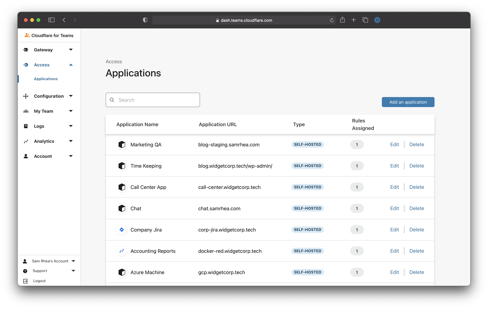
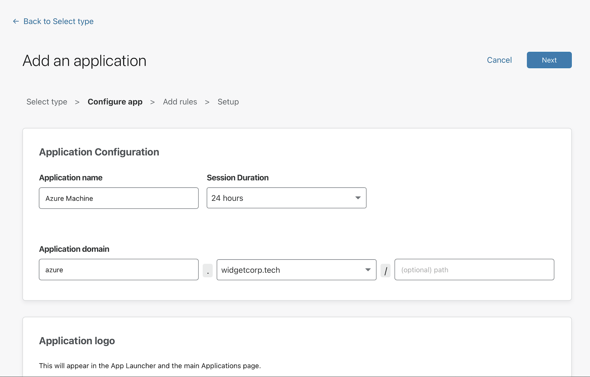
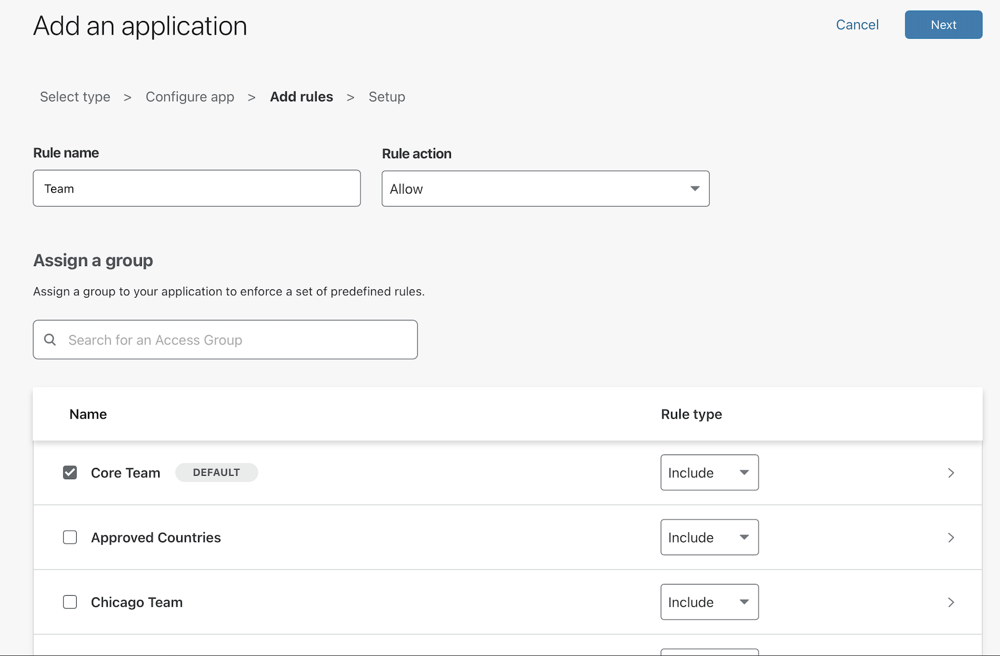
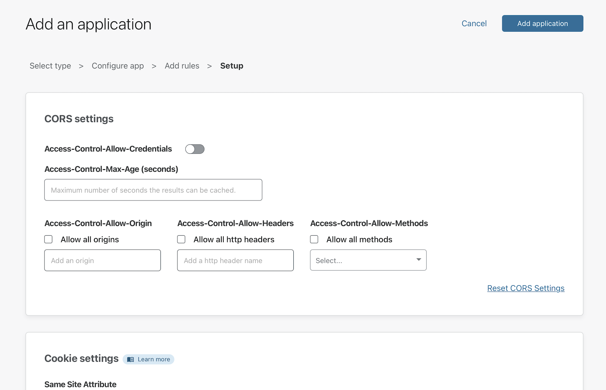
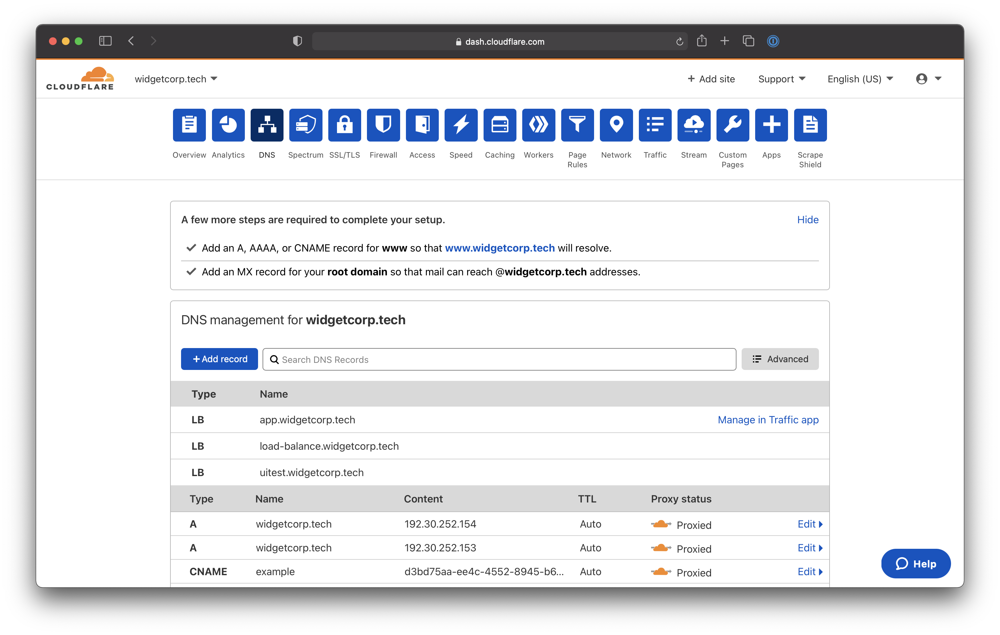
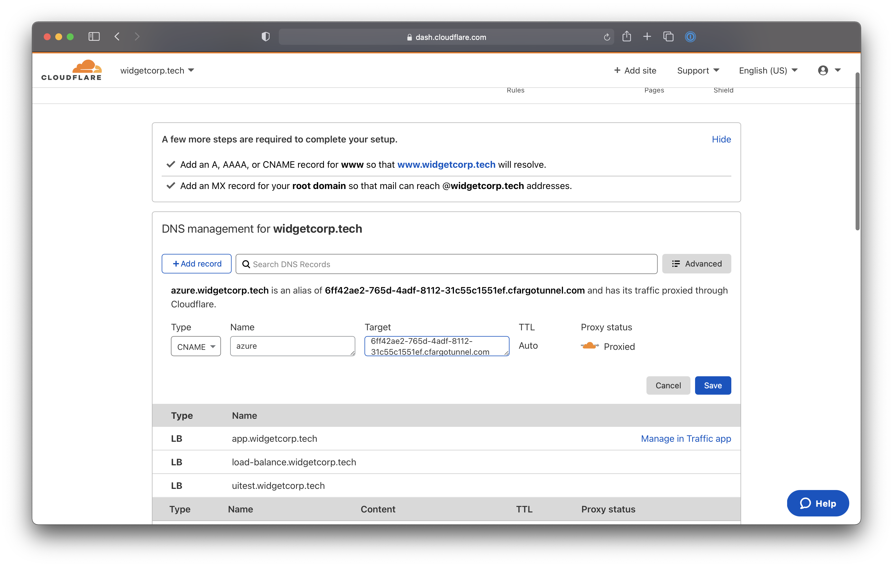

# Connect through Cloudflare Access over RDP

You can connect to machines over RDP using Cloudflare's Zero Trust platform.

**🗺️ This walkthrough covers how to:**

* Build a policy in Cloudflare Access to secure the machine
* Connect a machine to Cloudflare's network using an RDP connection
* Connect from a client machine

**⏲️ Time to complete: 30 minutes**

| Before you start |
|---|
| 1. [Add a website to Cloudflare](https://support.cloudflare.com/hc/en-us/articles/201720164-Creating-a-Cloudflare-account-and-adding-a-website) |
| 2. [Change your domain nameservers to Cloudflare](https://support.cloudflare.com/hc/en-us/articles/205195708) |

---

## Create a Zero Trust policy

First, navigate to the Cloudflare for Teams dashboard to create a new application. Select the `Applications` page from the sidebar. Click **Add application**.



Choose **Self-hosted** on the next page.


Input a subdomain where your application will be availble to users.



Next, create rules that control who can reach the application.



Finally, click **Save** to save the policy. You can return to edit the policy to make changes to who should be allowed or to choose what authentication providers can be used.



## Install `cloudflared`

Cloudflare Argo Tunnel creates a secure, outbound-only, connection between this machine and Cloudflare's network. With an outbound-only model, you can  prevent any direct access to this machine and lock down any externally exposed points of ingress. And with that, no open firewall ports.

Download the version of `cloudflared` that matches your architecture from the releases [available here](https://github.com/cloudflare/cloudflared/releases).

Place the `cloudflared` executable in a location accessible to the OS, for example:

```sh
C:\Cloudflared\bin\cloudflared.exe
```

Next, run `CMD` as an administrator to install the service.

```bash
C:\Cloudflared\bin\cloudflared.exe service install
```

By default, the agent will run as a Local Account service and will look for the configuration and certificate file in the systemprofile.

Run the following command to create a new directory within systemprofile, replacing the `System32` value if needed to match your architecture.

```bash
mkdir C:\Windows\System32\config\systemprofile\.cloudflared
```
<Aside>

Ensure that the machine's firewall permits egress on ports `80`, `443`, and `3389`, otherwise cloudflared will return an error.

</Aside>

## Authenticate `cloudflared`

Run the following command to authenticate cloudflared into your Cloudflare account.

```sh
C:\Cloudflared\bin\cloudflared.exe login
```

`cloudflared` will open a browser window and prompt you to login to your Cloudflare account. If you are working on a machine that does not have a browser, or a browser window does not launch, you can copy the URL from the command-line output and visit the URL in a browser on any machine.

Choose any hostname presented in the list. Cloudflare will issue a certificate scoped to your account. You do not need to pick the specific hostname where you will serve the Tunnel.

Copy the file to the `systemprofile` directory created previously.

```bash
copy C:\Users\%USERNAME%\.cloudflared\cert.pem C:\Windows\System32\config\systemprofile\.cloudflared
```

## Create an Argo Tunnel

Next, [create an Argo Tunnel](/connections/connect-apps/create-tunnel) with the command below.

```sh
$ cloudflared tunnel create <NAME>
```

Replacing `<NAME>` with a name for the Tunnel. This name can be any value. A single Argo Tunnel can also serve traffic for multiple hostnames to multiple services in your environment, including a mix of connection types like SSH and HTTP.

The command will output an ID for the Tunnel and generate an associated credentials file. At any time you can list the Tunnels in your account with the following command.

```sh
C:\Cloudflared\bin\cloudflared.exe tunnel create <NAME>
```

## Configure the Tunnel

You can now [configure the Tunnel](https://developers.cloudflare.com/connections/connect-apps/configuration) to serve traffic.

Create a `YAML` file that `cloudflared` can reach. By default, `cloudflared` will look for the file in the same folder where `cloudflared` has been installed.

Run `Notepad.exe` as an administrator. Next, configure the Tunnel, replacing the example ID below with the ID of the Tunnel created above. Additionally, replace the hostname in this example with the hostname of the application configured with Cloudflare Access.

```yaml
tunnel: 6ff42ae2-765d-4adf-8112-31c55c1551ef
credentials-file: /root/.cloudflared/6ff42ae2-765d-4adf-8112-31c55c1551ef.json

ingress:
  - hostname: azure.widgetcorp.tech
    service: rdp://localhost:3389
  - service: http_status:404
  # Catch-all rule, which responds with 404 if traffic doesn't match any of
  # the earlier rules
```

Save the file to the following location:

```bash
C:\Windows\System32\config\systemprofile\.cloudflared\config.yml`
```

## Route to the Tunnel

You can now create a DNS record that will route traffic to this Tunnel. Multiple DNS records can point to a single Tunnel and will send traffic to the service configured as long as the hostname is defined with an [ingress rule](/connections/connect-apps/configuration/ingress).

Navigate to `dash.cloudflare.com` and choose the hostname where you want to create a Tunnel. This should match the hostname of the Access policy. Click **+ Add record**.



Select `CNAME` as the record type. For the target, input the ID of your Tunnel followed by `cfargotunnel.com`. In this example, the target would be:

`6ff42ae2-765d-4adf-8112-31c55c1551ef.cfargotunnel.com`

Click **Save**.



## Run the Tunnel

You can now run the Tunnel to connect the target service to Cloudflare. Use the following command to run the Tunnel, replacing `<NAME>` with the name created for your Tunnel.

```sh
C:\Cloudflared\bin\cloudflared.exe tunnel run <NAME>
```

We recommend that you run `cloudflared` [as a service](/connections/connect-apps/run-tunnel/run-as-service) that is configured to launch on start.

## Connect from a client machine

### 1. Install cloudflared On The Client Machine

Follow steps 1 through 3 above to download and install cloudflared on the client desktop that will connect to the remote desktop.
cloudflared will need to be installed on each user device that will connect.

### 2. Connect To The Remote Desktop

1. Run the following command to create a connection from the device to Cloudflare. Any available port can be specified.

```bash
\cloudflared.exe access rdp --hostname rdp.site.com --url localhost:2244
```

This command can be wrapped as a desktop shortcut so that end users do not need to use the command line.

2. Open your RDP client and configure the client to point to `localhost:2244`. Do not input the hostname.

3. When the client launches, `cloudflared` will launch a browser window and prompt the user to authenticate with your SSO provider.

## Configuring A Desktop Shortcut

### Windows

You can help end users connect without requiring the command line by providing them with a shortcut that can be launched from the desktop.

1. Ensure that `cloudflared.exe` is installed on the end user device and available in the Windows Path.

2. Right-click on the Windows desktop and select **New > Shortcut**.

3. In the wizard that appears, paste in the following command with the hostname your team uses:

```sh
$ cloudflared access rdp --hostname monday.example.com --url localhost:2244
```
4. Click **Next** and complete the wizard.

At this point the shortcut will appear on the desktop, and users can launch with a double-click. The shortcut can then be distributed to end users along with `cloudflared`.

## Common issues

* You may get a warning indicating that the `.exe` (`cloudflared.exe`) is unknown. This can be skipped by clicking `More Info` in the dialog box and then clicking **Run Anyway**. This will only appear one time.

* Ensure that RDP is enabled on the target Windows machine. If not, you may encounter an error: `No connection could be made because the target machine actively refused it`.

### MacOS

MacOS users can save a command shortcut that will launch the RDP flow.

1. The command below can be saved as a `.command` file that can be launched on login:

```bash
var=/Applications/CF-RDP-Tunnel.command &&
echo "`which cloudflared` access rdp --hostname monday.example.com --url localhost:2244 &" > $var &&
chmod +x $var
```

2. Check that everything is successful by running the following command:

```sh
$ lsof -nP -iTCP:2244 | grep LISTEN
```
If needed, you can kill the process by running the following command:

```sh
$ sudo kill -9 [process id]
```

The command from Step 1 can then be configured to run at device login by navigating to **System Preferences > Users & Groups**.

3. Select the `+` sign.

4. Navigate to **Macintosh HD/Applications**.

5. Double click on the previously created `CF-RDP-Tunnel.command` file.

The default behavior in MacOS is for the Terminal window to stay open. You can configure it to close automatically.

<Aside>

Ensure that the machine's firewall permits egress on ports `80`, `443`, and `2244`, otherwise cloudflared will return an error.
</Aside>

## Video Guides

In this video, you’ll learn how to use Cloudflare Access to protect a Remote Desktop Protocol (RDP) connection by setting up a secure link with Argo Tunnel.

<StreamVideo id="2a3073fb7881b4fcba4b9e3709dfaacf"/>
