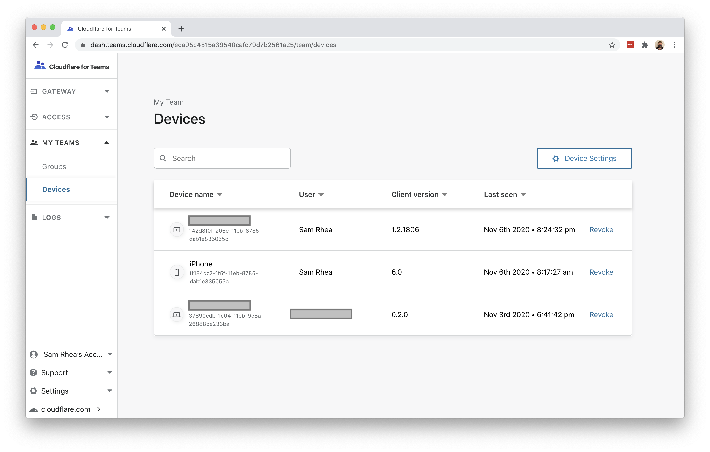
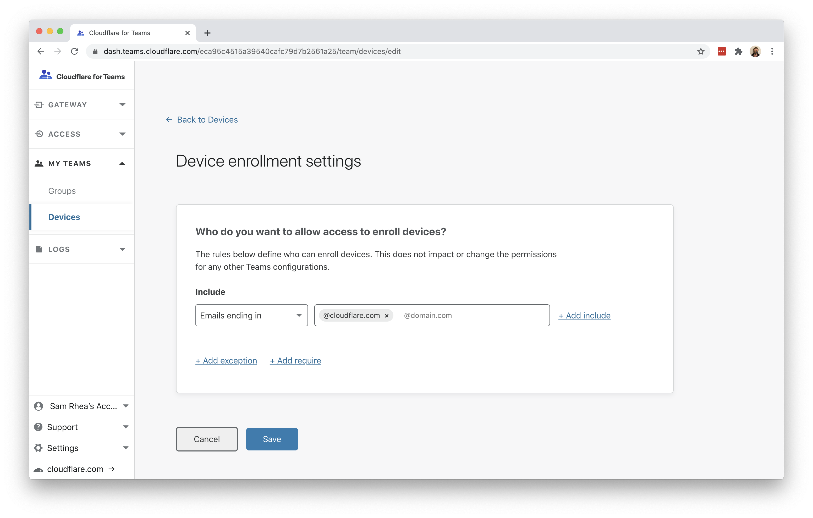
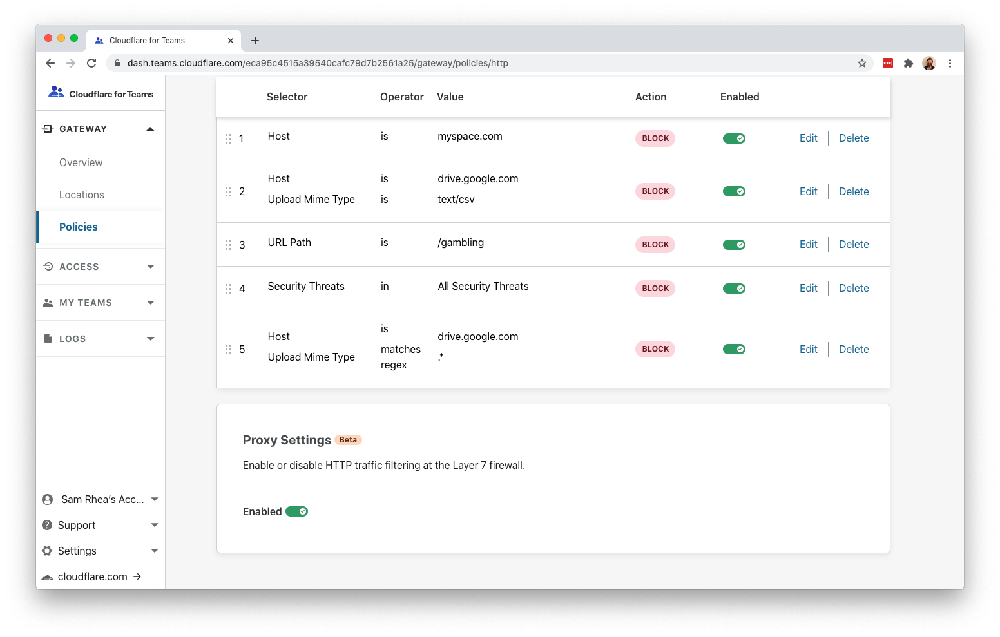
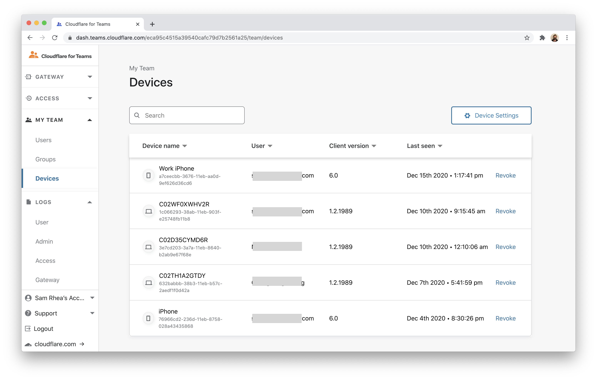
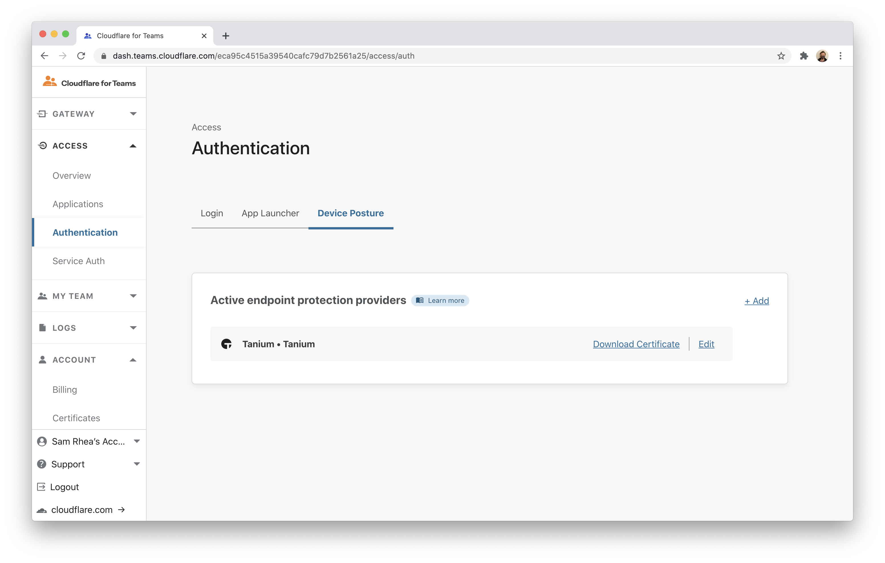
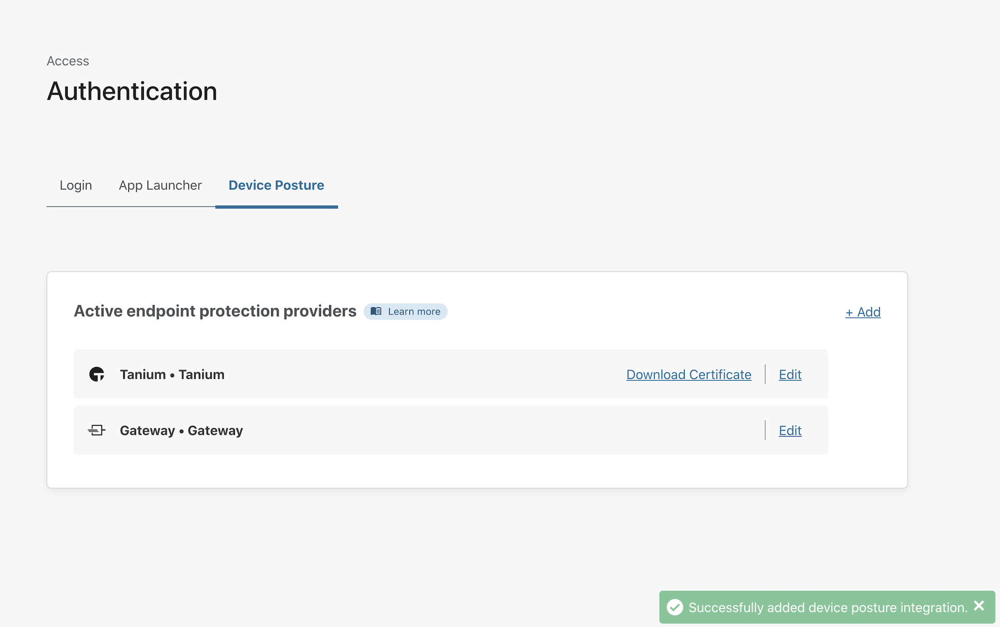
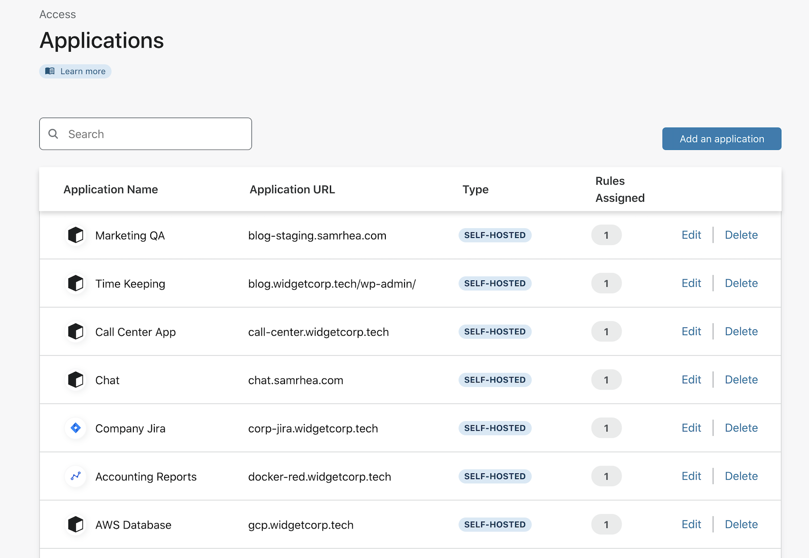
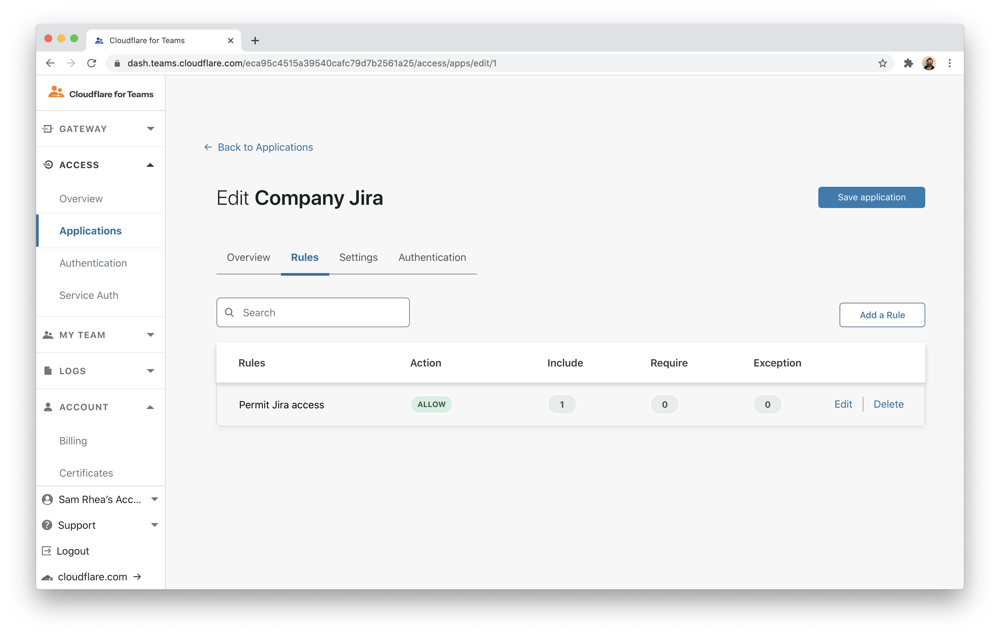
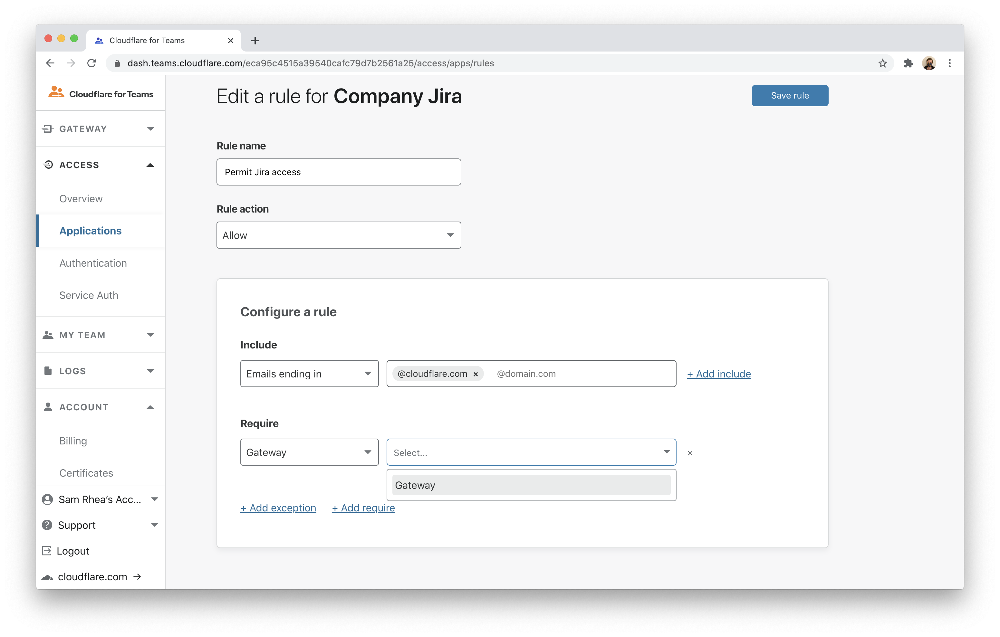
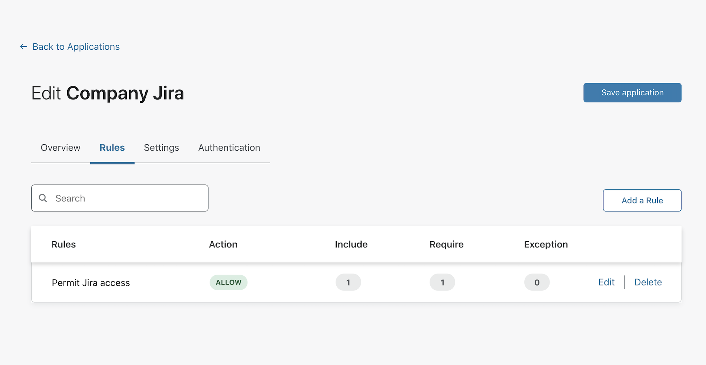

# Require Gateway connections

You can build rules in Cloudflare Access that require users to connect through your organization's Cloudflare Gateway configuration before they reach on-premise applications or login to [SaaS applications](https://blog.cloudflare.com/cloudflare-access-for-saas/).

**🗺️ This tutorial covers how to:**

* Add Cloudflare Gateway to your Cloudflare for Teams account
* Enroll devices in Cloudflare Gateway
* View enrolled devices
* Build a rule in Access to require Cloudflare Gateway

**⏲️Time to complete: 40 minutes**

## Configure Cloudflare Access

Before you begin, you'll need to follow [these instructions](https://developers.cloudflare.com/access/getting-started/access-setup/) to set up Cloudflare Access in your account.

## Add Cloudflare Gateway

Cloudflare Gateway operates in two modes:

* DNS filtering
* Proxy (HTTP filtering)

The proxy mode in Gateway requires a Gateway Standard or Cloudflare for Teams Standard [plan](https://www.cloudflare.com/teams-pricing/).

To filter all Internet-bound traffic in the proxy mode, devices must install and enroll the Cloudflare for Teams WARP client. The WARP client will send all Internet traffic to a Cloudflare data center near the user where it can be filtered and logged before reaching the rest of the Internet.

Building a rule in Access to enforce Gateway connections requires the use of the WARP client and its configuration to proxy Internet traffic to Cloudflare.

## Determine which devices can enroll

To proxy traffic through Gateway, devices must run the Cloudflare WARP client and [be enrolled in your Teams account](https://developers.cloudflare.com/gateway/connecting-to-gateway). When devices enroll, users will be prompted to authenticate with your identity provider or a consumer identity service. You can also deploy the client and its configurations [via a device management platform](https://developers.cloudflare.com/warp-client/warp-for-teams/teams) like JAMF or InTune.

First, determine which devices can enroll based on user identity. If you have already integrated your identity provider when setting up Cloudflare Access you can reuse that integration. If you have not set up an identity provider, follow [these instructions](https://developers.cloudflare.com/access/getting-started/access-setup) to add Access and integrate a free identity option or a specific provider.

Next, build a rule to decide which devices can enroll into your Gateway account. Navigate to the `Devices` page in the `My Teams` section of the sidebar.

Click `Device Settings` to build the enrollment rule. In the policy, define who should be allowed to enroll a device and click `Save`.

## Enroll a device

Follow the [instructions here](https://developers.cloudflare.com/warp-client/setting-up) to install the WARP client depending on your device type. Cloudflare Gateway does not need a special version of the client.

Once installed, click the gear icon.

Under the `Account` tab, click `Login with Cloudflare for Teams`.

Input your Cloudflare for Teams org name. You will have created this during the Cloudflare Access setup flow. You can find it under the `Authentication` tab in the `Access` section of the sidebar.

The user will be prompted to login with the identity provider configured in Cloudflare Access. Once authenticated, the client will update to `Teams` mode. You can click the gear to toggle between DNS filtering or full proxy. In this use case, you must toggle to `Gateway with WARP`. These settings can be configured globally for an organization through a device management platform.

## Configure the Cloudflare certificate

To inspect traffic, Cloudflare Gateway requires that a [certificate be installed](https://developers.cloudflare.com/gateway/connecting-to-gateway/install-cloudflare-cert) on enrolled devices. You can also distribute this certificate through an MDM provider. The example below follows a manual distribution flow.

Download the Cloudflare certificate provided in the [instructions here](https://developers.cloudflare.com/gateway/connecting-to-gateway/install-cloudflare-cert). You can also find the certificate in the Cloudflare for Teams dashboard. Navigate to the `Account` page in the `Settings` section of the sidebar and scroll to the bottom.

Next, follow [these instructions](https://developers.cloudflare.com/gateway/connecting-to-gateway/install-cloudflare-cert) to install the certificate on your system.

Once the certificate has been installed, you can configure Gateway to inspect HTTP traffic. To do so, navigate to the `Policies` page in the Gateway section. Scroll to the bottom and toggle `Proxy Settings` to enabled.

## View enrolled devices

You can view enrolled devices and their associated users in the Cloudflare for Teams dashboard. To do so, navigate to the `My Teams` section and open the `Devices` page.

## Build a Gateway rule in Access

You can now build rules in Cloudflare Access applications that require users connecting to those applications do so through Cloudflare Gateway. This can help protect your applications by only allowing devices which are blocked from reaching malware on the Internet. Additionally, you can ensure that you do not miss logs of SaaS application activity by requiring users who login to those SaaS applications only do so through Cloudflare Gateway.

To add a `Require Gateway` rule, navigate to the `Authentication` page of the `Access` section of the Cloudflare for Teams dashboard. Click the **Device Posture** tab. Click **+ Add**.

Select `Gateway` from the options listed.

Click **Save** on the next screen.

You can now build rules with your organization's Cloudflare Gateway configuration.

To do build rules, open the `Applications` page of the `Access` section of the dashboard. Edit an existing application or add a new one.

Edit an existing rule or add a new one.

In the rule builder view, click **+ Add require** and select `Gateway` from both drop-down menus.

Save the rule and the application.

Requests and logins to the application will now require Gateway be used to connect.

You can avoid adding the `Require Gateway` rule to each application manually by creating an `Access Group` which includes the `Require` rule, similar to [the configuration of country rules](/tutorials/country-rules). Add that `Access Group` to applications and the Gateway requirement will be enforced.
