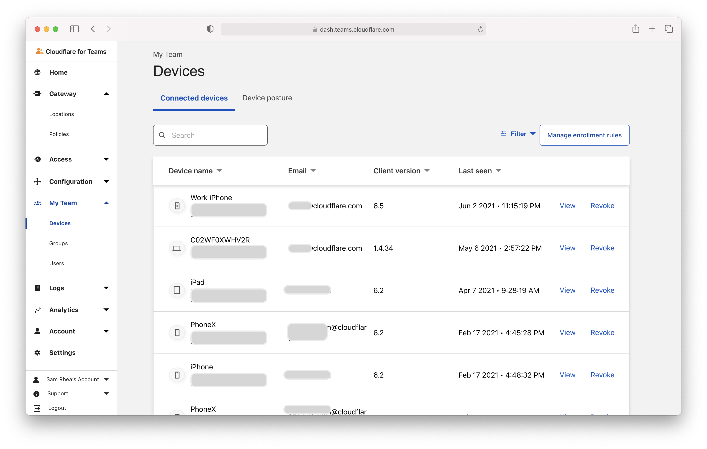
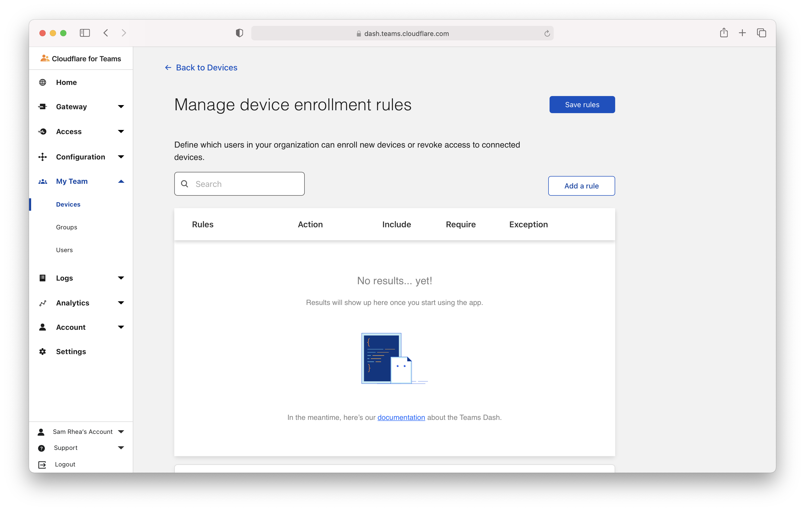
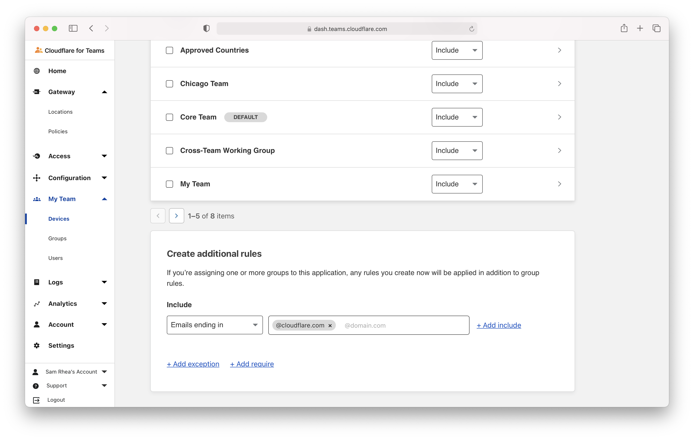
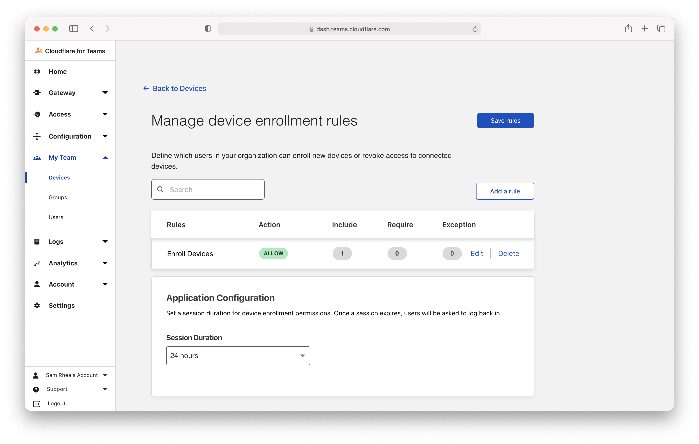
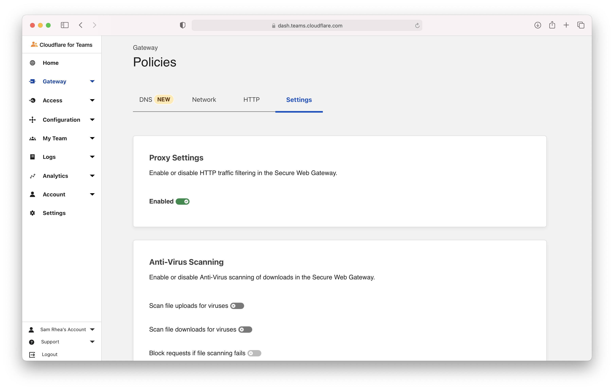
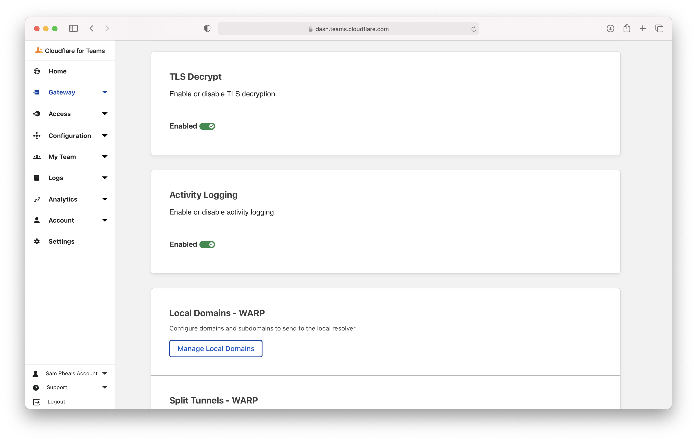

# Require Gateway connections

You can build rules in Cloudflare Access that require users to connect through your organization's Cloudflare Gateway configuration before they reach on-premise applications or login to [SaaS applications](https://blog.cloudflare.com/cloudflare-access-for-saas/).

**🗺️ This tutorial covers how to:**

* Add Cloudflare Gateway to your Cloudflare for Teams account
* Enroll devices in Cloudflare Gateway
* View enrolled devices
* Build a rule in Access to require Cloudflare Gateway

**⏲️Time to complete:**

40 minutes

---

## Add Cloudflare Gateway

Cloudflare Gateway operates in two modes:

* DNS filtering
* Proxy (HTTP filtering)

The proxy mode in Gateway requires a Gateway Standard or Cloudflare for Teams Standard [plan](https://www.cloudflare.com/teams-pricing/).

To filter all Internet-bound traffic in the proxy mode, devices must install and enroll the Cloudflare for Teams WARP client. The WARP client will send all Internet traffic to a Cloudflare data center near the user where it can be filtered and logged before reaching the rest of the Internet.

Building a rule in Access to enforce Gateway connections requires the use of the WARP client and its configuration to proxy Internet traffic to Cloudflare.

## Determine which devices can enroll

Next, build a rule to decide which devices can enroll in your account. Navigate to the `Devices` page in the `My Teams` section of the sidebar.

Click **Manage enrollment rules** to build the enrollment Next, click **Add a rule** to begin.

You can determine who is allowed to enroll using criteria including Access groups, groups from your identity provider, email domain, or named users. This example allows any user with a `@cloudflare.com` account to enroll.

Return to the top of the page and click **Add rule**.

On the next page, click **Save rules** to conclude.

## Configure the Cloudflare certificate

To inspect traffic, Cloudflare Gateway requires that a [certificate be installed](/connections/connect-devices/warp/install-cloudflare-cert) on enrolled devices. You can also distribute this certificate through an MDM provider. The example below describes the manual distribution flow.

Download the Cloudflare certificate provided in the [instructions here](/connections/connect-devices/warp/install-cloudflare-cert). You can also find the certificate in the Cloudflare for Teams dashboard - navigate to the `Account` page in the `Settings` section of the sidebar and scroll to the bottom.

Next, follow [these instructions](/connections/connect-devices/warp/install-cloudflare-cert) to install the certificate on your system.

## Enable the Cloudflare proxy

Once the certificate has been installed, you can configure Gateway to inspect HTTP traffic. To do so, visit the `Settings` tab in the `Policies` page. Toggle `Proxy Settings` to **Enabled**. This will tell Cloudflare to begin proxying any traffic from enrolled devices, except the traffic excluded using the [split tunnel](/connections/connect-devices/warp/exclude-traffic) settings.

Next, enable TLS decryption. This will tell Cloudflare to begin decrypting traffic for inspection from enrolled devices, except the traffic excluded from inspection.

## Enroll a device

Follow the [instructions](/connections/connect-devices/warp/deployment) to install the WARP client depending on your device type. Cloudflare Gateway does not need a special version of the client.

Once installed, click the gear icon.

Under the `Account` tab, click `Login with Cloudflare for Teams`.

Input your Cloudflare for Teams [organization name](/glossary#team-name), which is the editable part of your [team domain](/glossary#team-domain). You will have created this during the Cloudflare for Teams setup flow, and you can find it under the **Settings > General** section of the Teams Dashboard.

The user will be prompted to log in with the identity provider configured in Cloudflare Access. Once authenticated, the client will update to `Teams` mode. You can click the gear to toggle between DNS filtering or full proxy. In this use case, you must toggle to `Gateway with WARP`. These settings can be configured globally for an organization through a device management platform.

## Build a Gateway rule in Access

You can now build rules in Cloudflare Access applications that require users connecting to those applications do so through Cloudflare Gateway. This can help protect your applications by only allowing devices which are blocked from reaching malware on the Internet. Additionally, you can ensure that you do not miss logs of SaaS application activity by requiring users who login to those SaaS applications only do so through Cloudflare Gateway.

To add a `Require Gateway` rule, navigate to the `Authentication` page of the `Access` section of the Cloudflare for Teams dashboard. Click the **Device Posture** tab. Click **+ Add**.

Select `Gateway` from the options listed.

Click **Save** on the next screen.

You can now build rules with your organization's Cloudflare Gateway configuration.

To do build rules, open the `Applications` page of the `Access` section of the dashboard. Edit an existing application or add a new one.

Edit an existing rule or add a new one.

In the rule builder view, click **+ Add require** and select `Gateway` from both drop-down menus.

Save the rule and the application.

Requests and logins to the application will now require Gateway be used to connect.

You can avoid adding the `Require Gateway` rule to each application manually by creating an `Access Group` which includes the `Require` rule, similar to [the configuration of country rules](/tutorials/country-rules). Add that `Access Group` to applications and the Gateway requirement will be enforced.
