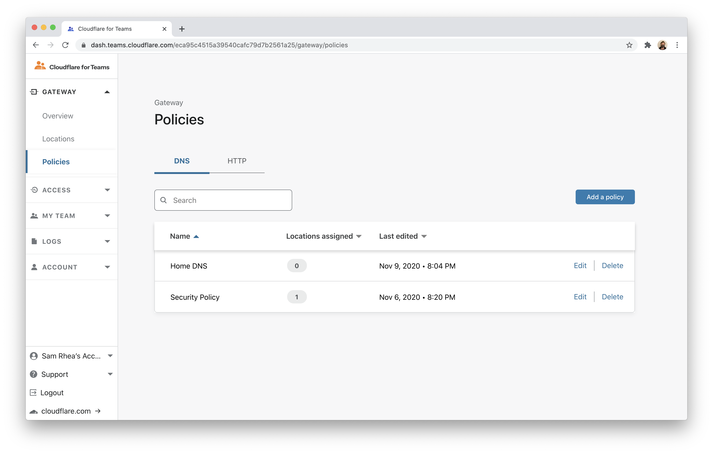
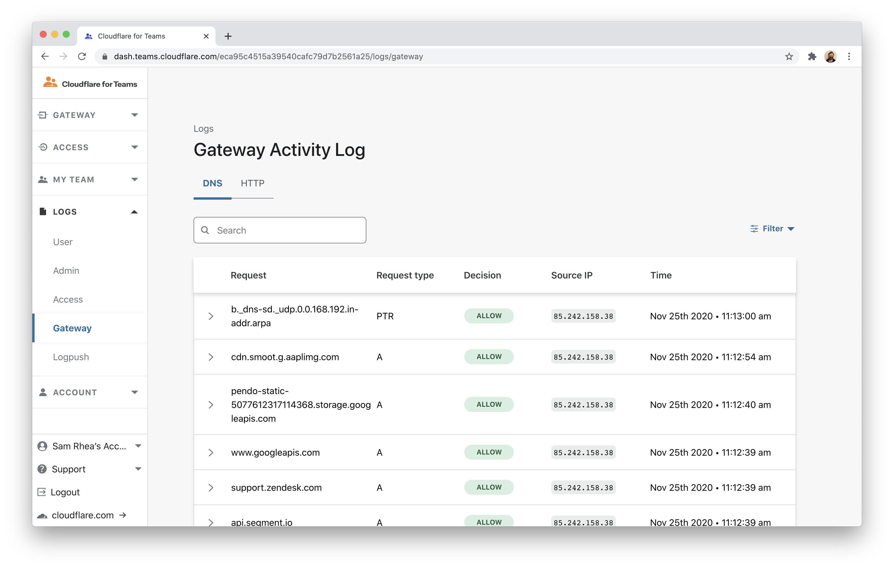
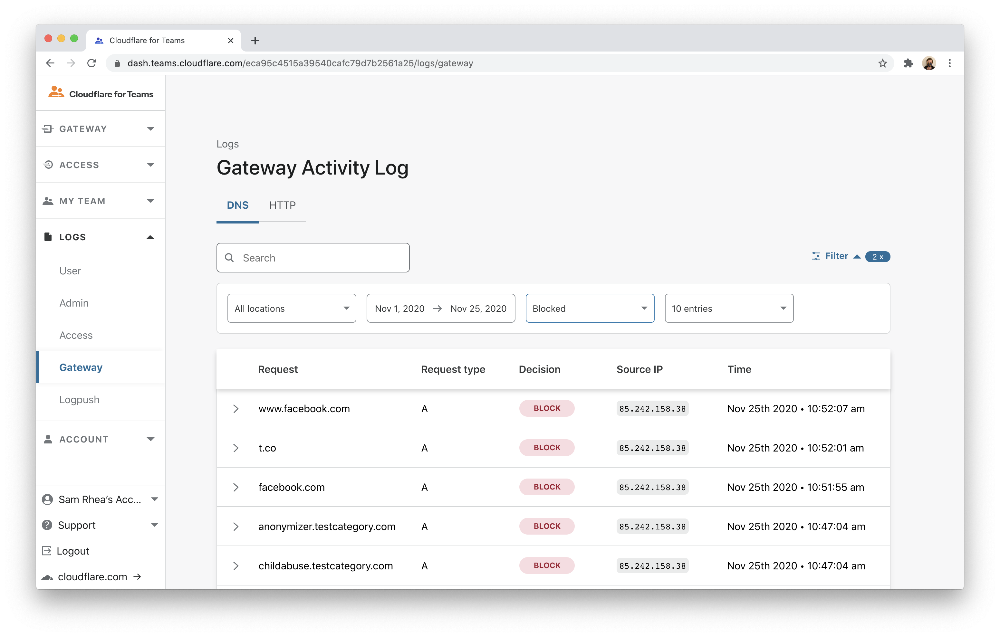
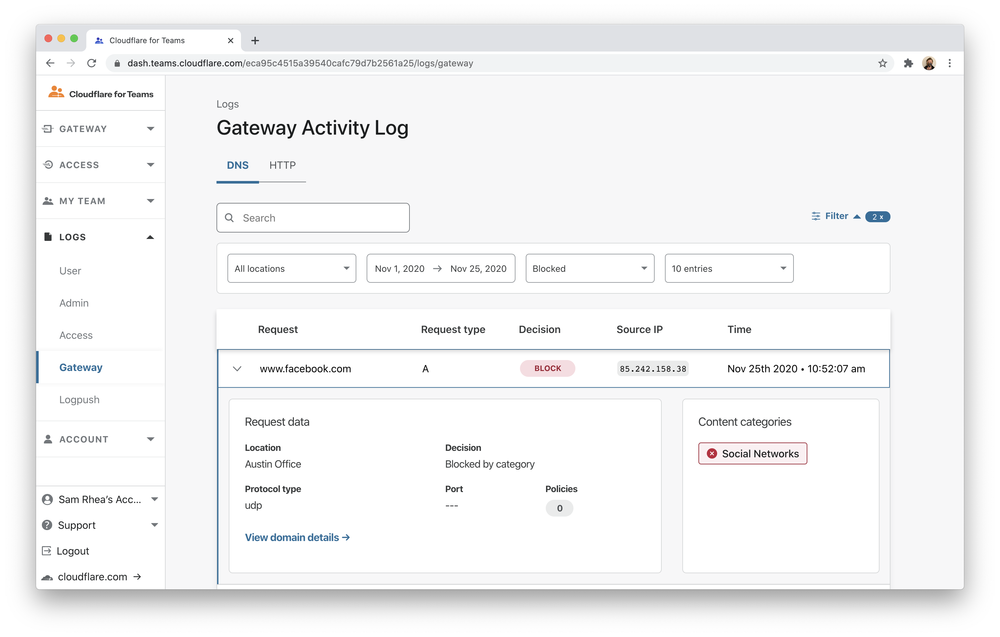
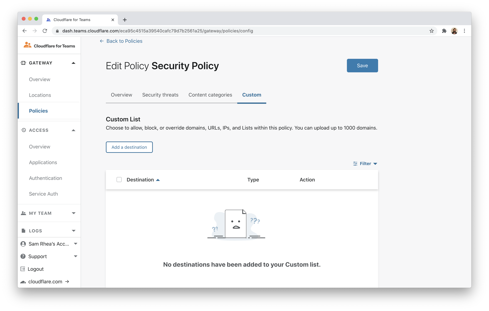
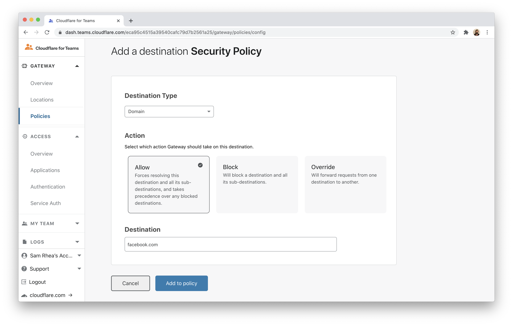

# Review Gateway blocks

You can use Cloudflare Gateway and the Cloudflare WARP client application to filter and log DNS queries from devices on any network. You can also use Cloudflare Radar to review why a site has been blocked.

**🗺️ This tutorial covers how to:**

* Review DNS filtering logs in Cloudflare Gateway
* Review the reason a domain was blocked in Cloudflare Radar
* Submit categorization feedback

**⏲️Time to complete: ~5 minutes**

## Configure Cloudflare Gateway

Before you begin, you'll need to follow [these instructions](https://developers.cloudflare.com/gateway/getting-started/onboarding-gateway) to set up Cloudflare Gateway in your account. To perform DNS filtering, you need one of the following subscriptions:

* Teams Free
* Teams Standard
* Gateway

You can follow [these instructions](/secure-web-gateway/secure-dns-devices) to configure Gateway DNS filtering on roaming devices and [these instructions](/secure-web-gateway/secure-dns-network) for home or office networks.

## Review Gateway events

Once deployed, you can review which policies apply to which locations in the `Policies` page of the `Gateway` section in the Cloudflare for Teams dashboard.

To see how these impact real traffic, navigate to the `Gateway` page in the `Logs` section.

You can filter by date and by decision type. Select `Block` as the type to review blocked events.

## Review block reason

You can select any of the events in the logs view to review the initial reason for the block. In this example, the policy configured blocks Social Media, which is the category that `facebook.com` belongs to.

You can review more information in Cloudflare Radar, Cloudflare's Internet security and trends tool. Click `View domain details` to launch the Radar page for the hostname selected.

You can review information like site ranking, certificate history, and WHOIS information. If you believe the site was not categorized appropriately, click `Submit Categorization Feedback` beneath the `Content Categories` section.

## Override a rule

If you need to allow a specific hostname immediately, you can override a hostname in a rule that takes precedence over content or security categories.

Navigate to the policy being applied and click `Edit`. Select the `Custom` tab of the policy.

Click `Add a destination`. In the next screen, select the `Allow` button and input the hostname that should override the category-based policies. Click save. This hostname will now resolve even if blocked by a content or security policy.

