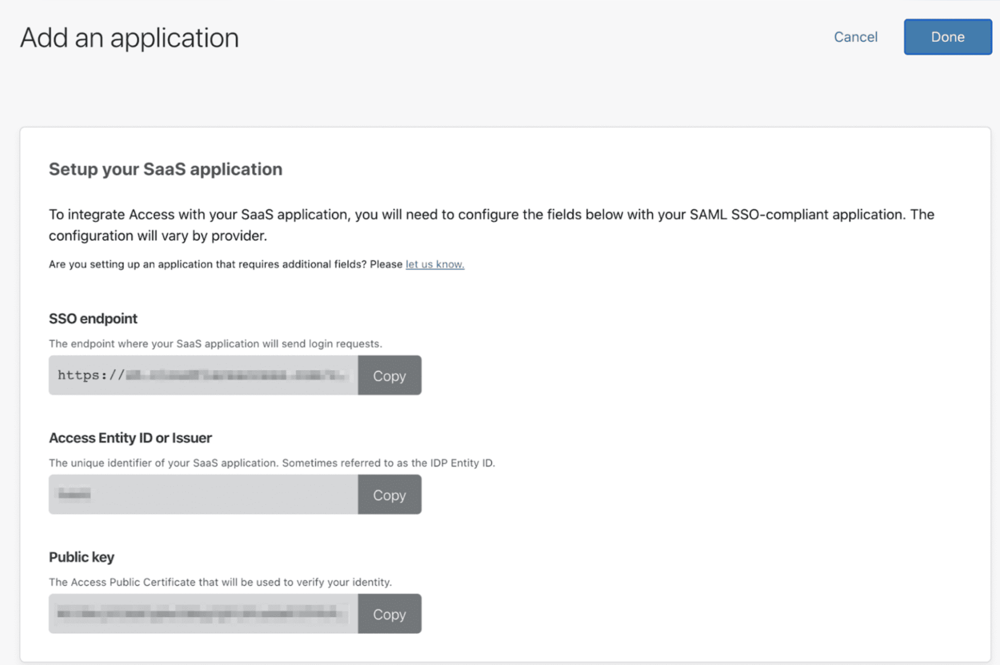

# Salesforce with Access for SaaS configuration

**🗺️ This tutorial covers how to:**
* Configure Salesforce as a SaaS application in Teams
* Force logins to Salesforce through Cloudflare's Zero Trust rules

**⏲️ Time to complete: 15 minutes**

What's needed to complete this guide:
* Admin access to a Cloudflare for Teams account
* Admin access to a Salesforce account

## Set up Salesforce as a SaaS application in Teams

1. On the [Teams dashboard](https://dash.teams.cloudflare.com), navigate to **Access > Applications**.
1. Select the SaaS application type. 
1. Next, select *Salesforce* from the **Application** drop-down menu.
1. Fill the remaining fields as follows:
    * **Entity ID**: `https://salesforce.com`
    * **Assertion consumer service URL**: https://[YOUR_SFDC_DOMAIN].my.salesforce.com
    * **Name ID format**: Email
1. Click **Next**.
1. Set the desired policy configuration for user access.
1. Click Add application.
1. Next, take note of the **SSO endpoint**, the **Access Entity ID or Issuer**, and the **Public Key**.

## Create a certificate file

1. Paste the **Public key** in VIM or another code editor.
1. Wrap the certificate in `-----BEGIN CERTIFICATE-----` and `-----END CERTIFICATE-----`.
1. Set the file extension as `.crt` and save.

## Enable Single Sign-On in Salesforce

1. In Salesforce, ensure your users have **Federation IDs**.

 <Aside>
 The Federation ID is found under Manage Users > Users in Setup. The Federation ID should match the email address of the user authenticating via Access.
 </Aside>

   

2. Navigate to **Security Controls > Single Sign-On Settings**
3. Set the following global settings:
    * **SAML Enabled:** true
    * **Make federation ID case-insensitive:** true

## Create a new SAML Single-Sign On configuration

1. Create a new SAML Single-Sign On configuration
Configure as follows:
  * **Name:** (this is what you want your users to see on sign in)
  * **API name:** (this will pre-populate)
  * **Issuer:** your-team-name.cloudflareaccess.com, where your-team-name is your [team name](/glossary#team-name).
  * **Identity Provider Certificate**: upload the `.crt` certificate file you’ve created in the previous step. 
  * **EntityID**: `https://salesforce.com`
  * **SAML Identity type:** Assertion contains the Federation ID from the User object
  * **Identity Provider Login URL**: This is the SSO endpoint provided in the Teams dashboard for that application.

1. Click **Save**.

  