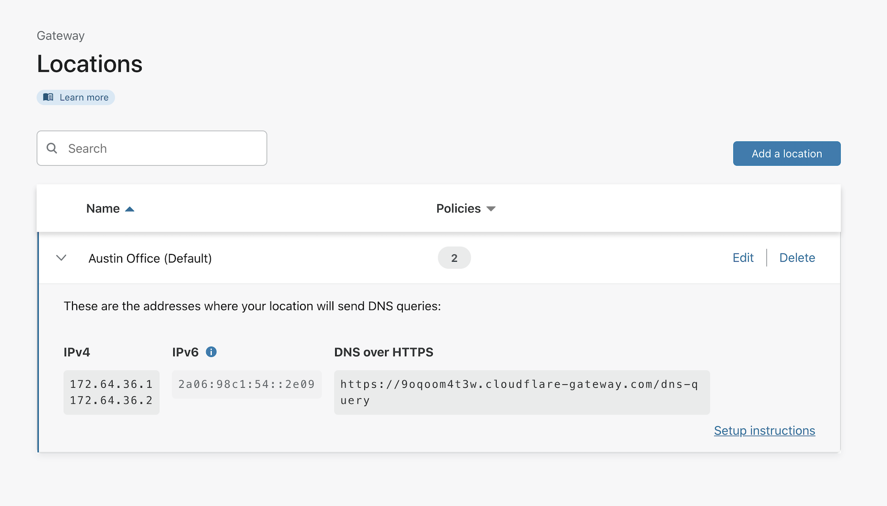
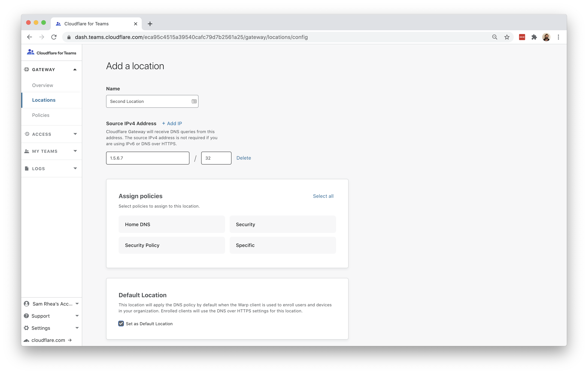

# Filter DNS on devices

You can use Cloudflare Gateway and the Cloudflare WARP client application to filter and log DNS queries from devices on any network.

**🗺️ This tutorial covers how to:**

* Create a DNS filtering policy that secures devices by blocking malicious hostnames
* Apply that policy to devices on any network

**⏲️ Time to complete: ~45 minutes**

| Before you start |
|---|
| 1. [Add Gateway to your account](/setup) |

## Create a default location

When you [enable Cloudflare Gateway](/setup) for the first time, you will be prompted to configure your first location. You can use that Location to represent a physical office and/or roaming users.

Start by navigating to the `Locations` page in the `Gateway` section of the sidebar. You will see the first location that you added has been set as the Default. Any device that enrolls into your Gateway account will follow the policies set for the default location by using the `DNS over HTTPS` address.

If you wish to [use a different Location](/connections/connect-networks/locations) as your Default, and subsequently the one used for roaming devices, click `Add a location`. During location creation, toggle the `Default location` toggle and the new location will be the Default.

## Create a Secure Web Gateway policy

Next, you can [build a policy](/policies/filtering/dns-policies) that will filter DNS queries for known malicious hostnames and other types of threats. Navigate to the `Policies` page. On the DNS tab, click `Add a policy`.

Assign the policy a name and choose which locations will adhere to this policy. In this example, `Austin Office` is the only location and also the Default. Any devices which enroll will be grouped into this location using its `DNS over HTTPS` hostname.

Under the `Security threats` tab you can toggle which types of threats to block. In this case, choosing `Block all` will toggle all threats to be blocked.

You can also configure content or custom blocks. Once complete, click `Save`.

## Determine which devices can enroll

Now that you have a default location and DNS filtering policy, you can [begin to enroll devices](/connections/connect-devices/warp/deployment). When devices enroll, users will be prompted to authenticate with your identity provider or a consumer identity service. By authenticating, you can attribute devices and DNS queries to users while also limiting who can enroll.

To begin, you will need to enable Cloudflare Access for your account. Cloudflare Access provides the identity integration to enroll users. This feature of Cloudflare Access is available in the Teams Free plan or in the Gateway plan at no additional cost. Follow [these instructions](/setup) to add Access and integrate a free identity option or a specific provider.

Next, build a rule to decide which devices can enroll into your Gateway account. Navigate to the `Devices` page in the `My Teams` section of the sidebar.

Click `Device Settings` to build the enrollment rule. In the policy, define who should be allowed to enroll a device and click `Save`.

## Enroll a device

You can use the WARP client to enroll a device into your security policies. Follow the [instructions here](/connections/connect-devices/warp) to install the client depending on your device type. Cloudflare Gateway does not need a special version of the client.

Once installed, click the gear icon.

Under the `Account` tab, click `Login with Cloudflare for Teams`.

Input your Cloudflare for Teams [team name](/glossary#team-name). You will have created this during the Cloudflare Access setup flow. You can find it under the `Authentication` tab in the `Access` section of the sidebar.

The user will be prompted to login with the identity provider configured in Cloudflare Access. Once authenticated, the client will update to `Teams` mode. You can click the gear to toggle between DNS filtering or full proxy. In this use case, you only need DNS filtering.

You can confirm that the device is using the default location under the `Connection` tab. The DoH address will match that of the default location.

## Optional: deploy via MDM

You can deploy the WARP client on corporate devices in a way that does not require users to configure the Org Name. To do so, [follow these instructions](/connections/connect-devices/warp/deployment).