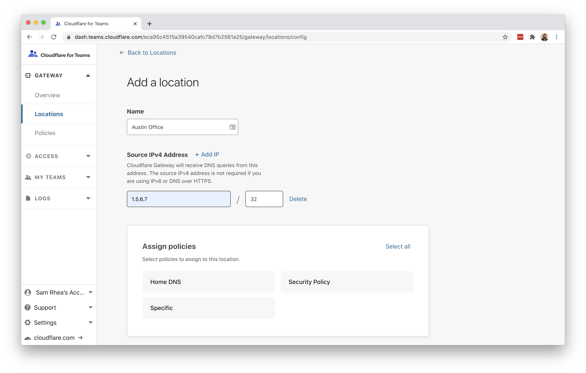
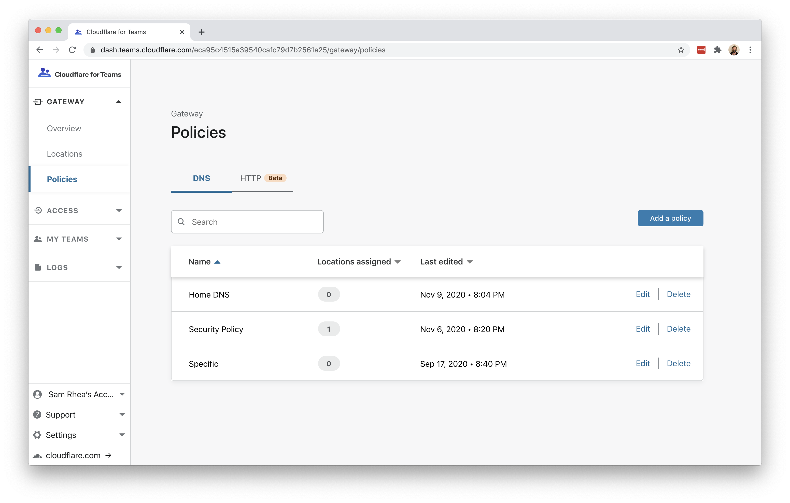
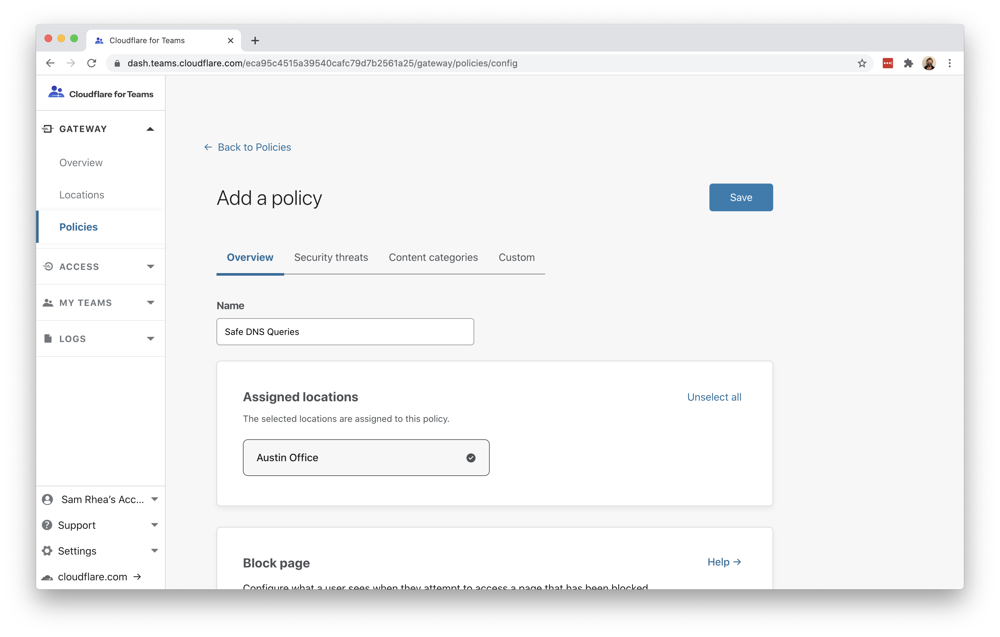
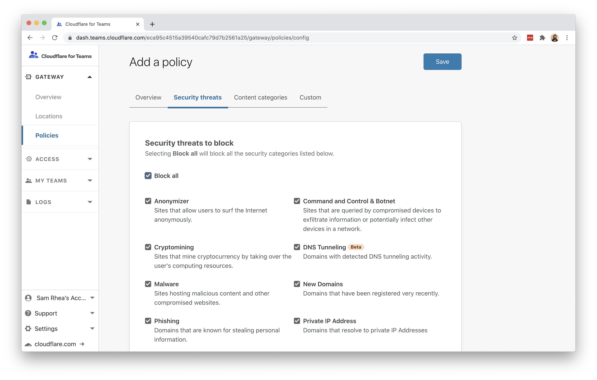
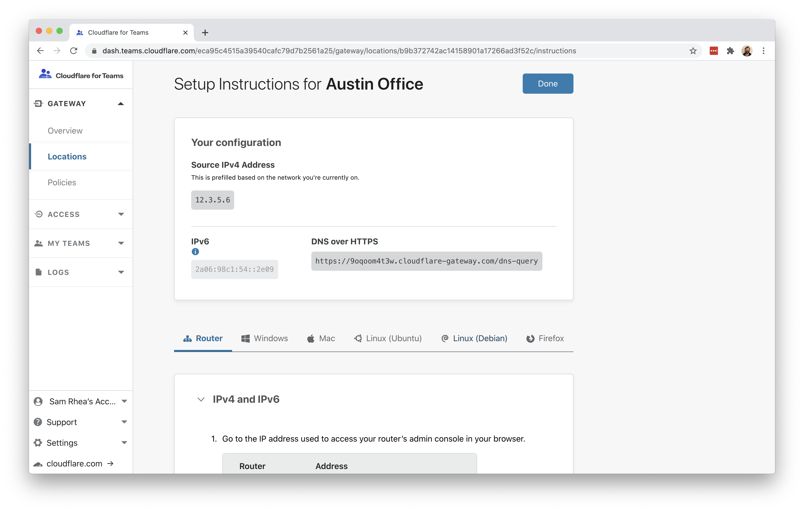
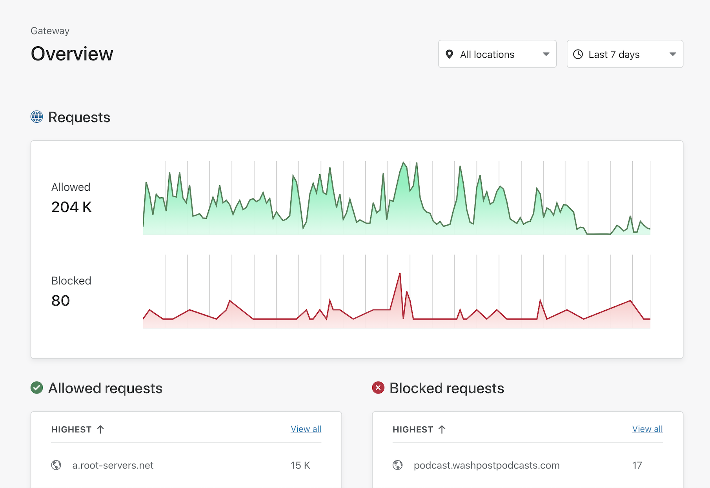

# Filter DNS on home or office network

You can use Cloudflare Gateway to filter and log DNS queries from any device using your network without installing client software.

**🗺️ This tutorial covers how to:**

* Create a DNS filtering policy that secures a home or office network by blocking malicious hostnames
* Review logs and events that occur on that network

**⏲️Time to complete: ~15 minutes**

## Configure Cloudflare Gateway

Before you begin, you'll need to follow [these instructions](https://developers.cloudflare.com/gateway/getting-started/onboarding-gateway) to set up Cloudflare Gateway in your account. To perform DNS filtering, you need one of the following subscriptions:

* Teams Free
* Teams Standard
* Gateway

## Add a location

During the Gateway onboarding flow, the dashboard will prompt you to configure a location for the IP you are currently using. Gateway will automatically detect the IP of your current network and assign it to the location being created.

If you want to create a different location, one that you are not currently using, you can add a new location from the `Locations` page in the `Gateway` Section.

## Create a Gateway policy

Next, you can [build a policy](https://developers.cloudflare.com/gateway/getting-started/configuring-dns-policy) that will filter DNS queries for known malicious hostnames and other types of threats. Navigate to the `Policies` page. On the DNS tab, click `Add a policy`.

Assign the policy a name and choose which locations will adhere to this policy. In this example, `Austin Office` is the only location and also the Default.

Under the `Security threats` tab you can toggle which types of threats to block. In this case, choosing `Block all` will toggle all threats to be blocked.

You can also configure content or custom blocks. Once complete, click `Save`. The policy will now filter DNS queries from that location once you have configured your router.

## Configure your router

You will need to make a one-time change to your router to use Cloudflare Gateway for DNS filtering for all devices in your network.

Instructions to change your router's DNS settings are available in the Cloudflare for Teams dashboard. Navigate to the `Locations` page and expand the location you want to configure. Click `Setup instructions`.

The default toggle presented will be `Router`. Follow the instructions on the page to change your router settings. Additional instructions are available for routers from specific manufacturers in the [documentation here](https://developers.cloudflare.com/1.1.1.1/setting-up-1.1.1.1/router).

## Review events

Once configured, you can review DNS queries made from your network in the Gateway overview page.

