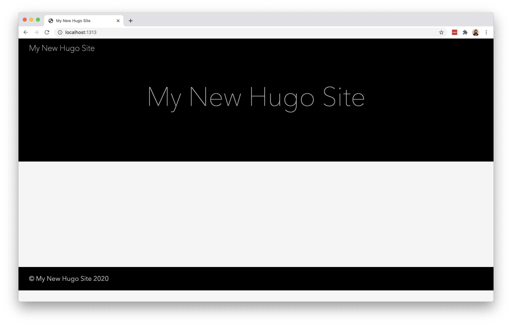
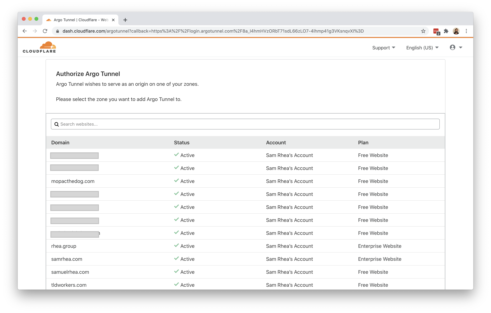
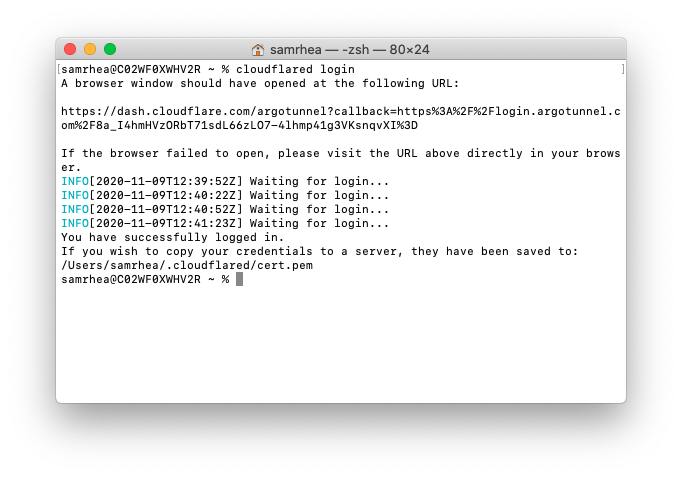
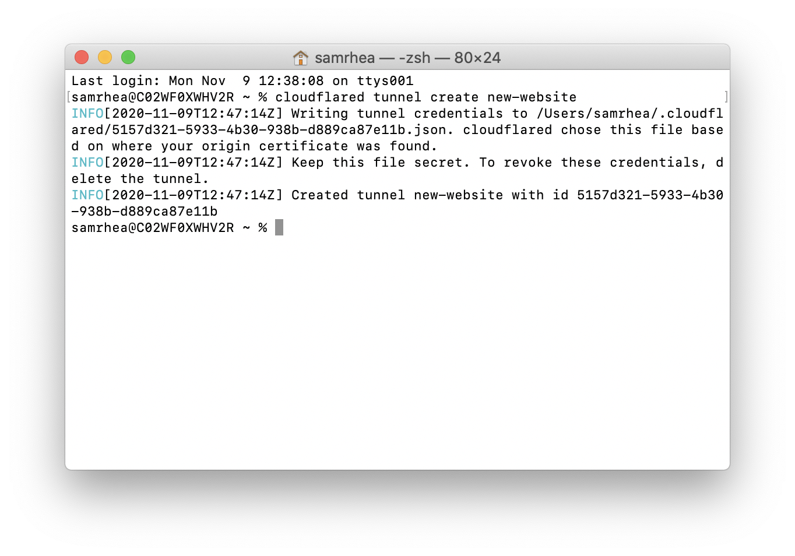
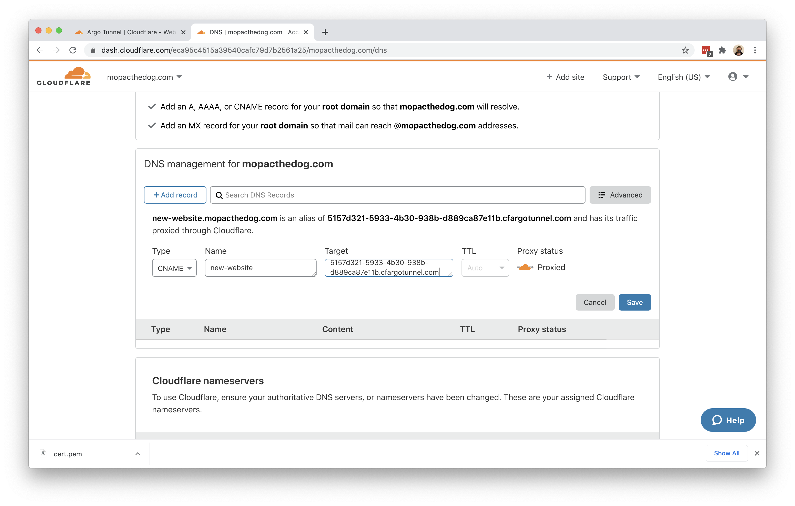
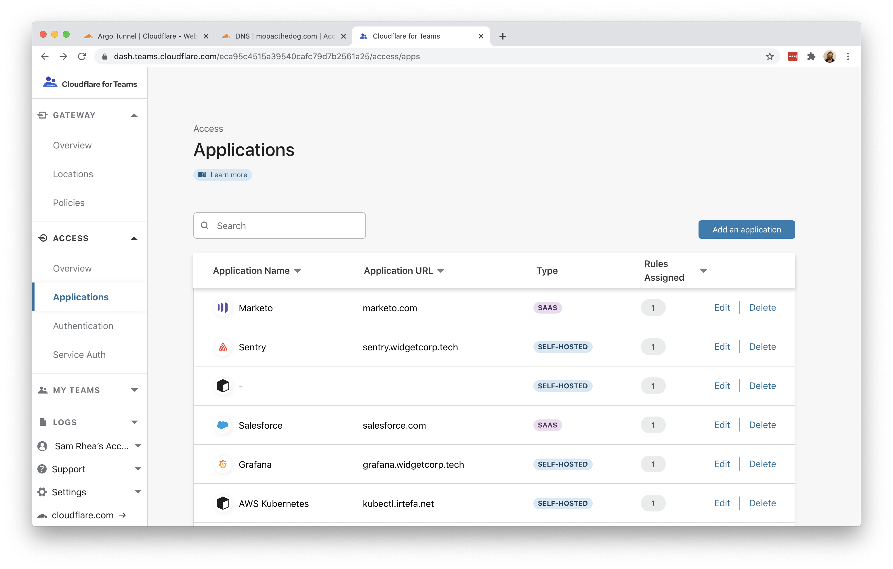
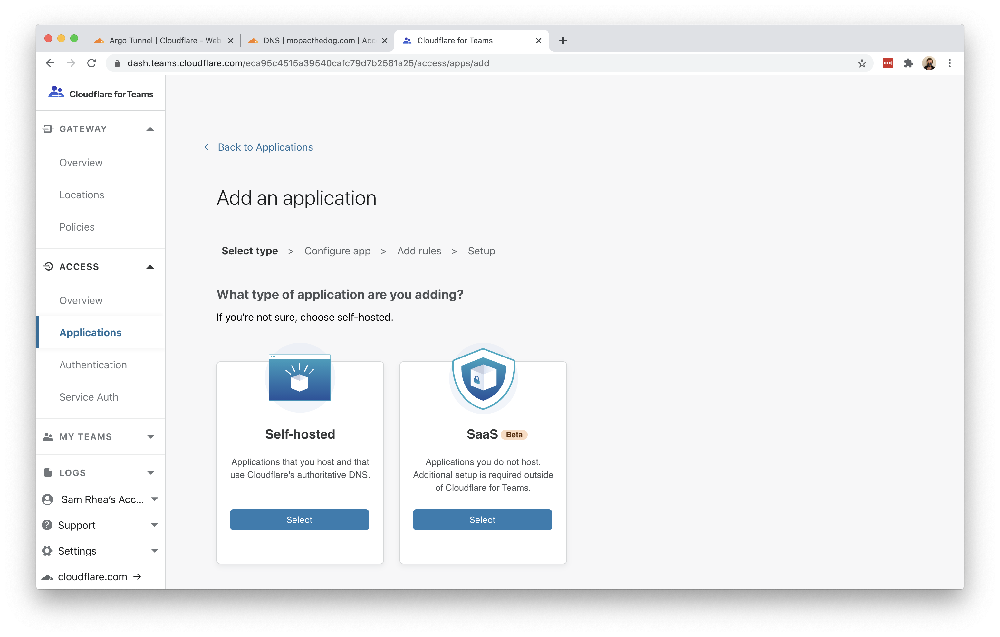
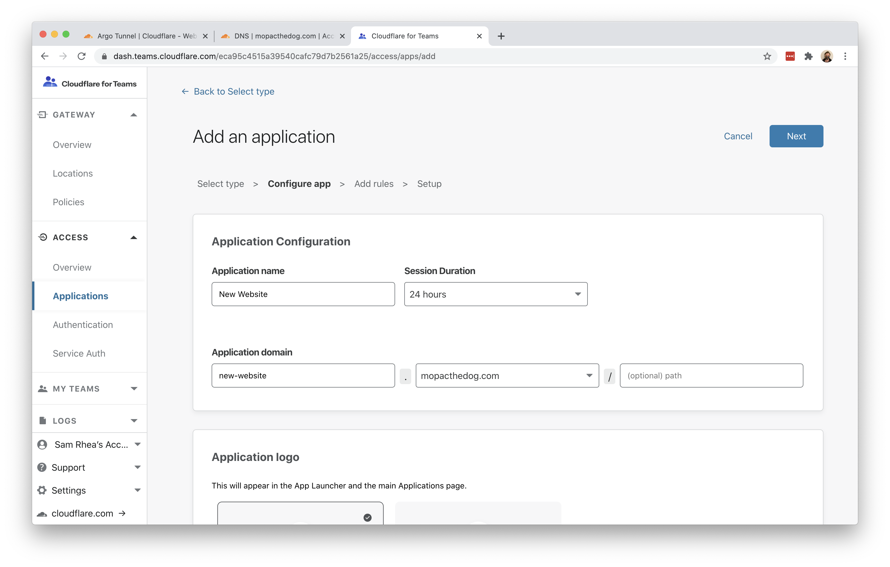
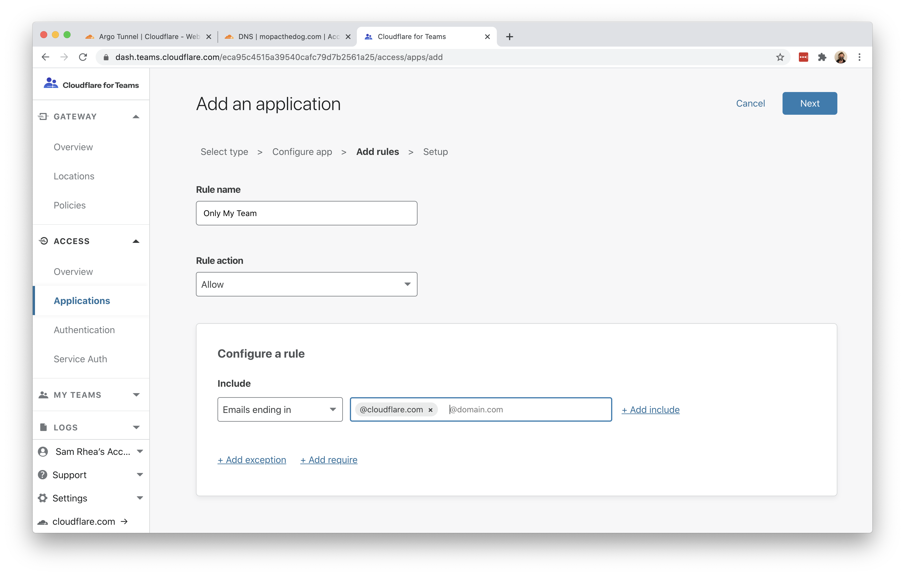

# Share development environments

You can use Cloudflare's reverse proxy and [Argo Tunnel](/glossary#argo-tunnel) to share local development environments with team members or customers.

**🗺️ This tutorial covers how to:**

* Start a secure, outbound-only, connection from an application running locally on a Mac laptop
* Give that application a hostname where users can reach the resource
* Optionally require a simple login to reach the application with Cloudflare Access

**⏲️Time to complete: ~30 minutes**

Instead of pointing DNS records to the external IP of a web service, you can connect that service to Cloudflare's network using Argo Tunnel. Argo Tunnel relies on a lightweight service, `cloudflared`, that you run in your infrastructure. `cloudflared` makes outbound-only connections to Cloudflare's network, so that you do not need to open holes in your firewall.

You can use Argo Tunnel to quickly share projects you are working on with team members. In this example, you can use Argo Tunnel to give users a preview of a new website. At the end, as an optional step, you'll be able to add a [Zero Trust policy](/policies/zero-trust) to only allow certain people to reach the site.

| Before you start |
|---|
| 1. [Add a website to Cloudflare](https://support.cloudflare.com/hc/en-us/articles/201720164-Creating-a-Cloudflare-account-and-adding-a-website) |
| 2. [Change your domain nameservers to Cloudflare](https://support.cloudflare.com/hc/en-us/articles/205195708) |
| 3. [Enable Argo Smart Routing for your account](https://support.cloudflare.com/hc/articles/115000224552-Configuring-Argo-through-the-UI)  |

## Install `cloudflared`

In this example, the new website is a [Hugo site](https://gohugo.io/getting-started/quick-start/). Hugo, a static site generator, provides a built-in server that can be used for testing changes. That server is available at `localhost:1313` - an address only available currently on the same machine as the server.



To share this work-in-progress with an audience on the Internet, start by [downloading and installing](/connections/connect-apps/install-and-setup) the Argo Tunnel daemon, `cloudflared`. On Mac, you can do so by running the following `brew` command. If you do not have Homebrew, follow the [documentation](https://docs.brew.sh/Installation) to install it.

`$ brew install cloudflare/cloudflare/cloudflared`

Once installed, run the following command in your Terminal to authenticate this instance of `cloudflared` into your Cloudflare account.

`$ cloudflared login`

The command will launch a browser window and prompt you to login with your Cloudflare account. Choose a website that you have added into your account.



Once you click one of the sites in your account, Cloudflare will download a certificate file to authenticate this instance of `cloudflared`. You can now use `cloudflared` to control Argo Tunnel connections in your Cloudflare account.



## Create a Tunnel

You can now [create an Argo Tunnel](/connections/connect-apps/create-tunnel) that will connect `cloudflared` to Cloudflare's edge. You'll configure the details of that Tunnel in the next step.

Run the following command to create a Tunnel. You can replace `new-website` with any name that you choose.

`$ cloudflared tunnel create new-website`

Cloudflare will create the Tunnel with that name and generate an ID and credentials file for that Tunnel.



## Configure `cloudflared`

You can now [configure](/connections/connect-apps/configuration) `cloudflared` to route traffic to your local development environment. You can use a configuration file to do so, which makes it easier to start `cloudflared` in the future.

By default, `cloudflared` expects the configuration file at a specific location: `~/.cloudflared/config.yml`. You can modify this location if you want. For this example, we'll keep the default. Create or edit your configuration file using a text editor.

`$ vim ~/.cloudflared/config.yml`

The `url` value is the destination where the new website is available locally. The `tunnel` and `credentials-file` value can be copied from the output of the last command.

```yml
url: http://localhost:1313
tunnel: 5157d321-5933-4b30-938b-d889ca87e11b
credentials-file: /Users/username/.cloudflared/5157d321-5933-4b30-938b-d889ca87e11b.json
```

## Run Argo Tunnel

At this point, you have created and configured your Argo Tunnel connection. You can now [run that](https://developers.cloudflare.com/argo-tunnel/create-tunnel) Tunnel. Running it will create connections to Cloudflare's edge. Those connections will not respond to traffic, yet. You'll add DNS records in the next step to share the resource across the Internet.

`$ cloudflared tunnel run`

## Create DNS records

You can now [route traffic](/connections/connect-apps/routing-to-tunnel) to your Tunnel, and on to your local server, using Cloudflare DNS. Visit the [Cloudflare dashboard](https://dash.cloudflare.com), select a website, and click on the `DNS` tab.

Click `+Add record` and choose `CNAME`. In the `Name` field, add the name of the subdomain of your new site. In the `Content` field, paste the ID of your Tunnel created earlier and append `cfargotunnel.com`.

`5157d321-5933-4b30-938b-d889ca87e11b.cfargotunnel.com`



Alternatively, you can create a DNS record from `cloudflared` directly.

Once saved, you can share the subdomain created and visitors can reach your local web server environment.

## Optional: Add a Zero Trust policy

When you create the DNS record, any visitor will be able to view that new site. You can restrict the audience to certain users by adding a rule in Cloudflare Access. You can also build this Access rule before creating the DNS record so that the site is never accessible to the rest of the Internet.

Before you build the rule, you'll need to follow [these instructions](/setup) to set up Cloudflare Access in your account.

Once enabled, navigate to the `Applications` page in the Cloudflare for Teams dashboard. Click `Add an application`.



Choose self-hosted from the options presented.



In the policy builder, add the subdomain of your new DNS record that represents your Argo Tunnel connection.



You can then add rules to determine who can reach the site.



## Additional Materials

* You can use this model to [share more complex development environments](https://blog.cloudflare.com/how-argo-tunnel-engineering-uses-argo-tunnel/) with other team members.