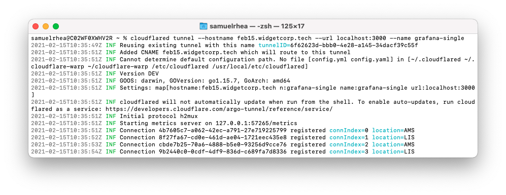

# Create and connect an application with a single command

You can use [Argo Tunnel](/connections/connect-apps) to connect applications and servers to Cloudflare's network. Argo Tunnel relies on a piece of software, `cloudflared`, to create those connections.

Argo Tunnels are [persistent objects](https://blog.cloudflare.com/argo-tunnels-that-live-forever/) that, once created, do not need to be recreated each time. The connections inside of an Argo Tunnel are ephemeral; your service can restart or be taken offline without deleting and recreating the Tunnel or associated DNS entries.

You can create and configure Argo Tunnel connections to [support multiple HTTP origins](/tutorials/multi-origin) or [multiple protocols simultaneously](/tutorials/gitlab). Doing so requires the use of a [configuration file](/connections/connect-apps/configuration/config), which Cloudflare recommends in most use cases. However, if you want to quickly spin up a new Tunnel, you can also use a single command to create, run, and route traffic to an Argo Tunnel.

<Aside>

If you are migrating from "classic" Argo Tunnel deployments to the new, persistent, model you can [follow the instructions](/tutorials/migrate-lb-tunnel) to migrate without downtime.

</Aside>

**🗺️ This tutorial covers how to:**

* Start a secure, outbound-only, connection from a machine to Cloudflare
* Give the application a hostname where users can connect
* Complete the entire process with a single command using `cloudflared`

**⏲️ Time to complete: 10 minutes**

## Install `cloudflared`

Start by [downloading and installing](/connections/connect-apps/install-and-setup) the Argo Tunnel daemon, `cloudflared`. On Mac, you can do so by running the following `brew` command. If you do not have Homebrew, follow the [documentation](https://docs.brew.sh/Installation) to install it.

`$ brew install cloudflare/cloudflare/cloudflared`

Once installed, run the following command in your Terminal to authenticate this instance of `cloudflared` into your Cloudflare account.

`$ cloudflared login`

The command will launch a browser window and prompt you to login with your Cloudflare account. Choose a website that you have added into your account. This will authenticate your instance of `cloudflared` to your Cloudflare account; you will be able to create a Tunnel for any site, not just the site selected.

Once you click one of the sites in your account, Cloudflare will download a certificate file, called `cert.pem` to authenticate this instance of `cloudflared`. The `cert.pem` file uses a certificate to authenticate your instance of `cloudflared` and includes an API key for your account to perform actions like DNS record changes.

You can now use `cloudflared` to control Argo Tunnel connections in your Cloudflare account.

## Create and run a Tunnel

You can now [create an Argo Tunnel](/connections/connect-apps/create-tunnel) that will connect `cloudflared` to Cloudflare's edge. In this example, you can use a single command to perform all of the steps required to connect an application to Cloudflare's edge. The command will perform the following functions:

1. [Create an Argo Tunnel](/connections/connect-apps/create-tunnel) with an associated name. That Argo Tunnel can serve traffic for multiple services and multiple hostnames; this example uses a single service and single hostname.
2. [Create DNS records](/connections/connect-apps/routing-to-tunnel) for the Tunnel. These DNS records will send traffic to the Tunnel. The records created will not be deleted if the Tunnel is interrupted or if `cloudflared` or your origin service restarts.
3. [Configure the Tunnel](/connections/connect-apps/configuration) by sending traffic to the URL specified. In this example, the only configuration argument required is the URL where traffic should be directed.
4. [Run the Tunnel](/connections/connect-apps/run-tunnel) and begin serving traffic.

Run the following command to perform all of the functions listed above, replacing the `--hostname` value with a hostname in your Cloudflare account as well as the `--url` and `--name` values with the URL of your service and the name you would like to assign to the Tunnel.

`cloudflared tunnel --hostname example.widgetcorp.tech --url localhost:3000 --name grafana`

The command above will
* create a Tunnel named `Grafana`,
* create a persisent DNS record at the `example` subdomain, and
* send traffic directed to that hostname through the Tunnel and to the service available at `localhost:3000`.

## Manage the Tunnel

You can now stop and restart `cloudflared` as needed. Stopping `cloudflared` will not delete the named Tunnel or the DNS record created. If you restart `cloudflared` with the same command, Cloudflare will recognize that you have already created a Tunnel with that name and that a DNS entry exists and will skip the step to reprovision those entries.

To review the Tunnels that you have created, and their connection status, run the following `list` command.

`cloudflared tunnel list`

