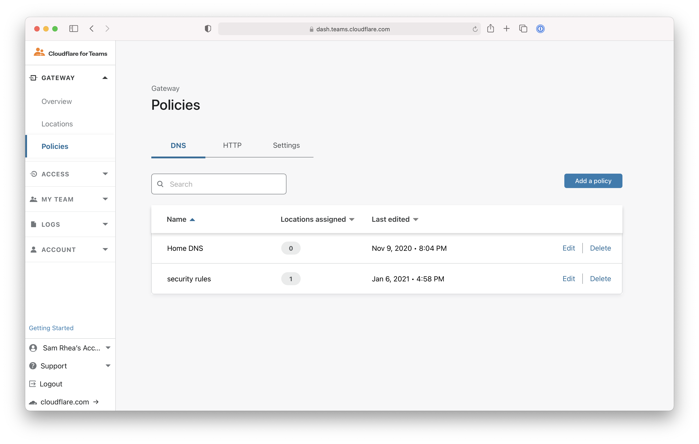
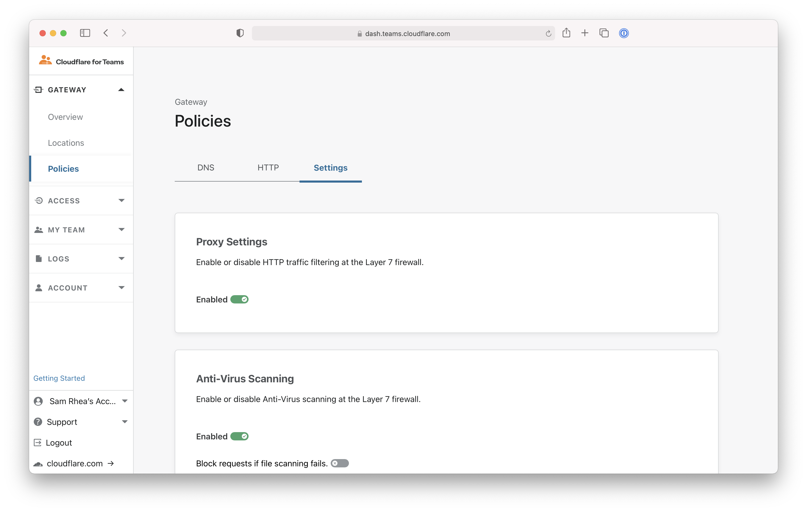
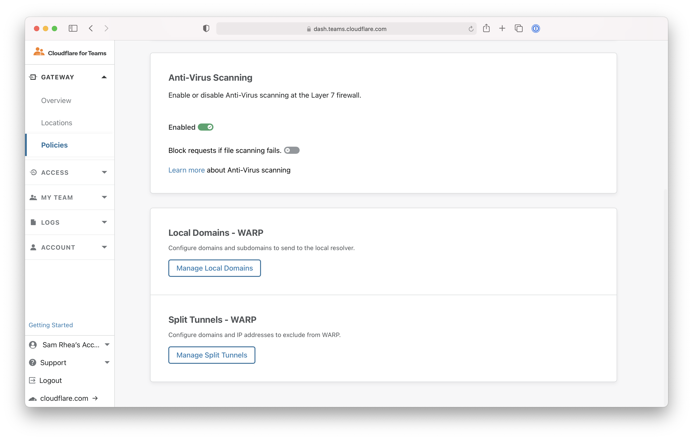
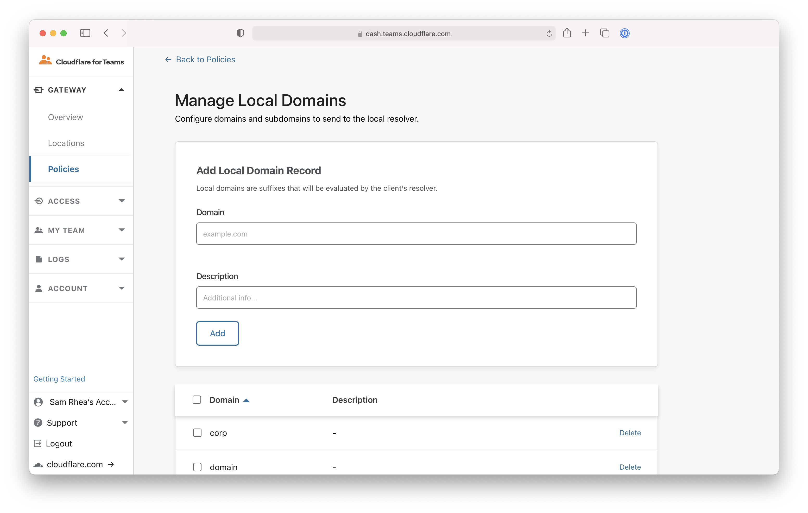
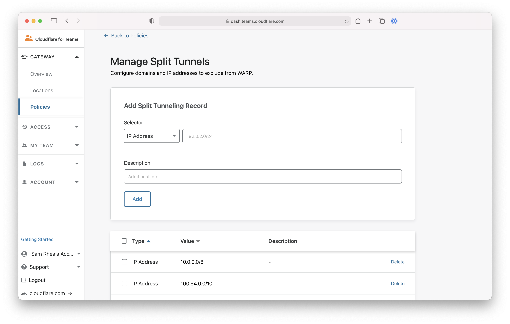

# Configure local domains and split tunnel mode

You can configure Cloudflare for Teams to exclude domains and IP addresses from being sent to the Cloudflare proxy. When excluded, domains will rely on local DNS resolution.

**🗺️ This walkthrough covers how to:**

* Manage the default lists of excluded domains and IP addresses
* Add a domain or IP address to the exclusion list

**⏲️Time to complete: 10 minutes**

## Configure domains to resolve locally

You can configure domains to use the device's local resolver. Cloudflare for Teams excludes a list of domains by default and you can also remove those default domains if needed.

Navigate to the `Policies` page in the `Gateway` section of the Cloudflare for Teams dashboard.

Click on the **Settings** tab.

Scroll to the bottom of the `Settings`. Click **Manage Local Domains**.

By default, Cloudflare for Teams excludes common top-level domains used for local resolution. Everything listed will be excluded. To include a default domain, toggle the box to the left of the domain name and click **Delete**.

To exclude a domain not in the default list, input the domain in the `Domain` field of the `Add Local Domain Record` card. You can add an optional description. Click **Add**.

Domains on the list will rely on the local DNS resolver configured for the device.

## Configure split tunnel mode

You can deploy Cloudflare for Teams in split tunnel mode and exclude IP addresses for devices enrolled in your account.

Navigate to the `Policies` page in the `Gateway` section of the Cloudflare for Teams dashboard.

Click on the **Settings** tab.

Scroll to the bottom of the `Settings`. Click **Split Tunnels**.

By default, Cloudflare for Teams excludes IP addresses commonly used for private routing, including those defined in [RFC 1918](https://tools.ietf.org/html/rfc1918). Everything listed in the page will be excluded. To include an IP address already excluded, toggle the box to the left of the IP address range and click **Delete**.

To exclude IP addresses not in the default list, input the address or CIDR in the `Selector` field of the `Add Split Tunneling Record` card. You can add an optional description. Click **Add**.

## Enroll devices

You [can now begin enrolling devices](/connections/connect-devices/warp) to use Cloudflare for Teams with the WARP client.