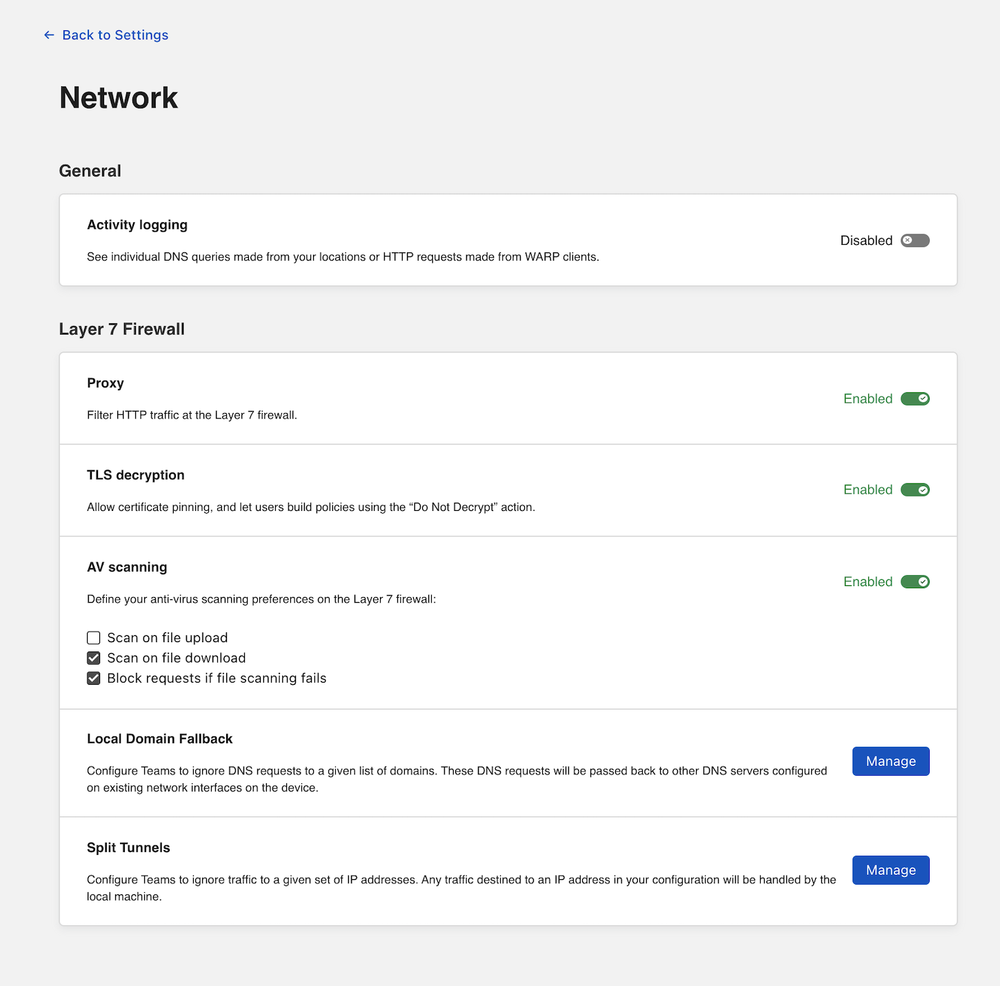
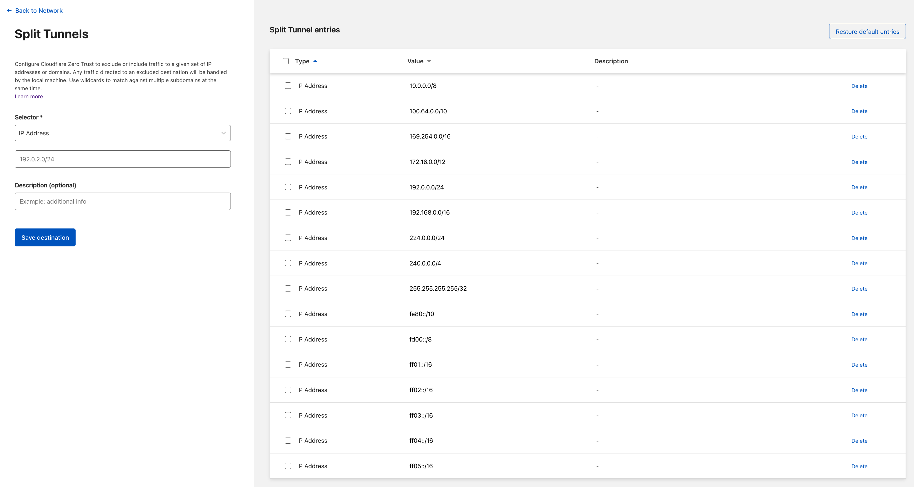

# Configure local domains and split tunnel mode

You can configure Cloudflare for Teams to exclude domains and IP addresses from being sent to the Cloudflare proxy. When excluded, domains will rely on local DNS resolution.

**🗺️ This walkthrough covers how to:**

* Manage the default lists of excluded domains and IP addresses
* Add a domain or IP address to the exclusion list

**⏲️ Time to complete:**

10 minutes

---

## Configure domains to resolve locally

You can configure domains to use the device's local resolver. Cloudflare for Teams excludes a list of domains by default and you can also remove those default domains if needed.

1. On the Teams Dashboard, navigate to **Settings > Network**.

1. Scroll down to **Local Domain Fallback** and click **Manage**.

    

By default, Cloudflare for Teams excludes common top-level domains used for local resolution. Everything listed will be excluded. To delete a default domain from this list, toggle the box to the left of the domain name and click **Confirm delete**.

To add a domain to the default list, input the domain in the `Domain` field. You can add an optional description and click **Add**.

## Configure split tunnel mode

You can deploy Cloudflare for Teams in split tunnel mode and exclude IP addresses for devices enrolled in your account.

1. On the Teams Dashboard, navigate to **Settings > Network**.

1. Scroll down to **Local Domain Fallback** and click **Manage**.

    

By default, Cloudflare for Teams excludes IP addresses commonly used for private routing, including those defined in [RFC 1918](https://tools.ietf.org/html/rfc1918). Everything listed under **Split Tunnel entries** will be excluded. To delete an IP address from the list of excluded IP addresses, toggle the box to the left of the IP address range and click **Confirm delete**.

To add IP addresses to the default list, input the address or CIDR in the **Selector** field. You can add an optional description and click **Add**.

## Enroll devices

You [can now begin enrolling devices](/connections/connect-devices/warp) to use Cloudflare for Teams with the WARP client.