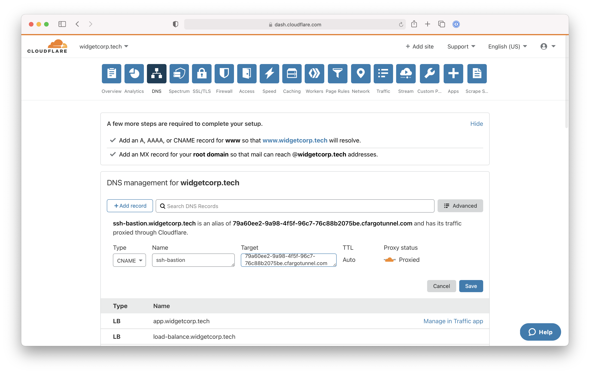

# SSH with short-lived certificates

Cloudflare Access can secure resources that users connect to over SSH. Cloudflare's network will enforce Zero Trust rules and prompt users to authenticate with your organization's identity provider and multifactor options.

Additionally, Access can help your team replace long-lived SSH keys with [short-lived certificates](https://blog.cloudflare.com/public-keys-are-not-enough-for-ssh-security/). The certificates are generated from the user's login to your identity provider and will authorize the user to the SSH server.


Replacing long-lived API keys with short-lived certificates offers the following advantages:

* API keys are not left lingering on machines
* Revocation at the identity provider extends to SSH key
* The keys used to authenticate are automatically rotating
* Users do not have to add SSH keys to their onboarding; instead, only the identity provider is required

**🗺️ This tutorial covers how to:**

* Connect a host to Cloudflare's network that users can reach over SSH
* Build Zero Trust rules to protect that resource
* Replace long-lived SSH keys with short-lived certificates to authenticate users to the host

**⏲️Time to complete: 45 minutes**

## Build a Zero Trust policy

First, build a Zero Trust policy to enforce rules whenever any user attempts to connect to the resources being protected. Building the Zero Trust policy first ensures that resources are not connected to Cloudflare for a period of time before a Zero Trust policy can be added.

In the Cloudflare for Teams dashboard, open the `Applications` page of the `Access` section. Select the "Self-hosted" option.


Name the application using a subdomain of a domain active in your Cloudflare account. This will be the host that users configure in their SSH configuration file to reach the protected resources.


Build a policy to determine who will be able to reach these resources. You can use Access Groups to build reuseable policies. In this case, the group specified includes rules that enforce [Okta group membership](/tutorials/okta-u2f) and [country location](/tutorials/country-rules).


## Connect a host to Cloudflare

You can now connect the host to Cloudflare with Argo Tunnel. Argo Tunnel, powered by its `cloudflared` daemon, will create an outbound-only connection from your environment and send SSH connections from users to protected resources once authorized.

First, [install and authenticate](/connections/connect-apps/install-and-setup) an instance of `cloudflared` in a location that can address the resources you are connecting to Cloudflare.

Next, create a new Argo Tunnel with the following command. You can replace `ssh-pool` with any name.

```sh
cloudflared tunnel create ssh-pool
```

`cloudflared` will create the Tunneland generate a UUID and corresponding credentials file.

You can now configure your Tunnel. The example configuration file below uses the UUID value of the Tunnel, adds the path to the credentials file, and sets an optional logging location.

In the `ingress` section, input the hostname of the application created in the Cloudflare for Teams dashboard. Placing the service in bastion mode will allow any connections that reach `cloudflared` to connect onward to resources avaialble to `cloudflared`, similar to a jump host.


<Aside>

Bastion mode introduces a risk of horizontal movement. Only use in cases where you expect that users who connect to `cloudflared` would then be able to connect to anything that `cloudflared` can address.

Alternatively, you can point the service directly to a specific URL, IP, or port.

</Aside>

```yaml
tunnel: 79a60ee2-9a98-4f5f-96c7-76c88b2075be
credentials-file: /root/.cloudflared/79a60ee2-9a98-4f5f-96c7-76c88b2075be.json
logDirectory: /var/log/cloudflared
http2: true
ingress:
        - hostname: ssh-bastion.widgetcorp.tech
          service: bastion
        - service: http_status:404
```

You can now run the Tunnel with the following command.

```sh
cloudflared tunnel run ssh-pool
```

## Configure a DNS record and route to the server

You can now configure a DNS record for the Tunnel you have created. Navigate to the Cloudflare dashboard and select the domain you configured in your Access policy and in the `hostname` value of your configuration file.

Open the `DNS` page and click **+Add record**. Select `CNAME` for `Type` and in the `Target` field input the UUID value of your Tunnel followed by `.cfargotunnel.com`. In this example, that value is:

```sh
79a60ee2-9a98-4f5f-96c7-76c88b2075be.cfargotunnel.com
```



Users will now be able to authenticate through Cloudflare Access and connect over SSH to these resources once they follow the configuration steps below.

## Deploy short-lived certificates

You can extend the Zero Trust security model by replacing long-lived SSH keys with short-lived certificates provided by Cloudflare Access. To do so, navigate to the Cloudflare for Teams dashboard and open the `Service Authentication` page. Select the `SSH` tab.

In the `Application` drop-down, select the application created previously and click **Generate certificate**.


Cloudflare Access will display the public key and an audience tag for the generated certificate.


You must now configure your SSH host to rely on the generated certificate. In your `sshd` configuration, set the following values:

```sh
PubkeyAuthentication yes
TrustedUserCAKeys /etc/ssh/ca.pub
```

Save the public key value as a `ca.pub` file in the path specified in the `TrustedUserCAKeys` setting. Restart the server.

## Configure the SSH client

Users can now modify their SSH configuration files to connect over SSH. This is a one-time step.

Instruct users to download `cloudflared` and run the following command, replacing the hostname in this example with the one that you created.

```sh
cloudflared access ssh-config --hostname ssh-bastion.widgetcorp.tech --short-lived-cert
```

`cloudflared` will generate the required lines to append to the SSH configuration file, similar to the example output below.

```sh
Host ssh-bastion.widgetcorp.tech
  ProxyCommand bash -c '/usr/local/bin/cloudflared access ssh-gen --hostname %h; ssh -tt %r@cfpipe-ssh-bastion.widgetcorp.tech >&2 <&1' 

Host cfpipe-ssh-bastion.widgetcorp.tech
  HostName ssh-bastion.widgetcorp.tech
  ProxyCommand /usr/local/bin/cloudflared access ssh --hostname %h
  IdentityFile ~/.cloudflared/ssh-bastion.widgetcorp.tech-cf_key
  CertificateFile ~/.cloudflared/ssh-bastion.widgetcorp.tech-cf_key-cert.pub
```

When users authenticate through Cloudflare Access, Cloudflare will generate a certificate for the individual using the username from the identity provider (stripped of the email domain). That certificate will then be presented to the SSH server.

<Aside>

The username in the identity provider must match the username on the SSH server.

</Aside>