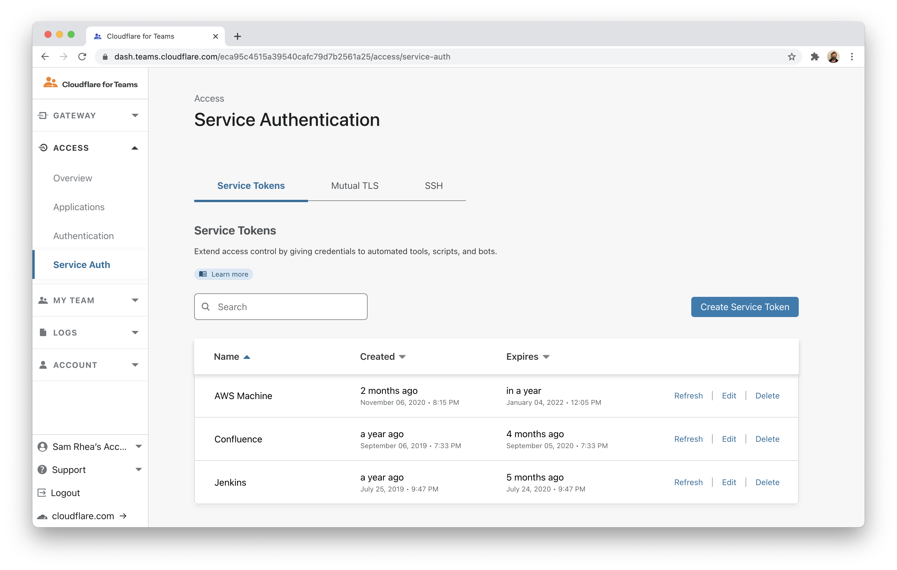
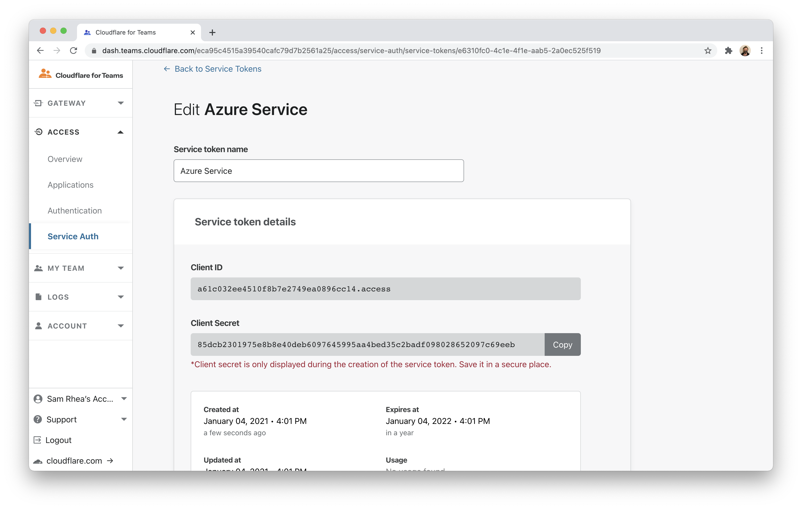
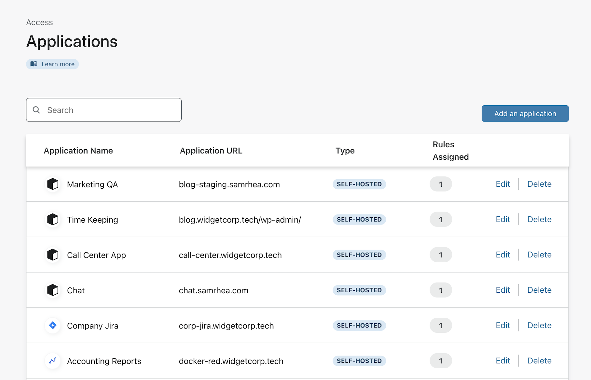
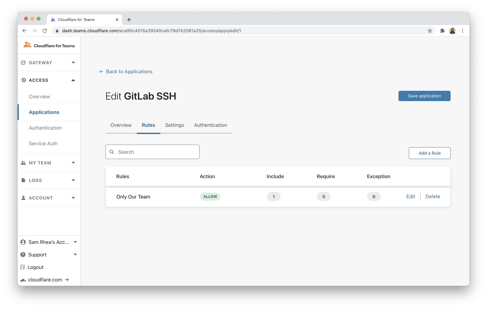
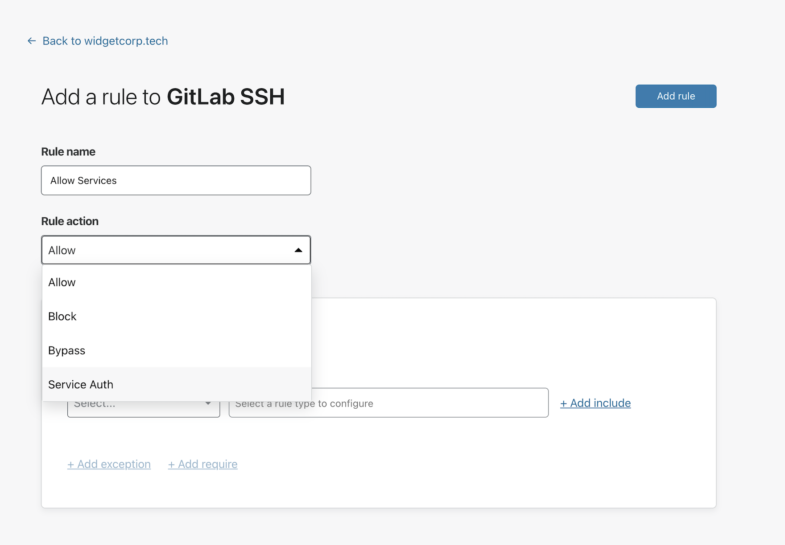
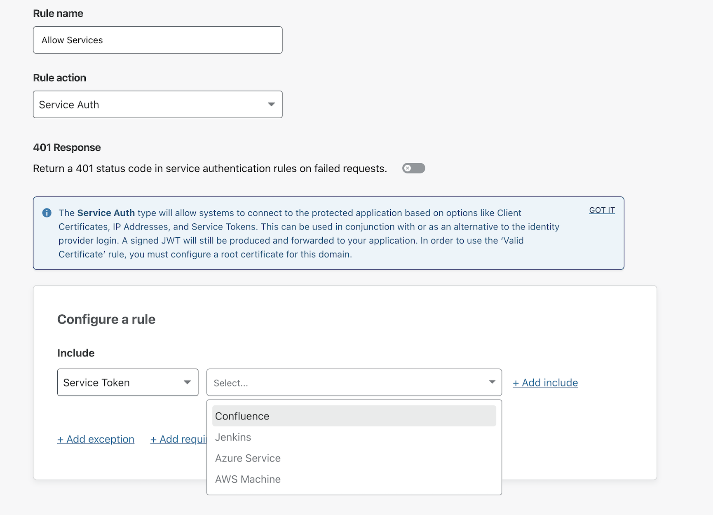
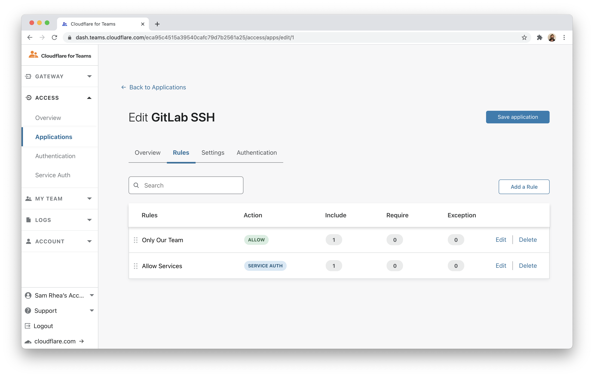

# Service tokens for SSH connections

You can use Cloudflare Access to create Zero Trust rules that determine which users can reach resources over HTTP, SSH, and other protocols. However, some resources also need to be available to automated systems that need to authenticate through Cloudflare's network. You can use Cloudflare Access to generate a service token for those systems.

This walkthrough extends a [previous guide](./gitlab) that describes configuring GitLab with Cloudflare Access. In this case, an administrator needs to reach GitLab over SSH using a service token. While this tutorial uses that as an example, any deployment can use these steps to add service tokens as an option.

**🗺️ This walkthrough covers how to:**

* Create a service token in Cloudflare Access
* Add a rule to an existing Access policy to allow `cloudflared` to reach the resource using the service token
* Configure the `cloudflared` command to connect to the protected resource

**⏲️ Time to complete: 1 hour**

---

## Create a service token

Navigate to the Access section of the Cloudflare for Teams dashboard and select the `Service Auth` page.



Click **Create Service Token** and name the service token. Cloudflare Access will generate a `Client ID` and `Client Secret`. You must copy the `Client Secret` from this page - it will not be shown again.



<Aside>

For the purposes of this tutorial, the `Client Secret` is visible. However, real use cases should treat this like a password.

</Aside>

## Add the service token to an app rule

Next, find the application that should be available to services connecting with this token. This example uses a GitLab instance previously configured in another tutorial. You can also add this type of rule to an Access Group so that it can be reused or to a new application.

Select the `Applications` page in the Access section of the Cloudflare for Teams dashboard. Locate the application and click **Edit**.



The rule currently shown is the identity-based rule that allows team members to connect. Click **Add a Rule** to allow services.



The dropdown for `Rule Action` defaults to `Allow`. To use a service token, you must select `Service Auth` instead.



In the rule configuration card, select `Service Token` from the dropdown. Choose the name of one or more service tokens that can authenticate. Click **Save rule**.



You should now see the `Service Auth` rule on a new line in the next page. Click **Save application** to save the changes made.



## Connect from `cloudflared`

You can use the `Client ID` and `Client Secret` to connect to the resource over HTTP by using those values as [HTTP headers](https://developers.cloudflare.com/access/access-service-auth/service-tokens#connect-your-service-to-access). This example uses `cloudflared` to connect over SSH.

The following `cloudflared` command is structured to use the Service Token generated to connect over SSH to the GitLab instance previously configured. The command relies on the [SSH configuration file being set](./gitlab#configuring-ssh) to proxy the connection through `cloudflared`.

```sh

cloudflared access ssh --hostname gitlab-ssh.widgetcorp.tech --id a61c032ee4510f8b7e2749ea0896cc14.access --secret 85dcb2301975e8b8e40deb6097645995aa4bed35c2badf098028652097c69eeb

```