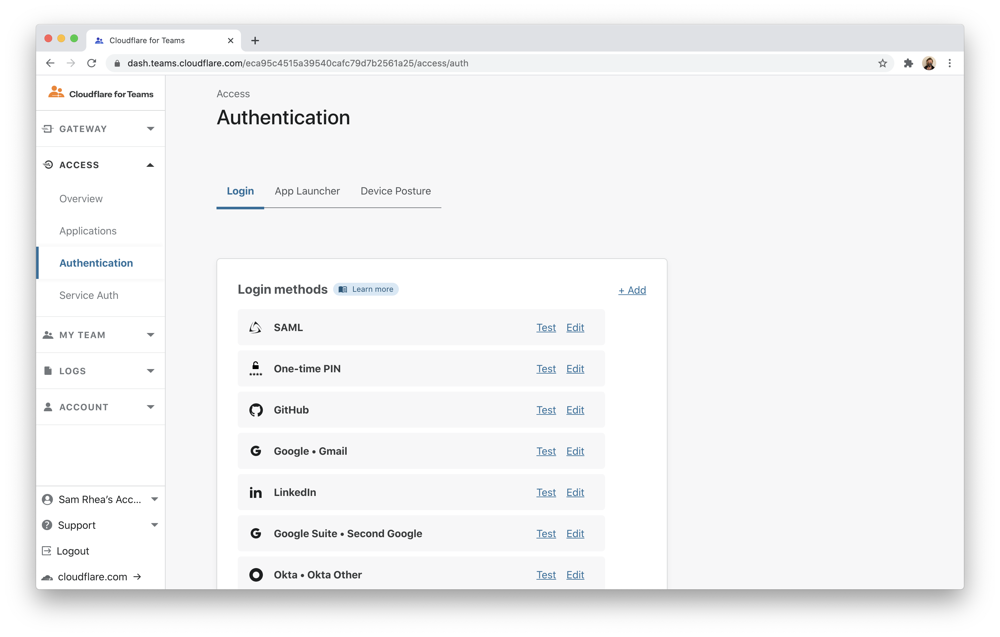
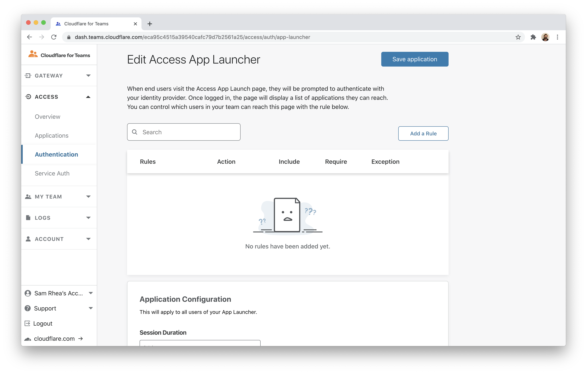
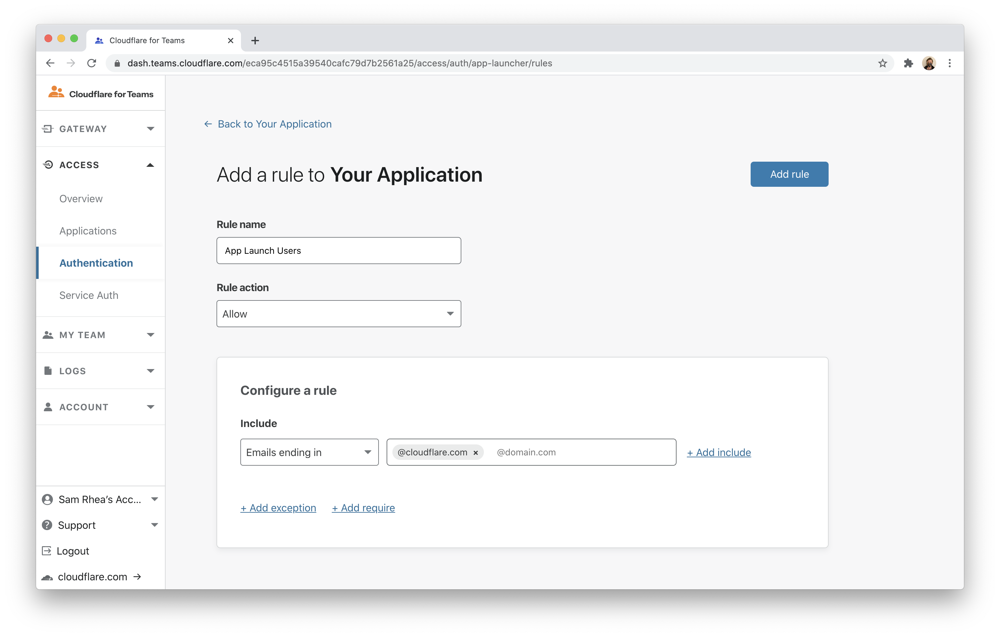
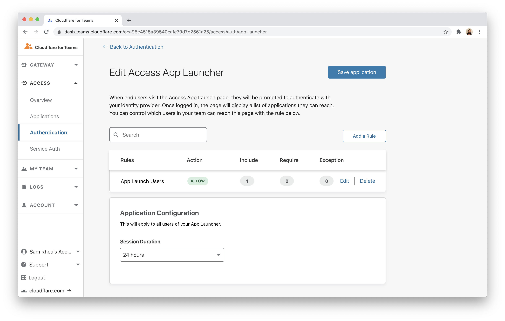
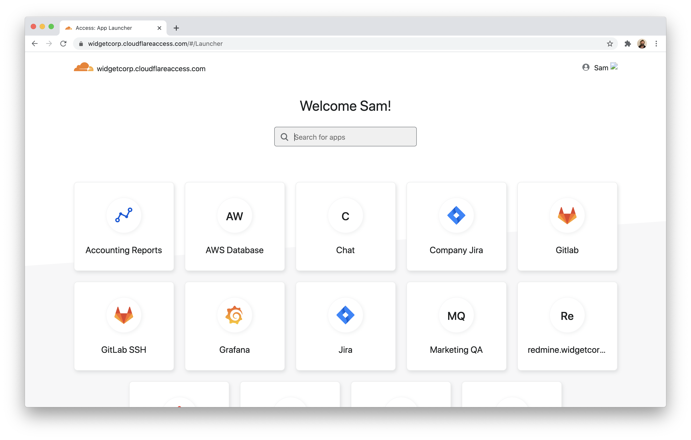
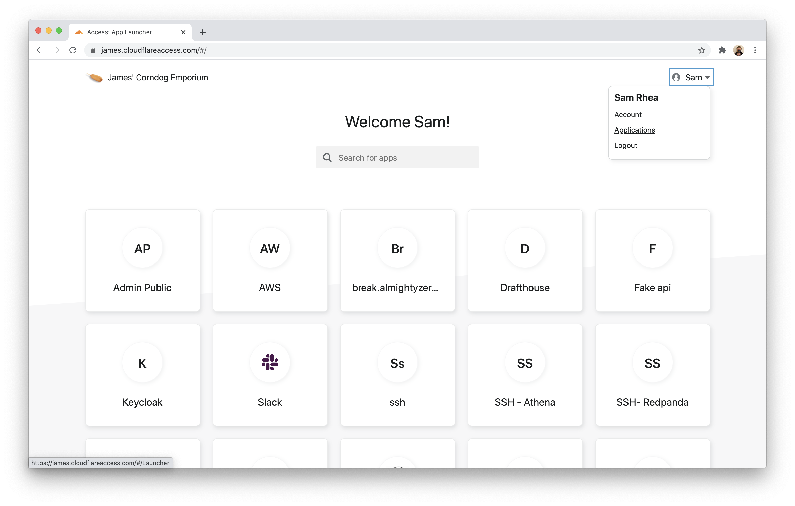
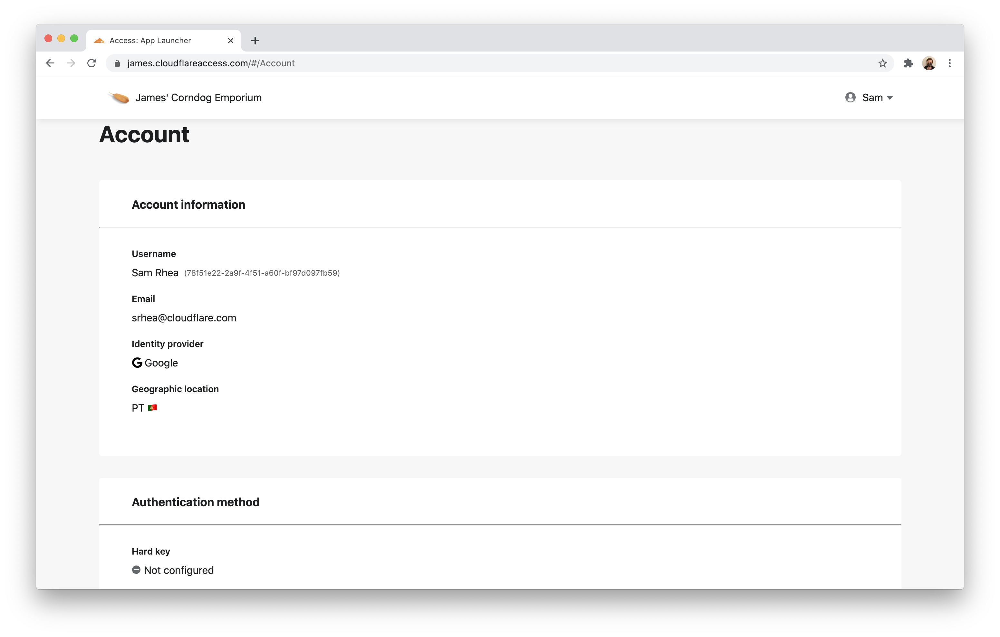
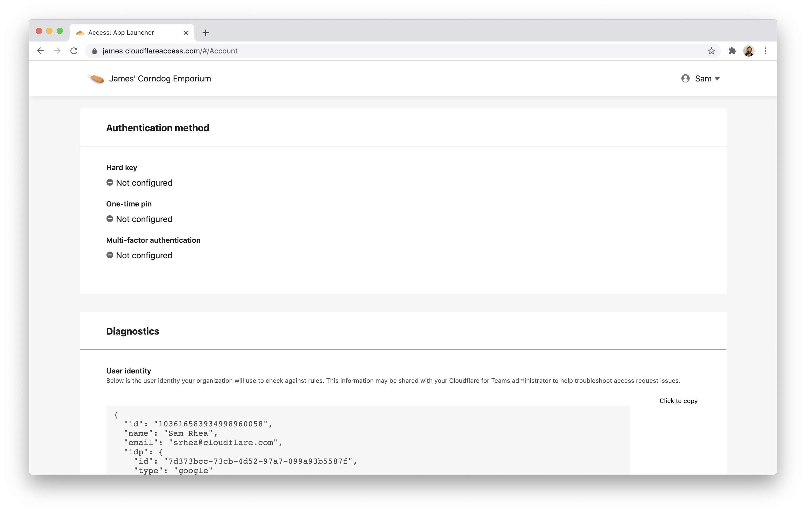

# Troubleshoot user login details

Cloudflare Access provides a user-facing portal, the [Access App Launcher](https://blog.cloudflare.com/announcing-the-cloudflare-access-app-launch/), which displays all applications that a user can reach in a single view. The same portal also can be used by a member of your team to gather diagnostic information about their account for troubleshooting.

**🗺️ This tutorial covers how to:**

* Configure the Access App Launcher
* Visit the Access App Launcher as an end user
* Review login diagnostics as an end user

**⏲️Time to complete: 10 minutes**

## Configure Cloudflare Access App Launcher

To enable the Cloudflare Access App Launch, navigate to the Cloudflare for Teams dashboard. Open the `Authentication` page in the Access section of the sidebar.



Click the **App Launcher** tab. The App Launcher works like other Access policies - you can define who is able to reach the App Launcher. When users visit the App Launcher, Cloudflare Access will display only the applications they have permission to reach.



To define who is able to use the App Launcher, add a new rule.



Once you have defined at least one rule, click **Save application**.



## Visiting the Access App Launcher

The Cloudflare Access App Launcher is availabe to users at your [team domain](/glossary#team-domain). When users visit that domain, they will be prompted to login. Once authenticated, Cloudflare Access will display the applications they can access.



## Find user diagnostics

You can build rules in Cloudflare Access based on identity, device, multifactor method, country, and other signals. Troubleshooting why someone cannot login can be done by gathering details about their Cloudflare Access signals.

Your users can check their authentication status by clicking their name in the top-right corner of the App Launcher and selecting **Account**.



The `Account` page will list everything that Cloudflare Access knows about that current user session.



When available, Access will list the multifactor method used by the user if the identity provider supports `amr` sharing.



Users can also copy the data to share it with an administrator. The data is structured as `json`; you can find an example output below. You can use this information to compare against application policies to determine why a user might not be able to reach an application.

```json
{
   "id":"103616583934998960058",
   "name":"Sam Rhea",
   "email":"srhea@cloudflare.com",
   "idp":{
      "id":"7d373bcc-73cb-4d52-97a7-099a93b5587f",
      "type":"google"
   },
   "geo":{
      "country":"PT"
   },
   "user_uuid":"78f51e22-2a9f-4f51-a60f-bf97d097fb59",
   "devicePosture":{
      
   },
   "account_id":"1c787a4e7a6972171826b9c0bdd5a4ee",
   "auth_cert":"",
   "ip":"85.XXX.XXX.XX"
}
```