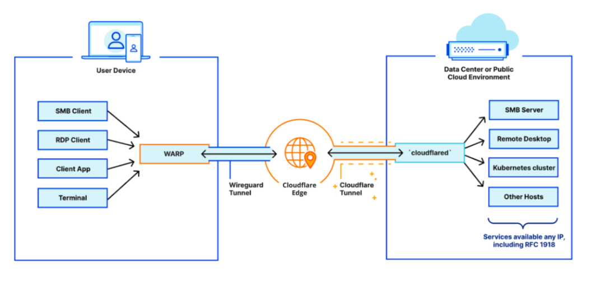
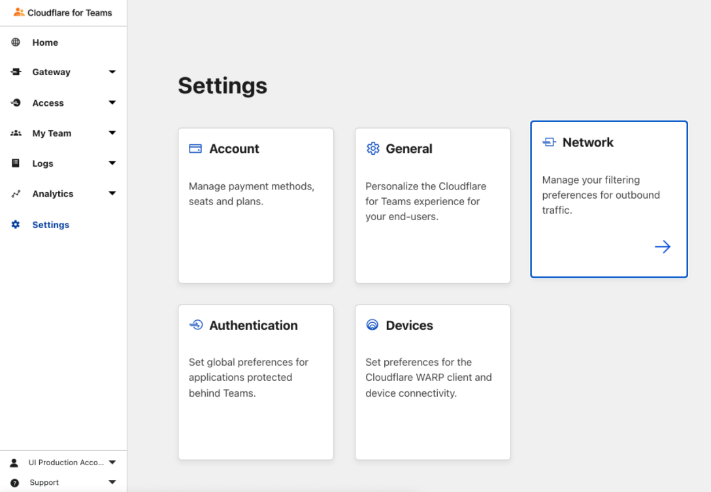
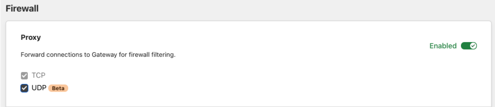
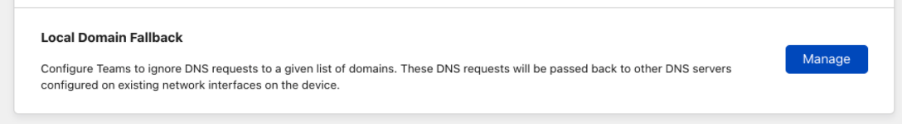
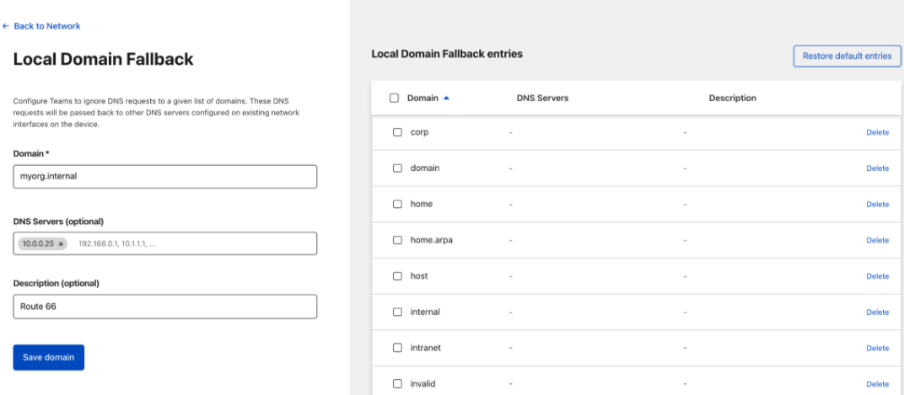
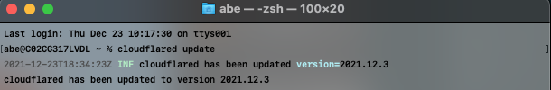

# Connect to private hostnames and IPs with Cloudflare Tunnel

Building out a private network has two primary components: the infrastructure side, and the client side.

The infrastructure side of the equation is powered by Cloudflare Tunnel, which connects your infrastructure to Cloudflare — whether that be a singular application, many applications, or an entire network segment. This is made possible by running `cloudflared` in your environment to establish multiple secure, outbound-only, load-balanced links to Cloudflare. Simply put, Tunnel is what connects your network to Cloudflare.

On the other side of this equation, your end users need to be able to easily connect to Cloudflare and, more importantly, your network. This connection is handled by Cloudflare WARP. This client can be rolled out to your entire organization in just a few minutes using your in-house MDM tooling, and it establishes a secure, WireGuard-based connection from your users’ devices to the Cloudflare network.



**📝 Pre-requisites:**

* Cloudflare Tunnel must be properly [configured](/connections/connect-apps/configuration) to route traffic to a private IP space.
* `cloudflared` must be connected to Cloudflare from your target private network.
* Cloudflare WARP must be installed on end-user devices to connect your users to Cloudflare.

**🗺️ This tutorial covers how to:**

* Define your internal DNS resolver with Cloudflare for Teams
* Resolve requests to your private network using Cloudflare Tunnel

**⏲️ Time to complete:** 30 minutes

## Enable UDP support

1. On the [Teams dashboard](https://dash.teams.cloudflare.com), navigate to **Settings** > **Network**.

    

1. Scroll down to Firewall settings.
1. Ensure the Proxy is enabled and both TCP and UDP are selected.

    

## Create a local domain fallback entry

Next, we need to create a [Local Domain Fallback](/connections/connect-devices/warp/exclude-traffic/local-domains) entry.

1. Remain in Network Settings and scroll further down to **Local Domain Fallback**.

    

2. Click **Manage**.
3. Create a new Local Domain Fallback entry pointing to the internal DNS resolver. The rule in the following example instructs the WARP client to resolve all requests for `myorg.internal` through an internal resolver at `10.0.0.25` rather than attempting to resolve this publicly. 



<Aside type='note'>

While on the Network Settings page, ensure that **Split Tunnels** are configured to include traffic to private IPs and hostnames in the traffic sent by WARP to Cloudflare. For guidance on how to do that, refer to [these instructions](/connections/connect-networks/private-net#optional-ensure-that-traffic-can-reach-your-network).

</Aside>

## Update `cloudflared`

Next, update your Cloudflare Tunnel configuration to ensure it is using QUIC as the default transport protocol. To do this, you can either set the `protocol: QUIC` property in your [configuration file](/connections/connect-apps/configuration/configuration-file) or [pass the `–-protocol quic` flag](/connections/connect-apps/configuration/arguments) directly through your CLI. 

Finally, update to the latest available version (2021.12.3 as of the time of writing) of cloudflared running on your target private network.



You can now resolve requests through the internal DNS server you set up in your private network.

## Test the setup

For testing, run a `dig` command for the internal DNS service. Here is an example for a Private DNS Resolver listening on a Private IP `10.0.0.25` and on Port 1053, for a private domain to be resolved: 

```sh
$ dig @10.0.0.25 -p 1053 AAAA www.myorg.internal
```

The `dig` will fail if the WARP client is disabled in your end user's device.

## Troubleshooting

* Ensure that `cloudflared` is connected to Cloudflare by visiting Access > Tunnels in the Cloudflare for Teams dashboard.

* Ensure that end-user devices are enrolled into WARP by visiting https://help.teams.cloudflare.com

* Ensure that the machine where `cloudflared` is running is allowed to egress via UDP to port 7844 to talk out to Cloudflare.

* Double check the precedence of your Application policies in the Gateway Network policies tab. Ensure that a more global Block or Allow policy will not supercede the application policies

* Ensure your Private DNS resolver is available over a routable private IP address

* Ensure requests to a private IP or hostname are arriving to Tunnel by viewing requests in the Gateway Network Logs.
