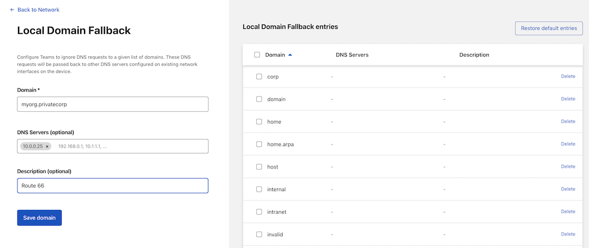

# Connect to Private IPs and Hostnames

You can use Cloudflare’s Zero Trust platform to connect to infrastructure you manage. You can connect from devices to private resources that use TCP or UDP with built-in Zero Trust controls through Cloudflare’s network. This model provides the convenience and flexibility of a traditional private network with identity-driven controls.

The infrastructure connects to Cloudflare using Cloudflare Tunnel, a product powered by a lightweight connector that you deploy in your environment. The connector can connect one or many applications or network segments simultaneously. The connector relies on establishing an outbound-only tunnel to Cloudflare’s edge so that you do not have to open holes in your firewall.

Your client device connects through Cloudflare’s network, and on to your infrastructure, using a lightweight agent called Cloudflare WARP. This client can be rolled out to your entire organization in just a few minutes using your in-house MDM tooling, and it establishes a secure, WireGuard-based connection from your users’ devices to the Cloudflare network.
​​

**📝 Pre-requisites:**

* Cloudflare Tunnel must be configured to route traffic to a private IP space
* `cloudflared` must be connected to Cloudflare from your target private network
* Cloudflare WARP must be installed on end-user devices to connect your users to Cloudflare

**🗺️ This tutorial covers how to:**

* Define your internal DNS resolver with Cloudflare for Teams
* Resolve requests to your private network using Cloudflare Tunnel

**⏲️ Time to complete:** 30 minutes

## Enable UDP support

To get started, login to the Cloudflare for Teams dashboard and navigate to Settings.

In Settings, you’ll select Network and scroll down until you see Firewall Proxy settings. Here, you’ll find two options: TCP and UDP. Ensure Proxy is enabled and both TCP and UDP are selected.

## Create a local domain fallback entry

Next, we will remain in Network Settings and navigate to Local Domain Fallback and select Manage.

You’ll then create a new Local Domain Fallback entry pointing to the internal DNS resolver.  If you already have an internal DNS resolver setup for your private network, this will be the domain configured for that resolver.

Here, I have created a rule that will direct Cloudflare WARP to resolve all requests for `myorg.internal` through your internal resolver at `10.0.0.25` rather than attempting to resolve this request publicly.

Note: While we are in Network Settings, make certain that Split Tunnel rules are configured to
allow traffic for private IPs to be included in the traffic sent by WARP to Cloudflare.

## Update `cloudflared`

Next, we need to update our Tunnel configuration to ensure we’re using QUIC as our default transport protocol. This can be accomplished by either setting `protocol: QUIC` in your config.yml or by passing –protocol quic directly through your CLI args run command.

Finally, update to the latest available version (2021.12.3 as of the time of writing) of cloudflared running on your target private network.

You can now resolve requests through the internal DNS server you set up in your private network.

For testing, run a `dig` command for the internal DNS service:

Here is an example for a Private DNS Resolver listening on a Private IP 10.0.0.25 and on Port 1053, for a private domain to be resolved:

`dig @10.0.0.25 -p 1053 AAAA www.myorg.internal`

If you turn off the Teams client in your eyeball, you can then retry that dig and it should fail.

## Troubleshooting Tips and Tricks

* Ensure that `cloudflared` is connected to Cloudflare by visiting Access > Tunnels in the Cloudflare for Teams dashboard.

* Ensure that end-user devices are enrolled into WARP by visiting https://help.teams.cloudflare.com

* Ensure that the machine where `cloudflared` is running is allowed to egress via UDP to port 7844 to talk out to Cloudflare.

* Double check the precedence of your Application policies in the Gateway Network policies tab. Ensure that a more global Block or Allow policy will not supercede the application policies

* Ensure your Private DNS resolver is available over a routable private IP address

* Ensure requests to a private IP or hostname are arriving to Tunnel by viewing requests in the Gateway Network Logs.
