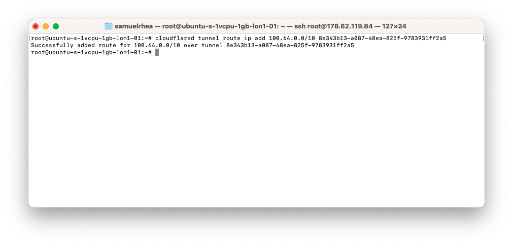
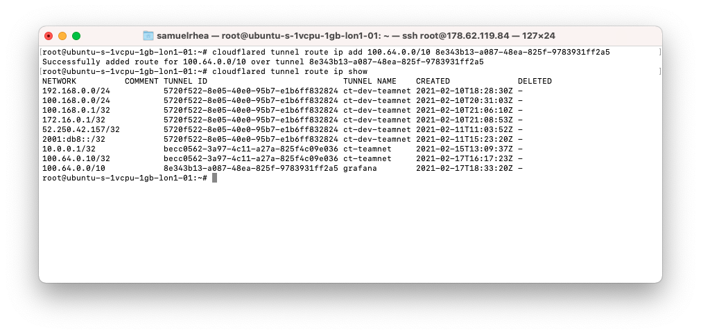

# Connect from WARP to a private network on Cloudflare using Argo Tunnel

You can use [Argo Tunnel](/connections/connect-apps) to connect applications and services to Cloudflare's network. Argo Tunnel relies on a piece of software, `cloudflared`, to create those connections.

You can create and configure Argo Tunnel connections to [support multiple HTTP origins](/tutorials/multi-origin) or [multiple protocols simultaneously](/tutorials/gitlab). You can also use Argo Tunnel to connect any service that relies on a TCP-based protocol to Cloudflare's network. Users in your organization can then reach the service by enrolling into your organization's Cloudflare for Teams account and using the WARP agent.

Once enrolled, user endpoints will be able to connect to private [RFC 1918](https://tools.ietf.org/html/rfc1918) IP space that you control. Applications running on those endpoints will be able to reach those private IPs as well in a private network model. Coming soon, administrators will be able to build Zero Trust rules to determine who within your organization can reach those IPs.

**🗺️ This tutorial covers how to:**

* Start a secure, outbound-only, connection from a machine to Cloudflare
* Assign the machine an RFC 1918 IP address or range
* Connect to that private IP space from an enrolled WARP agent without client-side configuration changes
* Connect using any TCP-based protocol

<Aside>

* You must have a Cloudflare for Teams Gateway or Standard plan to use this feature.
* This flow does not currently work on mobile versions of the WARP software.

</Aside>

**⏲️ Time to complete: 45 minutes**

## Install `cloudflared`

Start by [downloading and installing](/connections/connect-apps/install-and-setup) the Argo Tunnel daemon, `cloudflared`. On Mac, you can do so by running the following `brew` command. If you do not have Homebrew, follow the [documentation](https://docs.brew.sh/Installation) to install it.

`$ brew install cloudflare/cloudflare/cloudflared`

Once installed, run the following command in your Terminal to authenticate this instance of `cloudflared` into your Cloudflare account.

`$ cloudflared login`

The command will launch a browser window and prompt you to login with your Cloudflare account. Choose a website that you have added into your account. This will authenticate your instance of `cloudflared` to your Cloudflare account; you will be able to create a Tunnel for any site, not just the site selected.


Once you click one of the sites in your account, Cloudflare will download a certificate file, called `cert.pem` to authenticate this instance of `cloudflared`. The `cert.pem` file uses a certificate to authenticate your instance of `cloudflared` and includes an API key for your account to perform actions like DNS record changes.

You can now use `cloudflared` to control Argo Tunnel connections in your Cloudflare account.


<Aside>
  If you already have `cloudflared` installed, make sure it's updated to the latest version before you continue with the tutorial. Some commands may not run with older versions of `cloudflared`. 
</Aside>

## Create a Tunnel

You can now [create an Argo Tunnel](/connections/connect-apps/create-tunnel) that will connect `cloudflared` to Cloudflare's edge.

Begin by [creating an Argo Tunnel](/connections/connect-apps/create-tunnel) with an associated name. This example uses the name `grafana`.

```bash
cloudflared tunnel create grafana
```


You can confirm the ID of the Tunnel by running the following command.

```bash
cloudflared tunnel list
```


Next, you will need to create a route. Routes map a Tunnel ID to a CIDR range that you specify. That range should use private IP space specified by [RFC 1918](https://tools.ietf.org/html/rfc1918). The private IP space specified should match the private IP space of your subnet or environment where Argo Tunnel will send connections.

This example tells Argo Tunnel that, for users in this organization, connections to `100.64.0.0/10` should be served by this Tunnel. For the purposes of this tutorial, Grafana is running in a Digital Ocean environment where a virtual interface has been applied that will send traffic bound for localhost to `100.64.0.1`.

```bash
cloudflared tunnel route ip add 100.64.0.0/10 8e343b13-a087-48ea-825f-9783931ff2a5
```



Similar to the `list` command, you can confirm the routes enrolled with the following command.

```bash
cloudflared tunnel route ip show
```



## Configure and run the Tunnel

Next, create a configuration file for the Tunnel. The following template contains the required fields but can be further modified as needed.

```yaml
tunnel: 8e343b13-a087-48ea-825f-9783931ff2a5
credentials-file: /root/.cloudflared/8e343b13-a087-48ea-825f-9783931ff2a5.json
warp-routing:
  enabled: true
```

You can now run the Tunnel. The command below will connect this instance of `cloudflared` to Cloudflare's network. Traffic inside of your organization, from enrolled WARP agents, will be sent to this instance when the destination is this private IP range.

```bash
cloudflared tunnel run grafana
```

This example runs it from the command-line but we recommend running `cloudflared` [as a service](/connections/connect-apps/run-tunnel/run-as-service#create-route-and-configure-the-tunnel) for long-lived connections.


## Include RFC 1918 IP ranges in WARP

Users can reach this private service by logging into their Cloudflare for Teams account and the WARP agent.

By default, Cloudflare WARP excludes traffic bound for RFC 1918 space as part of its [Split Tunnel feature](/tutorials/split-tunnel). To use this feature the IPs that you specified for your Tunnel must be included which will send traffic for those destinations through the WARP agent and to the Tunnel.

Navigate to the `Policies` page of the Gateway section in the Cloudflare for Teams dashboard. Click the **Settings** tab. The IP ranges listed are those that Cloudflare excludes by default. Choose the range being used for this private connection and delete it.


## Connect via WARP

Users can now connect over this private network by [enrolling their devices into the WARP agent](https://developers.cloudflare.com/cloudflare-one/connections/connect-devices/warp) in the same account as the Argo Tunnel configuration. They must use the `Gateway with WARP` mode. A specific tutorial for enrollment is also [available](https://developers.cloudflare.com/cloudflare-one/tutorials/block-football-users).

Once enrolled, they will be able to connect to the private IPs configured for HTTP traffic in this example or arbitrary TCP traffic.


