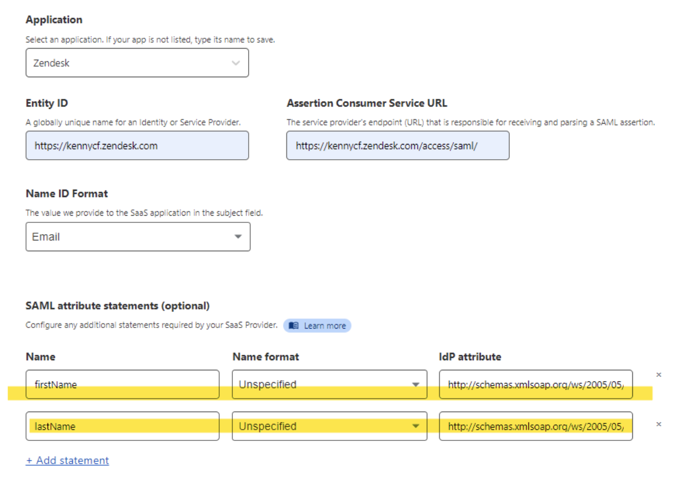
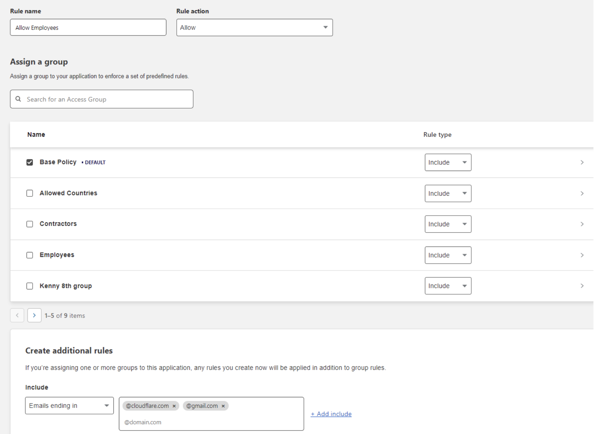
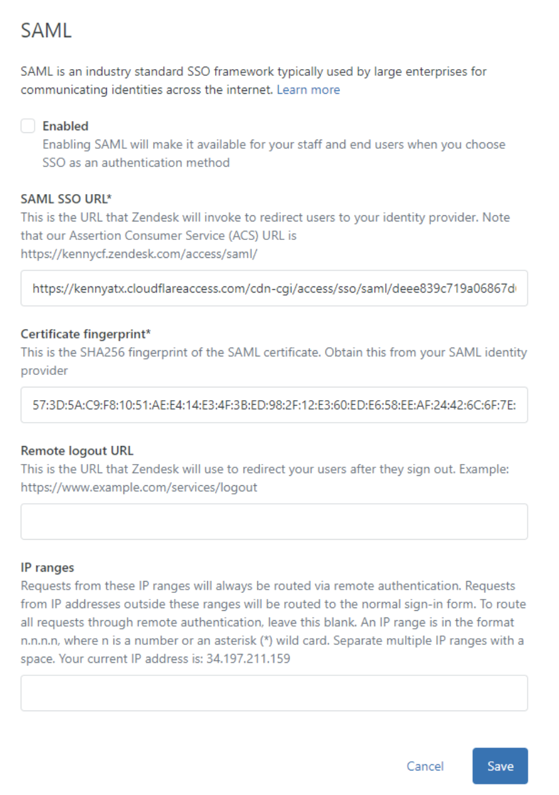

# Configure Zendesk SSO with Access for SaaS

This tutorial covers how to configure Zendesk SSO with Access for SaaS.

<Aside>

For this tutorial, you will need:
* A Zero Trust Account
* An integrated identity provider (IdP)
* Admin access to your Zendesk account

</Aside>

**⏲️ Time to complete:**

20 minutes

## Configure Zendesk and Cloudflare

1. To begin, navigate to your Zendesk administrator dashboard, typically available at `<yourdomain>.zendesk.com/admin/security/sso`.

1. In a separate tab or window, open the [Zero Trust Dashboard](https://dash.teams.cloudflare.com) and navigate to **Access** > **Applications**.

1. Select *SaaS* as the application type to begin creating a SaaS application.

1. Copy the following fields from your Zendesk account and input them in the Zero Trust application configuration:
    * **Assertion Consumer Service URL**. This URL appears as `SAML SSO URL` in your Zendesk account.
    * **Entity ID**: `https://yoursubdomain.zendesk.com`
    * **NameID**: Email

1. Configure these Attribute Statements to include a user’s first and last name:

    * `<Cloudflare Firstname attribute name>` => `http://schemas.xmlsoap.org/ws/2005/05/identity/claims/givenname`
    * `<Cloudflare Last name attribute name>` => `http://schemas.xmlsoap.org/ws/2005/05/identity/claims/surname`

    <Aside type='note'>
    This step is optional. If the name is not provided, Zendesk will [use the user’s email address as their name](https://support.zendesk.com/hc/en-us/articles/203663676#topic_dzb_gl5_2v))
    </Aside>

    

1. Create an Access policy to determine who can access Zendesk.

    

1. Copy the Cloudflare IdP values and add them to the following Zendesk Fields:

    * SSO Endpoint => SAML SSO URL
    * Public Key => Certificate Fingerprint

    <Aside>

    The Public key must be transformed into a fingerprint. To do that:
    1. Copy the Public Key Value.
    1. Paste the Public Key into [SAML X.509 Certificate Fingerprint - Online SHA1 Decoder | SAMLTool.com](https://www.samltool.com/fingerprint.php).
    1. Wrap the value in `-----BEGIN CERTIFICATE-----` and `-----END CERTIFICATE-----`.
    1. Set the algorithm to SHA256.
    1. Copy the Formatted Fingerprint Value.

    </Aside>
    
    

1. Go to `https://<yourdomain>.zendesk.com/admin/security/staff_members` and enable **External Authentication** > **Single Sign On**.

    

Users should now be able to log into Zendesk if their Email address exists in the Zendesk user list.
