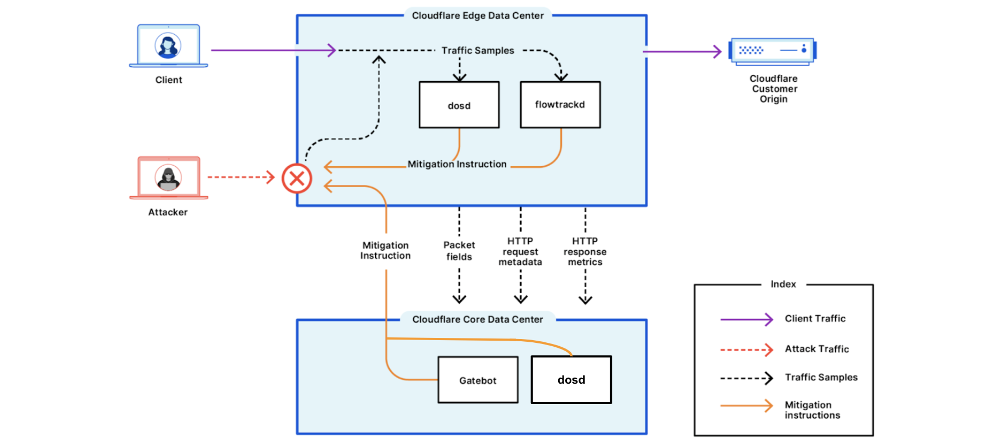

# About Cloudflare DDoS Protection

The DDoS Protection Managed Rulesets provide comprehensive protection against a variety of DDoS attacks across L3/4 (network layer) and L7 (application layer) of the [OSI model](https://www.cloudflare.com/learning/ddos/glossary/open-systems-interconnection-model-osi/), including the following:

* Attacks that are generated by known attack tools and botnets
* Traffic anomalies and abnormalities
* Protocol violations
* Reflection and amplification attacks
* Stateless and stateful attacks
* Traffic that causes an increase in origin errors

For more information, refer to the available [Managed Rulesets](/managed-rulesets).

## How does it work?

To detect and mitigate DDoS attacks, Cloudflare’s [Autonomous Edge](https://blog.cloudflare.com/deep-dive-cloudflare-autonomous-edge-ddos-protection/) analyzes traffic samples such as HTTP request metadata, HTTP response metrics, and IP packet samples. The analysis is done “out-of-path”, which allows Cloudflare to asynchronously detect DDoS attacks without causing latency or impacting performance.

Once attack traffic matches a rule, Cloudflare's systems will track that traffic and generate a real-time signature to surgically match against the attack pattern and mitigate the attack without impacting legitimate traffic. The fingerprint is propagated as a mitigation rule to the most optimal location in the Cloudflare edge for cost-efficient mitigation.

## Under the hood

The Cloudflare Autonomous Edge is powered by the denial-of-service daemon (`dosd`), which is a home-grown software-defined system. `dosd` instances run in every single server in every one of Cloudflare’s data centers around the world and are able to detect and mitigate DDoS attacks autonomously without requiring any centralized consensus.
