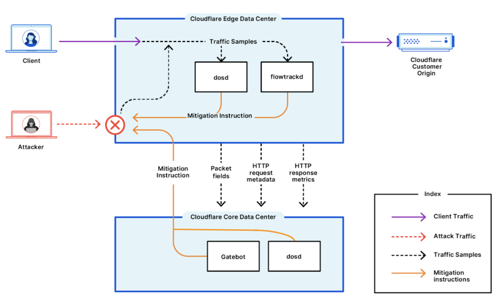

# About Cloudflare DDoS Protection

Cloudflare provides unmetered and unlimited [distributed denial-of-service (DDoS)](https://www.cloudflare.com/learning/ddos/what-is-a-ddos-attack/) protection to all customers on all plans and services.

The protection is enabled by Cloudflare’s [Autonomous DDoS Protection Edge](https://blog.cloudflare.com/deep-dive-cloudflare-autonomous-edge-ddos-protection/), which automatically detects and mitigates DDoS attacks. Cloudflare’s Autonomous Edge and centralized DDoS systems analyze traffic samples such as HTTP request metadata, HTTP response metrics, and IP packet samples. The analysis is done “out-of-path”, which allows Cloudflare to asynchronously detect DDoS attacks without causing latency or impacting performance.

The Autonomous Edge includes multiple dynamic mitigation rules exposed as [Cloudflare DDoS Attack Protection Managed Rulesets](/managed-rulesets). These rulesets provide comprehensive protection against a variety of DDoS attacks across L3/4 and L7 of the OSI model, and are enabled by default. You can customize the mitigation rules in these rulesets to optimize and tailor the protection to your needs.

Once attack traffic matches a rule, Cloudflare's systems will track that traffic and generate a real-time signature to surgically match against the attack pattern and mitigate the attack without impacting legitimate traffic. The fingerprint is propagated as a mitigation rule to the most optimal location in the Cloudflare edge for cost-efficient mitigation.

## Under the hood

The Cloudflare Autonomous Edge is powered by the denial-of-service daemon (`dosd`), which is a home-grown software-defined system. `dosd` instances run in every single server in every one of Cloudflare’s data centers around the world and are able to detect and mitigate DDoS attacks autonomously without requiring any centralized consensus.
