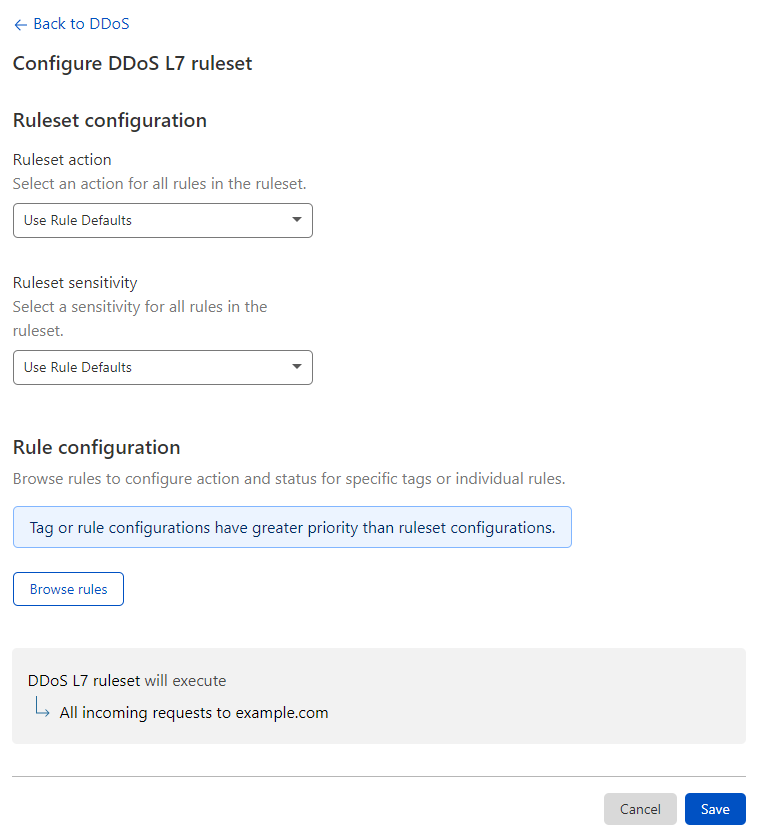
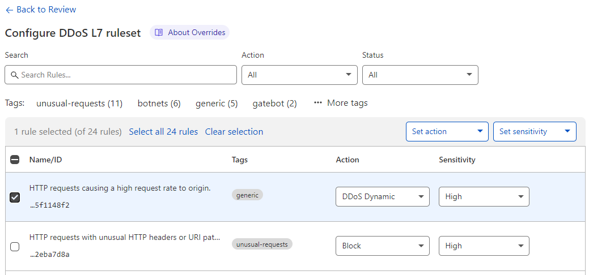

# Configure HTTP DDoS Attack Protection in the dashboard

You can customize the **action** and **sensitivity** of the rules in the HTTP DDoS Attack Protection Managed Ruleset in the following ways:

* [Configure all the rules in the ruleset](#configure-all-the-rules-in-the-ruleset)
* [Configure one or more rules](#configure-one-or-more-rules)

Tag and rule configurations have greater priority than ruleset configurations.

For more information on the available parameters and allowed values, refer to [Managed Ruleset parameters](/managed-rulesets/http/override-parameters).

## Configure all the rules in the ruleset

1. Log in to the [Cloudflare dashboard](https://dash.cloudflare.com/), and select your account and website.
1. Go to **Firewall** > **DDoS**.
1. Next to **HTTP DDoS attack protection**, click **Configure**.
1. In **Ruleset configuration**, select the action and sensitivity values for all the rules in the HTTP DDoS Attack Protection Managed Ruleset.

    

1. Click **Save**.

## Configure one or more rules

1. Log in to the [Cloudflare dashboard](https://dash.cloudflare.com/), and select your account and website.
1. Go to **Firewall** > **DDoS**.
1. Next to **HTTP DDoS attack protection**, click **Configure**.
1. In **Rule configuration**, click **Browse rules**.
1. Search for the rules you wish to configure using the available filters. You can search for tags.

    

1. To configure a single rule, select the desired value for a field in the displayed dropdowns next to the rule.

    To configure more than one rule, select the rules using the row checkboxes and update the fields for the selected rules using the dropdowns displayed before the table. You can also configure all the rules with a given tag. For more information, refer to [Configure rules in bulk in a Managed Ruleset](https://developers.cloudflare.com/waf/managed-rulesets/deploy-zone-dashboard#configure-rules-in-bulk-in-a-managed-ruleset).

1. Click **Next**.
1. Click **Save**.
