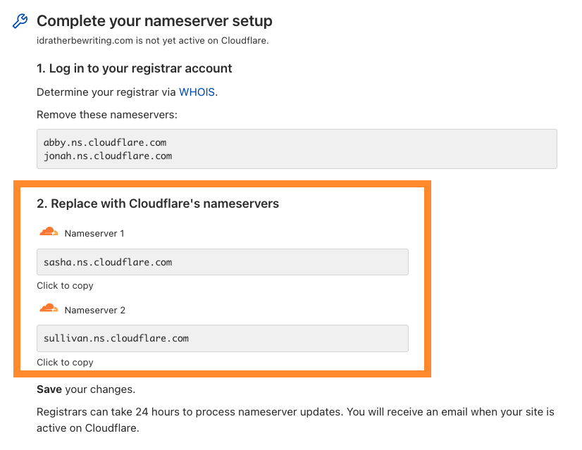

# Full setup

To use Cloudflare for your authoritative DNS, update the administration settings at your current registrar. 

<Aside type="note" header="Note:">

If you are using [Cloudflare Registrar](https://developers.cloudflare.com/registrar), you do not need to update your authoritative nameservers. Registrar uses Cloudflare for authoritative DNS by default.

</Aside>

---

## Change your domain nameservers

### Prerequisites

- **Tasks**: Create an account and [add your domain](https://support.cloudflare.com/hc/articles/201720164) to Cloudflare.
- **Concepts**: If you are new to Cloudflare or Internet concepts more generally, you might want to review the following concepts:

    - [Registrar](https://www.cloudflare.com/learning/dns/glossary/what-is-a-domain-name-registrar/)
    - [Content Delivery Network](https://www.cloudflare.com/learning/cdn/what-is-a-cdn/)
    - [Nameservers](https://www.cloudflare.com/learning/dns/dns-server-types)
    - [Domain Name System (DNS)](https://www.cloudflare.com/learning/dns/what-is-dns/)
    - [DNS Security (DNSSEC)](https://www.cloudflare.com/learning/dns/dns-security/)

### Update your nameservers

Once you have added an application to Cloudflare, that application will receive two assigned nameservers.

#### Get nameserver names

1. Log in to the [Cloudflare dashboard](https://dash.cloudflare.com) and select your account and domain.
1. On **Overview**, copy the information from **Replace with Cloudflare's nameservers**.

    

#### Update your registrar

1. Log into the admin account for your domain registrar. If you do not know your provider, use [ICANN WHOIS](https://whois.icann.org/).
1. Disable **DNSSEC** for your domain. 
1. Remove your existing nameservers.
1. Create new nameservers. If these names are not [copied exactly](#get-nameserver-names), your DNS will not resolve correctly.

    

    
Provider-specific instructions

    

    This is not an exhaustive list, but the following links may be helpful:
    
     - [1and1](https://help.1and1.com/domains-c36931/manage-domains-c79822/dns-c37586/use-your-own-name-server-for-a-1and1-domain-a594904.html)
     - [101Domain](https://help.101domain.com/domain-management/nameservers-dns)
     - [Amazon](https://docs.aws.amazon.com/Route53/latest/DeveloperGuide/domain-name-servers-glue-records.html#domain-name-servers-glue-records-adding-changing)
     - [Blacknight](https://help.blacknight.com/entries/22942338-Changing-nameservers-in-cp-blacknight-com)
     - [BlueHost](https://my.bluehost.com/cgi/help/222)
     - [DirectNIC](https://directnic.com/knowledge/article/33:how%2Bdo%2Bi%2Bmodify%2Bname%2Bservers%2Bfor%2Bmy%2Bdomain%2Bname%253F)
     - [DNSMadeEasy](http://www.dnsmadeeasy.com/support/faq/)
     - [Domain.com](http://www1.domain.com/knowledgebase/beta/article.bml?ArticleID%3D166)
     - [Dotster](https://www.dotster.com/help/article/domain-management-how-to-update-nameservers)
     - [DreamHost](https://help.dreamhost.com/hc/en-us/articles/216385417)
     - [EasyDNS](https://www.easydns.com/nameservers/)
     - [Enom](http://www.enom.com/kb/kb/kb_0086_how-to-change-dns.htm)
     - [Fast Domain](http://www1.domain.com/help/article/domain-management-how-to-update-nameservers)
     - [FlokiNET](https://billing.flokinet.is/index.php?rp%3D/knowledgebase/57/Nameserver-changes.html)
     - [Gandi](https://wiki.gandi.net/en/dns/change)
     - [GoDaddy](https://www.godaddy.com/help/change-nameservers-for-your-domain-names-664)
     - [Google Domains](https://support.google.com/domains/answer/3290309?hl%3Den)
     - [HostGator](http://support.hostgator.com/articles/hosting-guide/lets-get-started/dns-name-servers/how-do-i-change-my-dns-or-name-servers)
     - [HostMonster](https://my.hostmonster.com/cgi/help/222)
     - [Internetdbs](https://internetbs.net/faq/content/1/13/en/how-to-update-the-list-of-dns-nameservers-linked-to-a-domain.html?highlight%3Dnameservers)
     - [iPage](https://www.ipage.com/help/article/domain-management-how-to-update-nameservers)
     - [MediaTemple](https://mediatemple.net/community/products/dv/204643220/how-do-i-edit-my-domain's-nameservers)
     - [MelbourneIT](https://support.melbourneit.com.au/articles/help/Domain-Name-Administration-FAQ/?q%3Dedit%2Bnameservers%26fs%3DSearch%26pn%3D1)
     - [Moniker](https://faq.moniker.com/register-own-nameservers)
     - [Name.com](https://www.name.com/support/articles/205934547-Changing-Your-Name-Servers)
     - [NameCheap](https://www.namecheap.com/support/knowledgebase/article.aspx/767/10/how-can-i-change-the-nameservers-for-my-domain)
     - [Network Solutions](https://www.networksolutions.com/manage-it/edit-nameservers.jsp)
     - [OVH](https://docs.ovh.com/gb/en/domains/web_hosting_general_information_about_dns_servers/#step-2-edit-your-domains-dns-servers)
     - [Porkbun](https://kb.porkbun.com/article/22-how-to-change-your-nameservers)
     - [Rackspace](https://support.rackspace.com/how-to/rackspace-name-servers/)
     - [Register](https://knowledge.web.com/subjects/article/KA-01114/en-us)
     - [Site5](https://knowledge.web.com/subjects/article/KA-01114/en-us)
     - [Softlayer](https://console.bluemix.net/docs/infrastructure/dns/add-edit-custom-name-servers.html#add-edit-or-delete-custom-name-servers-for-a-domain)
     - [Tucows](http://www.tucowsdomains.com/name-server-dns-changes/how-do-i-change-my-name-servers-dns/)
     - [Yahoo!](http://support.hostgator.com/articles/how-to-change-name-servers-with-yahoo-com)
     - [Yola](https://www.yola.com/tutorials/article/Changing-the-name-servers-1285944436498/Publishing_domains_and_email)

    

    

1. Wait 24 hours while your registrar updates your nameservers. You will receive an email when your site is active on Cloudflare.

#### Verify changes

To check whether you correctly changed your nameservers, you can log in to the [Cloudflare dashboard](https://dash.cloudflare.com) or use a [third-party tool](https://www.whatsmydns.net/).

If you see unexpected results, refer to [Nameserver FAQs](/zone-setups/troubleshooting#nameservers).

---

### Re-enable DNSSEC

When you updated your nameservers, you should have also disabled DNSSEC at your registrar. 

You should now enable DNSSEC within Cloudflare to protect from domain spoofing. For additional help, refer to [Configuring DNSSEC](https://support.cloudflare.com/hc/articles/360006660072).
